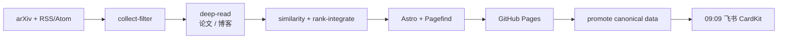

# RecSys Daily

[](https://github.com/Bin-Zhang-hhht/rec-sys-daily/actions/workflows/verify.yml) [](https://github.com/Bin-Zhang-hhht/rec-sys-daily/actions/workflows/daily.yml) [](https://github.com/Bin-Zhang-hhht/rec-sys-daily/actions/workflows/daily.yml) [](LICENSE)

面向推荐系统研究与工程实践的中文日报。RecSys Daily 每天从 arXiv 和精选工程博客中筛选高相关内容，提供保留原文术语的中文摘要、结构化解读、检索、归档与相似内容导航。

*A Chinese daily digest for recommendation-system research and production engineering.*

[在线阅读](https://bin-zhang-hhht.github.io/rec-sys-daily/) · [产品文档](docs/product.md) · [架构文档](docs/architecture.md) · [工作流](https://github.com/Bin-Zhang-hhht/rec-sys-daily/actions)


## 内容与体验

RecSys Daily 面向推荐系统研究者、算法工程师和技术负责人，将分散的论文与工程实践整理成可快速浏览、可继续深读、可回溯原文的中文研究入口。

- **论文精选**：保留原始英文标题，提供中文 summary、结构化 deep read、taxonomy 标签和 arXiv 原文链接。
- **工程实践**：从配置的 RSS/Atom 来源筛选高质量文章，生成中文转述与结构化分析，并链接回来源站点。
- **检索与发现**：通过日报归档、中英文术语搜索、taxonomy 筛选和轻量交互图谱，回顾主题脉络并发现相邻内容。

### 实际页面预览

<p align="center">
  
</p>

## 项目结构

```text
.
├── config/                 # 来源、主题、模型与策略
├── data/                   # canonical items、日报与运行状态
├── pipeline/               # Python：采集、深读、相似度、排序与测试
├── site/                   # Astro、Tailwind、Pagefind、ECharts
├── .github/workflows/      # daily、feishu-notify、site-only、verify
├── docs/feishu/            # 飞书 CardKit 设计稿备份
├── docs/product.md         # 产品边界与用户体验
└── docs/architecture.md    # 架构、契约、发布与验证
```

## 自动更新与配置

`RecSys Daily` GitHub Actions 每天在 **03:33（Asia/Shanghai）** 运行，也支持从 Actions 页面手动触发。

- 采用事务式更新：只有 Pages 部署成功后才提升正式 data/；任何阶段失败都不会推进状态。
- 独立飞书工作流每天 **09:09（Asia/Shanghai）** 检查已提升的数据，也可从 Actions 页面手动重跑当天通知；两种运行方式都会在 Secret 缺失、当天发布未完成或论文与博客均无推荐时跳过，单类为空时隐藏对应栏目，通知失败不回滚网站。




部署自己的实例时：

1. 在仓库 Secrets 中设置 `DEEPSEEK_BASE_URL`、`DEEPSEEK_API_KEY` 与 `MINERU_API_KEY`。
2. 在仓库 Variables 中设置不带路径的 `SITE_ORIGIN`，例如 `https://your-account.github.io`。
3. 如需飞书推送，在仓库 Secrets 中设置 `FEISHU_WEBHOOK_URL` 与 `FEISHU_WEBHOOK_SECRET`。
4. 在 GitHub Pages 中启用 GitHub Actions 作为发布源，然后手动触发 `RecSys Daily` 首次运行；当天数据晋升后，可手动运行 `Feishu Daily Notification` 测试推送。

不要把密钥提交到仓库。`.env.example` 仅提供本地变量名模板；`config/` 是可审查的行为配置入口：

| 配置 | 用途 |
| --- | --- |
| [`config/sources.yaml`](config/sources.yaml) | RSS/Atom 来源、启用状态、权重与场景。 |
| [`config/topics.yaml`](config/topics.yaml) | 检索词与 taxonomy，是标签、筛选和图谱分类的唯一来源。 |
| [`config/models.yaml`](config/models.yaml) | DeepSeek、MinerU、超时、重试与批次设置。 |
| [`config/settings.yaml`](config/settings.yaml) | 评分、门槛、来源 pacing、相似度与存储策略。 |
| [`config/feishu.json`](config/feishu.json) | 飞书模板 ID、版本和论文/博客展示上限。 |

## 快速验证

开发与测试以 Docker 为标准环境；宿主 shell 使用 PowerShell。以下命令生成不含真实密钥的 fixture 发布包，并完成 Astro、Pagefind 与图谱构建验证：

```powershell
docker compose build pipeline site
docker compose run --rm pipeline test-fixtures --case all --work /workspace/work/fixture-bundle
docker compose run --rm -e PUBLISH_BUNDLE_DIR=/workspace/work/fixture-bundle site build
```

若只改动站点，也可以执行：

```powershell
docker compose run --rm site build
```

完整命令、各阶段 artifact 契约和失败语义请见[架构文档](docs/architecture.md#9-本地-docker-验证)。

## 技术栈

Python 3.12 · Docker · DeepSeek OpenAI-compatible Responses API · MinerU · FastEmbed · Astro · TypeScript · Tailwind CSS 4 · Pagefind Extended · ECharts · GitHub Actions · GitHub Pages · Feishu CardKit

## 数据与版权边界

站点只发布公开元数据、中文转述、结构化分析和来源链接。PDF、MinerU Markdown、博客原始 HTML、提取全文、完整模型 prompt/response、reasoning trace、embedding 与构建索引均不进入 Git 或 Pages。

本项目不是全文镜像、PDF viewer、数据库、用户账户、聊天或 RAG 服务；不会绕过登录、付费墙或来源站点的访问限制。外部论文和博客内容的版权归原作者及其来源站点所有，请遵守各来源的访问与再发布条款。

## License

本项目采用 [MIT License](LICENSE)。
