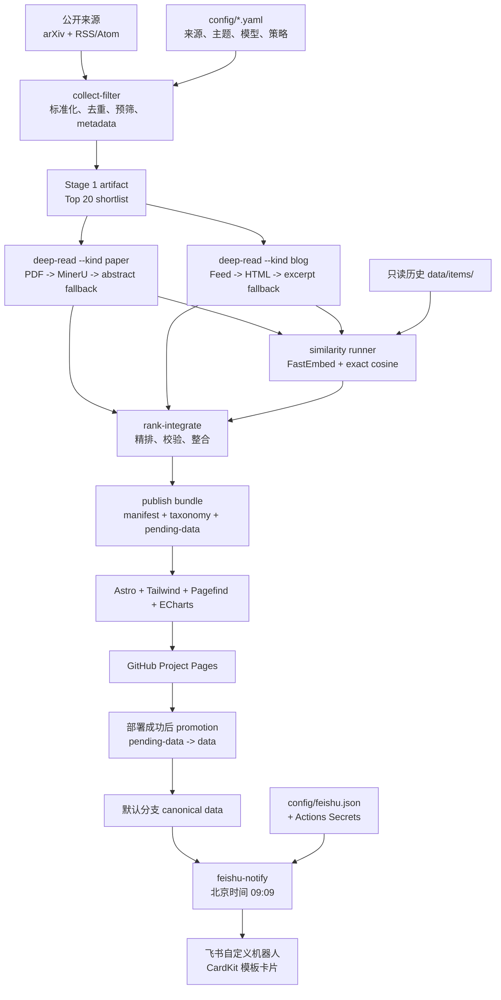
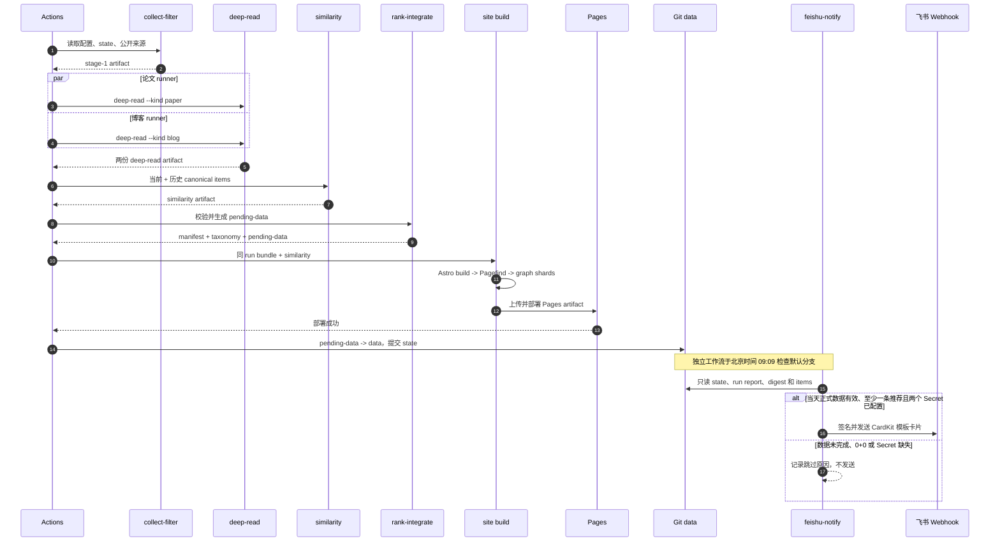
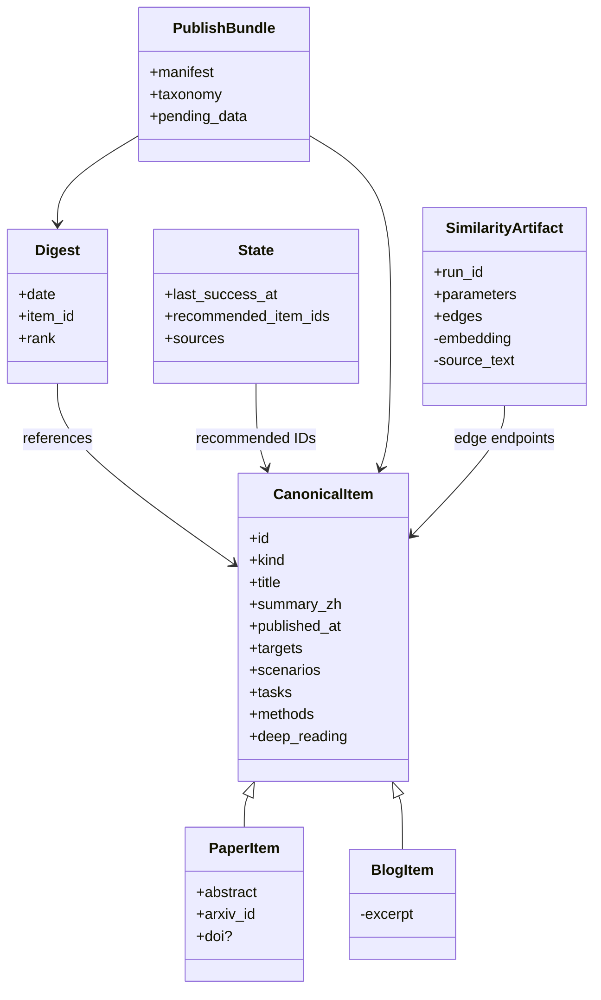
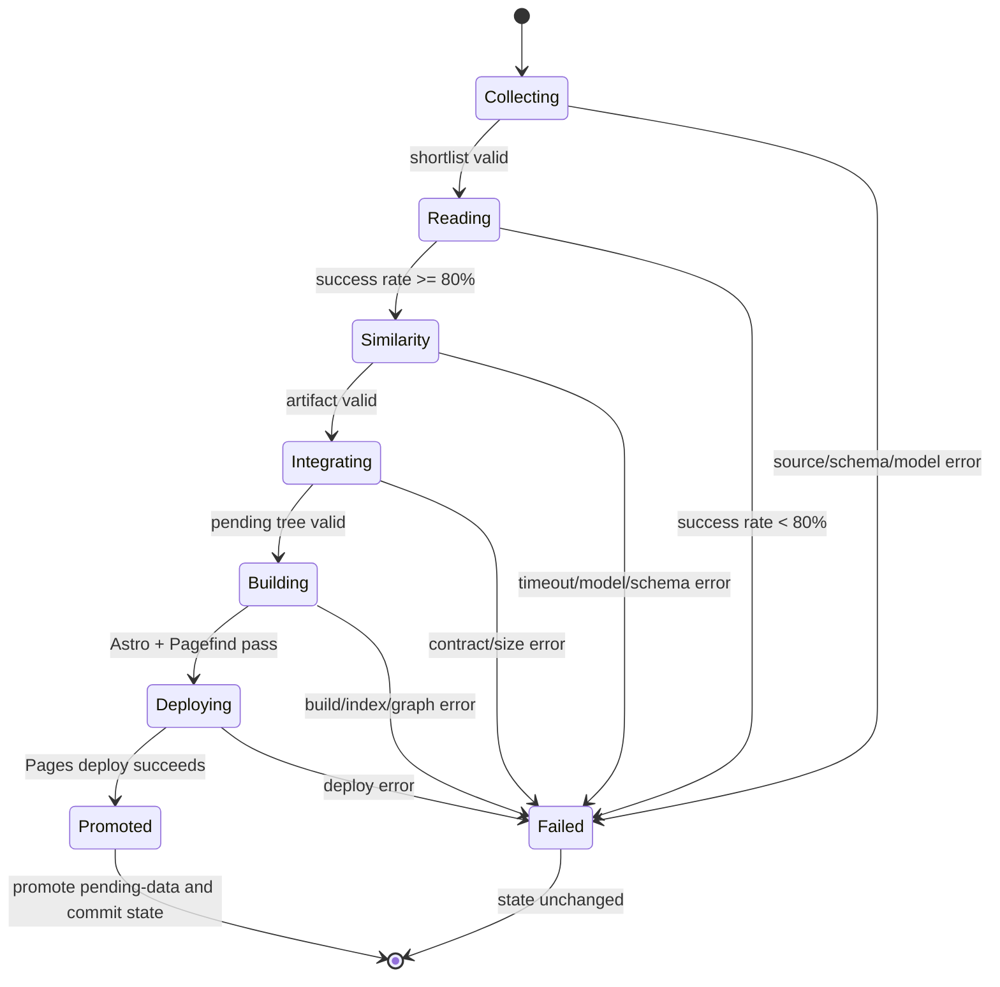

# 架构文档

状态：当前有效 · 最后核验：2026-08-29

本文是系统组件、数据契约、发布事务和本地验证的唯一技术说明。产品范围见
[`docs/product.md`](product.md)。

## 1. 总体架构

系统由 GitHub Actions 定时驱动，使用两个 Docker 镜像完成一次性数据处理和静态站点构建。
独立通知工作流在标准 GitHub-hosted runner 上读取已发布数据并调用飞书 Webhook；系统没有常驻
API、数据库或运行时内容服务。



数据逻辑只有一个 Python 包和三个阶段：`collect-filter`、`deep-read`、`rank-integrate`。
`similarity` 是第三阶段的独立物理 runner；网站构建是第四阶段。飞书通知只消费已经晋升的
canonical data，不属于数据阶段，也不参与发布事务。

## 2. 阶段与发布时序

| 阶段 | 输入 | 输出 | 失败后果 |
| --- | --- | --- | --- |
| `collect-filter` | 来源、配置、有效 `state.json` | 论文/博客各最多 20 条 shortlist、脱敏报告 | 不启动后续阶段 |
| `deep-read` | Stage 1 shortlist | 结构化 reading 或稳定错误码 | 按 80% 成功率门槛阻断整合 |
| `similarity` | 当前成功项 + 历史 canonical items | 短期有界边列表 | 缺失或校验失败阻断整合 |
| `rank-integrate` | 三类 artifact、只读历史 `data/` | 完整 `pending-data/` | 不生成可消费 bundle |
| `build-deploy` | bundle + 同 run similarity | Astro/Pagefind/图谱 Pages artifact | 不提升 `state.json` |
| `feishu-notify` | 已晋升的 `data/`、飞书配置和 Secret | 有推荐时发送一张模板卡片 | 只影响通知工作流，不回滚发布 |



部署成功之前，任何阶段都只能写临时目录或短期 artifact；只有 `build-deploy` 能写 Pages 和
canonical data。Git push 冲突直接失败，不 force push。通知工作流只有 `contents: read` 权限，
不会写 Git、Pages 或 artifact，也不触发 promotion。

## 3. 数据契约

### 3.1 CLI

统一入口为 `python -m recsys_daily`：

```text
collect-filter --output <dir> [--root <dir>]
deep-read --kind paper|blog --input <dir> --output <dir> [--root <dir>]
similarity --input <dir> --output <dir> [--root <dir>]
rank-integrate --input <dir> --output <dir> [--root <dir>]
run --output <dir> [--root <dir>]
test-fixtures --case all|cold-start|daily|degraded|failures|site --work <dir>
```

命令失败返回非零并清理临时源文件。`rank-integrate --output` 必须是已挂载父目录下不存在的
子目录，空目录也拒绝覆盖。

飞书通知是同一 Python 包中的独立模块，不增加数据阶段或常驻进程：

```text
PYTHONPATH=pipeline python -m recsys_daily.feishu_notify --root <repository>
```

模块只读取仓库数据和环境变量；除向已配置 Webhook 发出单次通知外，不写入仓库。正常运行使用
GitHub-hosted runner 自带的 Python 标准库，不需要第三个 Docker 镜像或 self-hosted runner。

### 3.2 配置

| 文件 | 责任 |
| --- | --- |
| `config/sources.yaml` | arXiv/RSS/Atom、启用状态、必需性、权重和来源场景 |
| `config/topics.yaml` | `collection_terms` 与 `targets/scenarios/tasks/methods` taxonomy |
| `config/models.yaml` | DeepSeek、MinerU、超时、重试和批量大小 |
| `config/settings.yaml` | 评分、门槛、HTTP pacing、图谱、similarity、存储阈值 |
| `config/feishu.json` | 飞书 CardKit 模板 ID、版本和卡片展示上限 |

四类 taxonomy 条目都必须是唯一的 `id`、`name_zh`、`name_en`、`terms`。`topics.yaml` 是
标签、检索筛选和图谱分类的唯一来源；`rank-integrate` 输出按配置顺序标准化的 `taxonomy.json`，
站点不再维护第二份 label map。Secret 只来自环境变量或 Actions Secrets。

关键默认值：论文/博客每日目标各 10，预筛上限 100/50，深读 shortlist 上限各 20；不存在有效
state 时查询窗口为论文 5 年、博客 3 年，后续使用 `last_success_at - 48h/7d`。模型为单一
DeepSeek Responses API；不得增加 provider failover、协议回退或客户端 RPM 限制。

飞书配置独立于 `settings.yaml`，避免通知模块依赖数据流水线的 Pydantic/YAML 配置和运行时依赖。
首版配置固定为：

```json
{
  "template_id": "AAqP2jToTOo2R",
  "template_version": "1.0.0",
  "max_papers": 3,
  "max_blogs": 3
}
```

`template_id` 和 `template_version` 必须是非空字符串，两个展示上限必须是 `1..3` 的整数。
卡片模板变量名是固定契约：`date` 为北京时间业务日期的 `YYYY-MM-DD` 字符串，`content` 为
飞书 Markdown 字符串。模板导出的 `docs/feishu/RecSys Daily Card.card` 用于设计和备份，不是
运行时输入，也不从其中读取变量的 `apiName`。Webhook 地址和签名密钥不得进入配置文件，分别
只从 Actions Secrets 映射为 `FEISHU_WEBHOOK_URL` 和 `FEISHU_WEBHOOK_SECRET`。站内详情链接继续
使用已有的 Actions Variable `SITE_ORIGIN`，不在飞书配置中复制站点地址。

### 3.3 跨阶段 artifact

所有 manifest 只含 `run_id` 和 `schema_version: "1"`；每次 artifact 必须使用同一个 run。

```text
stage-1/
├── manifest.json
├── papers.jsonl
├── blogs.jsonl
├── source-states.json
└── stage-report.json

deep-read/
├── manifest.json
└── paper-deep-readings.json | blog-deep-readings.json

similarity/
├── manifest.json
├── similarity.json
└── similarity-report.json

publish-bundle/
├── manifest.json
├── taxonomy.json
└── pending-data/
```

Stage 1 只传 metadata shortlist、来源游标/validators 和计数；博客 excerpt 仅允许作为有界的
临时降级输入。Deep-read 每个输入 ID 必须在 `items` 或 `failures` 中恰好出现一次：

```json
{
  "kind": "paper",
  "items": [{"id": "item-id", "deep_reading": {"analysis_basis": "mineru_full_text"}}],
  "failures": [{"id": "item-id", "code": "source_unavailable"}]
}
```

失败只记录稳定短错误码，不写异常链、URL、请求头或源内容。论文和博客深读成功率分别达到
`0.80` 才能整合；无候选时视为成功。

### 3.4 Canonical data

```text
data/
├── state.json
├── items/papers/YYYY/MM/<stable-id>.json
├── items/blogs/YYYY/MM/<stable-id>.json
├── digests/YYYY/MM/YYYY-MM-DD.json
└── runs/YYYY/MM/<run-id>.json
```

Canonical item 保存公开元数据、中文 summary、四类 taxonomy ID、评分和结构化 deep reading。
Paper 额外包含 `abstract`、`arxiv_id` 和可空 `doi`；Blog 不含 excerpt。Digest 只保存日期、
rank、推荐理由和 `item_id`，不复制内容。State 只保存上次成功时间、来源游标/validators、实际
进入 digest 的 `recommended_item_ids` 和更新时间，不记录未发布候选。

成功完成整合时，无论推荐数是否为零，都生成当前 run report 并更新 pending `state.json`。
只有论文或博客至少一类存在推荐时才写当天 digest；`paper_recommendations=0` 且
`blog_recommendations=0` 的 run report 是成功的空日报，不是失败标记。正式 state 和 run report
仍须等待 Pages 部署成功后一起晋升。



## 4. 采集、深读与排序

采集只使用 arXiv Atom API 和配置的 RSS/Atom；按 arXiv ID、DOI、canonical URL、标准化标题
哈希去重。`collection_terms` 先做确定性门禁，模型再批量生成 CJK summary、标签、相关性和
证据；模型失败只能使用候选自身文本做规则降级。标签必须有源文本 term 证据。

论文正文降级链固定为 `arXiv PDF -> MinerU full.md -> abstract fallback`，博客为
`Feed full content -> article HTML -> excerpt fallback`。论文 runner 不调用 arXiv HTML、
PyMuPDF、VLM 或 TeX source；Feed、HTML、PDF、MinerU ZIP/Markdown 只存在进程临时目录，并在
`finally` 清理。深读只保存转述后的结构化字段和 section/page 或 heading/section 证据定位。

## 5. 相似度与图谱

相似度 runner 对当前成功项和历史 canonical items 全量去重，按 `title`、`abstract`、
`summary_zh` 的 128-token 预算生成 384 维 L2-normalized embedding，使用
`fastembed==0.8.0`、`paraphrase-multilingual-MiniLM-L12-v2`、blockwise exact cosine、
`min_cosine=0.60`、`top_k=5`、mutual Top-K。artifact 只保存参数、计数和有界边，不保存 embedding、
全文或索引；详情页最多显示 4 条相关内容。相似度只用于导航，不改变 final score。

图谱构建在 site image 中按需生成 manifest、节点索引、taxonomy 边和 similarity adjacency
shards；首屏从最新 digest 及一跳邻居开始，沿 similarity 边确定性 BFS 扩展至最多 180 个内容
节点。ECharts 只在 `/graph/` 加载，Pagefind 只索引论文/博客详情页主内容；全部路由遵循
`/rec-sys-daily/` base。

## 6. 发布事务与失败状态

`rank-integrate` 从只读仓库复制完整 `data/` 树到 pending tree，再覆盖本次结果；bundle 顶层
严格只有 `manifest.json`、`taxonomy.json`、`pending-data/`。Astro 构建、Pagefind、图谱分片和
Pages artifact 都在临时构建目录产生，不回写 bundle。



失败时不生成可消费的 publish bundle，不推进正式 `data/state.json`；冷启动失败仍按冷启动窗口
重试。只有 Pages 部署成功后，才用受限 exact-tree 同步提升 `pending-data/`。

## 7. 飞书每日通知

### 7.1 组件与调度

首版通知由三个文件边界组成：

| 文件 | 责任 |
| --- | --- |
| `.github/workflows/feishu-notify.yml` | 定时、最小权限、Secret 映射和进程退出状态 |
| `pipeline/recsys_daily/feishu_notify.py` | 成功门禁、内容组装、签名、HTTP 请求和响应校验 |
| `config/feishu.json` | 非敏感 CardKit 模板配置 |
| `docs/feishu/RecSys Daily Card.card` | 飞书卡片搭建工具的设计稿备份，不参与运行 |

workflow 使用 `cron: "9 1 * * *"`，对应无夏令时的北京时间 09:09，并提供 `workflow_dispatch`
用于从 Actions 页面手动重跑当天通知。定时与手动运行都在实际启动时重新计算 `Asia/Shanghai`
的当天业务日期，并执行相同的 Secret 和正式数据门禁；手动运行不提供历史日期或跳过门禁的输入。
GitHub Actions 调度允许排队延迟。workflow 运行在默认分支、使用 `ubuntu-latest`、授予
`contents: read`，且与 `.github/workflows/daily.yml` 解耦；无需独立部署 runner，也不修改 daily
workflow 的成功、失败或回滚行为。

### 7.2 推送成功门禁

通知模块 checkout 当时默认分支的最新提交，并按以下顺序判断：

1. `FEISHU_WEBHOOK_URL` 或 `FEISHU_WEBHOOK_SECRET` 任一为空时，记录 `skipped` 原因并以 0
   退出，不进行网络请求；日志只写缺失的变量名，不写变量值。
2. 读取 `data/state.json`，将 `last_success_at` 转为 `Asia/Shanghai` 日期；日期不是当天时跳过。
3. 在 `data/runs/` 中找到与 `state.last_success_at` 完全对应的唯一 run report，并要求
   `completed_at` 存在、转换后的业务日期为当天。缺失、重复或不一致均视为当天正式数据尚未
   完成，跳过推送。
4. 以该 run report 的 `paper_recommendations` 和 `blog_recommendations` 为本次权威计数。
   任一计数大于零时，当天 digest 必须存在、分区数量与 report 一致，且引用的 canonical item
   都可解析；校验失败时跳过。
5. 两个计数均为零时是有效成功状态；不要求当天 digest 存在，也不读取可能残留的同日 digest，
   记录 `skipped` 并且不请求飞书 Webhook。

该门禁只接受已经通过 Pages 部署并晋升到 `data/` 的结果。Actions artifact、工作目录中的
`pending-data/` 或仅有 digest 文件都不能作为“当天完成”的依据。

### 7.3 卡片内容与请求契约

非空日报按 digest 的 `rank` 确定性排序，论文和博客各截取 `config/feishu.json` 规定的数量，
当前上限为 3+3。每条内容只使用 canonical item 中允许公开的原始标题、中文 summary 和站内
详情链接；不读取或发送 PDF、原始 HTML、source full text、模型请求响应或推理痕迹。论文或
博客任一分区为空时不渲染该分区；两个分区均为空时不构造卡片。

自定义机器人请求使用 `msg_type: "interactive"` 和模板卡片，不把 `.card` DSL 内联到代码：

```json
{
  "timestamp": "<Unix seconds>",
  "sign": "<Base64 HMAC-SHA256>",
  "msg_type": "interactive",
  "card": {
    "type": "template",
    "data": {
      "template_id": "AAqP2jToTOo2R",
      "template_version_name": "1.0.0",
      "template_variable": {
        "date": "2026-08-26",
        "content": "<Feishu Markdown>"
      }
    }
  }
}
```

`date` 和 `content` 使用模板变量的 `name`，不是 `.card` 导出文件中的 `apiName`。签名使用请求
发出时的 Unix 秒级时间戳；令 `string_to_sign = timestamp + "\n" + secret`，按飞书规则计算
`Base64(HMAC-SHA256(key=string_to_sign, message=empty))`。请求格式和签名算法以
[飞书自定义机器人使用指南](https://open.feishu.cn/document/client-docs/bot-v3/add-custom-bot)为准。
`FEISHU_WEBHOOK_URL` 只接受飞书官方 HTTPS 自定义机器人地址，请求不跟随重定向。HTTP 非成功
状态、无效 JSON、飞书业务返回非成功码或超时都使通知 workflow 失败，但绝不修改或回滚已发布
网站与 canonical data。日志不得输出 Webhook URL、Secret、签名或完整请求体。

### 7.4 成功日报与通知语义

| 当天状态 | State | Run report | Digest | 通知行为 |
| --- | --- | --- | --- | --- |
| 发布成功且两类都有推荐 | 已晋升 | 有且与 State 对应 | 有且计数一致 | 发送最多 3+3 |
| 发布成功且仅一类有推荐 | 已晋升 | 有且与 State 对应 | 有且计数一致 | 只发送有内容的栏目 |
| 发布成功且 0+0 | 已晋升 | 两类计数均为 0 | 可以不存在 | 跳过，不请求 Webhook |
| 生产、构建、部署或晋升未完成 | 未推进到当天 | 不作为成功依据 | 不作为成功依据 | 跳过 |
| Secret 缺失 | 不受影响 | 不受影响 | 不受影响 | 跳过 |
| 飞书发送失败 | 不受影响 | 不受影响 | 不受影响 | 通知 workflow 失败 |

## 8. 安全与合规

- URL 仅允许 `http/https`；每次重定向重新检查 loopback、私网和 link-local，拒绝 SSRF。
- 响应使用流式大小上限；对 `429/5xx` 尊重 `Retry-After`，最多有限重试，`401/403` 不盲重试。
- HTML 不执行脚本；模型输入被视为只读资料，输出必须通过 JSON Schema 校验。
- 不提交或发布 PDF、提取全文、原始 HTML、完整 prompt/response、reasoning trace、Secret、
  embedding、Pagefind index、graph shards 或 Astro `dist`。
- 运行报告只记录来源状态、计数、模型调用量、耗时和告警，不记录正文或密钥。

## 9. 本地 Docker 验证

宿主默认使用 PowerShell，Docker 是正常开发环境；两个镜像分别承担 Python pipeline 和
Node/Astro site：

```powershell
docker compose build pipeline site
docker compose run --rm pipeline test-fixtures --case all --work /workspace/work/fixture-bundle
docker compose run --rm -e PUBLISH_BUNDLE_DIR=/workspace/work/fixture-bundle site build
docker compose run --rm pipeline run --output /workspace/work/publish-bundle
docker compose run --rm site build
```

测试使用运行时生成的 fixture 和 fake model response，不需要真实 API key。验证重点是 Schema、
清理、artifact 内容、失败时 state 不推进、Astro production build、Pagefind 输出和图谱分片。
飞书通知测试使用 fixture canonical data、固定时钟、固定签名输入和 fake HTTP transport，覆盖
Secret 缺失、State 过期、run report 不匹配、成功 0+0 跳过、单类空栏目隐藏、digest/item 校验、
3+3 截断、请求体及飞书错误响应；测试不得访问真实 Webhook。

## 10. 关键决策

| 决策 | 原因 |
| --- | --- |
| 静态 GitHub Pages | 无服务器成本；Git 保留可审计的 canonical 数据 |
| 两个 Docker 镜像 | 隔离 Python 数据依赖与 Node 前端依赖 |
| `pending-data` 事务提升 | 构建或部署失败不会发布半批数据 |
| FastEmbed + exact cosine | 在当前规模下可复现、无需 Vector DB，关系可解释 |
| taxonomy 与 similarity 分责 | 标签用于筛选，语义边用于发现，避免把搜索命中伪装成事实关系 |
| 单一 DeepSeek wrapper | 保持协议和故障行为可测试、可审计 |
| 飞书通知独立 workflow | 通知故障不阻断、不回滚网站发布，且不需要常驻服务或专用 runner |
| 独立 `config/feishu.json` | 模板配置可审计，同时避免通知模块耦合主流水线 YAML/Pydantic 配置 |
