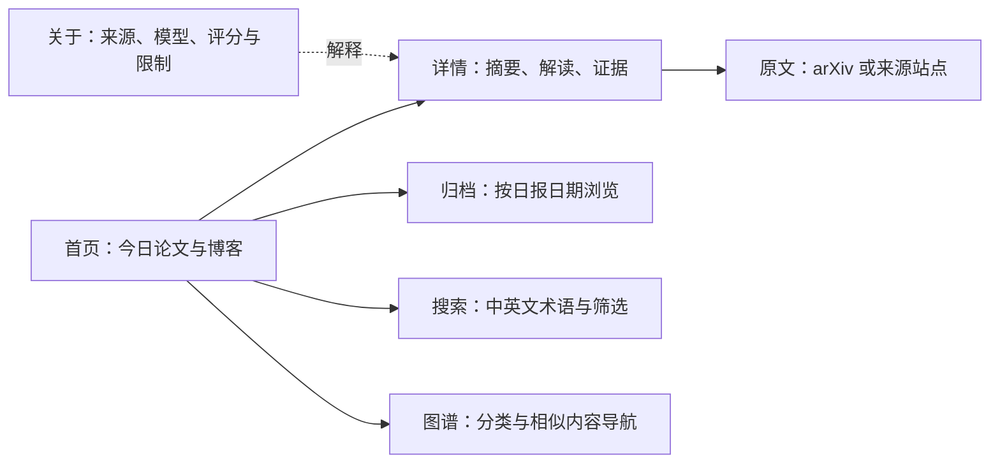

# 产品文档

状态：当前有效 · 最后核验：2026-08-28

本文定义 RecSys Daily 做什么、面向谁以及公开内容的边界；组件、字段和命令见
[`docs/architecture.md`](architecture.md)。

## 定位

RecSys Daily 是面向推荐系统研究人员、工程师和技术负责人的中文研究导航。它每天从
公开来源筛选内容，保留原始英文术语，生成可快速浏览的中文摘要和结构化解读，并链接回
原文。它不是事实数据库、全文镜像或个性化推荐服务。

## 内容范围

| 维度 | 首版范围 |
| --- | --- |
| 学术来源 | arXiv 官方 Atom API |
| 工程来源 | `config/sources.yaml` 启用的 RSS/Atom |
| 推荐目标 | `content`、`user`、`room` |
| 业务场景 | `text_feed`、`voice_chat`、`livestream`、`friend_recommendation` |
| 技术任务 | Retrieval、Ranking、Re-ranking、User Matching、Link Prediction、Multi-objective Optimization |
| 方法方向 | Collaborative Filtering、Two-Tower Model、Sequence Modeling、Graph Neural Network、Reinforcement Learning、Large Language Model、Multi-task Learning |

主题、标签和检索词只由 `config/topics.yaml` 维护；产品文档不复制配置清单。

## 每日输出

| 类型 | 目标 | 质量规则 |
| --- | ---: | --- |
| 论文 | 10 篇 | 候选不足时少发，不以低相关或重复内容填充 |
| 技术博客 | 10 篇 | 候选不足时少发，不以低质量内容填充 |

每条推荐包含原始英文标题、作者、日期、来源链接、中文一句话 summary、四类 taxonomy
标签、评分、推荐理由和结构化 deep read。论文保留公开 abstract；博客不发布 excerpt、
原始 HTML 或全文。

## 页面体验

- **首页**：按论文、博客分区展示当天内容和中文总结。
- **详情页**：展示 summary、结构化方法/结果/局限、证据定位、标签、相邻内容和原文链接。
- **归档页**：按日报日期浏览历史推荐。
- **搜索页**：支持中文和英文术语、内容类型、时间及 taxonomy 筛选。
- **图谱页**：按 taxonomy 和语义相似度导航；相似度用于发现，不代表事实关系。
- **关于页**：公开来源范围、生成模型、评分用途、分析依据和免责声明。

界面和分析以中文为主；标题、作者、算法、数据集、指标、模型名和必要 English terms 保留
原文。中文 summary 必须含 CJK 字符，详情页标明生成模型和分析依据。

## 质量行为

1. 先用 `collection_terms` 做确定性相关性门禁，再进行结构化 metadata 分析。
2. 每类内容最多取 20 条进入 deep read，按相关性、证据、业务价值和技术深度选出最终推荐。
3. 每日论文和博客分别排序；无合格候选时如实减少数量。
4. 失败条目使用明确的降级标记，不把摘要降级伪装成全文解读。
5. 详情页的“相关内容”来自同次构建的 similarity 结果，不改变日报评分。

## 版权与非目标

站点只发布公开元数据、中文转述和短证据定位，并始终链接来源。PDF、MinerU Markdown、
博客原始 HTML、提取全文、完整模型 prompt/response 和 reasoning trace 只存在于受控临时过程，
不进入 Git、Pages 或跨 job artifact。

首版不建设常驻后端、数据库、Vector DB、Graph DB、用户账户、聊天/RAG、OpenReview、TeX
source、PDF viewer、全文镜像，也不绕过登录、付费墙或来源站点的访问限制。图谱只承担导航、
筛选和发现相邻内容的作用。

## 术语

| 术语 | 含义 |
| --- | --- |
| Candidate | 通过来源抓取和相关性门禁、等待 deep read 的内容 |
| Canonical item | 按 stable ID 保存的单篇结构化事实记录 |
| Digest | 按业务日期组织、只引用 item ID 的推荐清单 |
| Publish bundle | 含 `manifest.json`、`taxonomy.json`、`pending-data/` 的短期发布包 |
