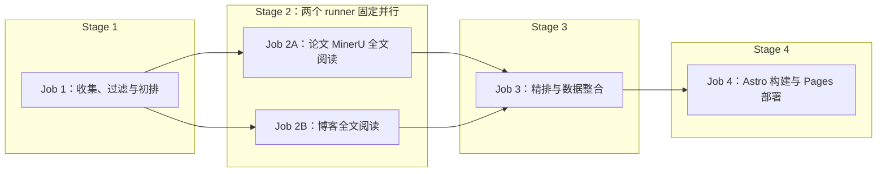

# RecSys Daily 全自动论文与行业情报站设计

日期：2026-08-09

状态：已批准，首发实施中

部署目标：GitHub Project Pages（`/rec-sys-daily/`）

运行环境：GitHub Actions + Docker

LLM：单一 DeepSeek 模型，OpenAI-compatible Responses API

## 1. 目标

构建一个无需服务器和数据库、完全依靠 GitHub Actions 定时运行的中文推荐系统研究情报站。系统每天自动抓取学术论文和高质量工程博客，筛选与业务相关的内容，调用 LLM 生成中文摘要和结构化标签，随后部署到 GitHub Pages。

站点服务于以下推荐目标和业务场景：

- 推荐目标：`content`、`user`、`room`
- 文字流：Feed、文章、帖子、短内容推荐
- 语聊：语聊房、听众、主播、用户匹配与关系发现
- 直播间：直播内容、房间、主播和观众推荐
- 好友推荐：People You May Know、Follow Recommendation、Social Recommendation、Link Prediction
- 通用推荐技术：Retrieval、Ranking、Re-ranking、Multi-task Learning、Sequence Modeling、Graph Learning、LLM for Recommendation、Online Experimentation

系统输出为中文，但标题、算法名、数据集、指标和英文术语保留原文。

## 2. 非目标

首个版本明确不建设以下能力：

- 不运行常驻后端服务
- 不使用关系型数据库、Vector DB 或 Graph DB
- 不下载或解析 TeX source archive；不在 Git、缓存或 Pages artifact 中永久保存论文 PDF、MinerU ZIP/Markdown、博客原始 HTML 或任何提取全文
- 不在详情页嵌入 PDF、镜像论文/博客全文或提供站内全文阅读器
- 不建设复杂 RAG、聊天机器人或用户登录系统
- 不把知识图谱作为严格事实库或学术结论依据
- 不自动绕过来源站点的访问限制

知识图谱只承担导航、筛选和发现相邻内容的作用。

## 3. 每日输出规则

每天分别形成论文和博客两个推荐区：

| 内容类型 | 每日数量 | 规则 |
| --- | ---: | --- |
| 学术论文 | 目标 8 篇 | 优先新论文；不足时允许少于 8 篇，不填充低相关或重复论文 |
| 技术博客 | 目标 8 篇 | 优先未推荐的近期文章；不足时允许少于 8 篇，不为凑数降低阈值 |

因此每日页面最多展示 16 条新推荐。

系统按日运行。存在成功状态时，论文从 `last_success_at - 48 小时` 开始查询，博客从 `last_success_at - 7 天` 开始查询；重叠窗口用于容忍来源延迟和偶发漏跑，历史日报去重保证内容不会被重复推荐。任一类型不足 8 篇时允许少于 8 篇，并在运行报告中记录原因。

每条推荐至少包含：

- 原始英文标题
- 中文一句话总结
- 来源、作者、发布日期和原文链接
- 推荐目标：`content` / `user` / `room`
- 业务场景和技术主题标签
- 推荐理由与相关性分数
- LLM 生成状态和失败降级标记

## 4. 统一工作流与时间窗口

### 4.1 单工作流与时间窗口分支

首次运行不是独立的“冷启动模式”，只是同一管道在不存在有效 `data/state.json` 时选用较长查询窗口的一个分支。`daily.yml`、Python CLI、四阶段处理逻辑和候选上限均不变，不提供独立模式参数、专用 workflow 或额外数据模型。前三个数据阶段由 Python 完成，网站构建与部署由 Node/Astro 完成。

`query_window()` 严格读取状态并按下表选择时间窗口；状态文件不存在时走首次运行分支，状态文件存在但无法通过 Schema 或时间字段校验时必须明确失败，不得静默当作首次运行：

| 状态 | 论文起始时间 | 博客起始时间 |
| --- | --- | --- |
| `state.json` 不存在 | 当前时间减 5 年 | 当前时间减 3 年 |
| 存在有效状态 | `last_success_at - 48 小时` | `last_success_at - 7 天` |

每次运行统一使用论文最多 100 篇、博客最多 50 篇，完成元数据分析后各取最多 16 篇进行临时全文解读，再分别重排出目标 8 篇。无有效状态与有效状态分支使用完全相同的候选数、深读数和筛选代码，唯一业务差异是时间范围。模型不设置每次运行调用次数或客户端 RPM 上限；安全边界由候选数量、同步单请求、单请求 context、有限重试和各 job 超时共同提供。服务端返回 `429/5xx` 时按 `Retry-After` 或有限退避恢复。

### 4.2 成功条件

所有待发布数据先写入临时工作目录。每次运行只有在以下步骤全部成功后，才提交正式数据和新的 `data/state.json`：

1. 必需来源完成抓取
2. 数据去重和 Schema 校验通过
3. LLM 结构化结果达到最低成功率
4. 知识图谱生成和裁剪通过
5. Docker 测试通过
6. 静态站点构建通过
7. GitHub Pages 部署成功

如果任一关键步骤失败，不提交新的 `state.json`。无有效状态的首次运行失败后，下次定时运行仍使用 5 年/3 年时间范围；已有有效状态的运行失败后，下次运行仍从上一次成功时间回溯，不会跳过失败期间的内容。

博客 RSS 属于可选来源，单个 Feed 暂时失败只记录警告，避免某个公司博客故障导致整个工作流永远无法完成。来源配置仍支持将特定 Feed 标为 `required: true`。RSS 通常只返回近期条目，因此首次运行的“近 3 年、最多 50 篇”是接受范围和安全上限，不保证每个 Feed 都能回溯到 3 年前。

### 4.3 后续日更

存在有效状态后，同一管道使用增量时间窗口：

- 根据来源游标、发布日期和内容 ID 拉取新增候选
- 使用 arXiv ID、Canonical URL、DOI 和标准化标题去重
- 从候选中分别生成论文目标 8 篇、博客目标 8 篇
- 无新博客时仍正常发布论文日报
- 未产生任何新内容时只记录成功运行，不生成空日报

## 5. 来源设计

### 5.1 学术来源

| 来源 | 接口 | 作用 | 必需 |
| --- | --- | --- | --- |
| arXiv | 官方 Atom API | RecSys、IR、ML、Social Network、Multimedia 等论文主来源 | 是 |

首版学术来源只支持 arXiv。arXiv RSS 不作为独立论文来源启用，以免和 Atom API 重复；Atom API 提供查询、分页和稳定 ID。

### 5.2 高质量 RSS/Atom 来源

以下地址已通过站点链接或 Feed 内容类型进行核验。“核心/次级”只是文档中对来源适用性的分组；首版配置仍只使用既有 `weight`，不增加 tier 字段或分组专属阈值。

#### 核心来源

| ID | 来源 | Feed URL | 主要覆盖场景 | 默认权重 |
| --- | --- | --- | --- | ---: |
| `meta_engineering` | Meta Engineering | `https://engineering.fb.com/feed/` | 文字流、视频/直播、社交图、用户与内容推荐 | 1.00 |
| `netflix_techblog` | Netflix TechBlog | `https://netflixtechblog.com/feed` | 视频内容推荐、Ranking、Foundation Model | 1.00 |
| `spotify_engineering` | Spotify Engineering | `https://engineering.atspotify.com/feed/` | 音频推荐、用户偏好、序列建模 | 1.00 |
| `pinterest_engineering` | Pinterest Engineering | `https://medium.com/feed/pinterest-engineering` | Home Feed、Retrieval、Ranking、Graph、Ads | 1.00 |
| `discord_engineering` | Discord Engineering | `https://discord.com/blog/rss.xml` | 语聊、房间/社区、好友关系、Entity Embedding | 0.95 |

#### 次级来源

| ID | 来源 | Feed URL | 主要覆盖场景 | 默认权重 |
| --- | --- | --- | --- | ---: |
| `airbnb_tech` | Airbnb Engineering & Data Science | `https://airbnb.tech/feed/` | Search/Ranking、双边市场、Embedding、Experimentation | 0.90 |
| `etsy_codeascraft` | Etsy Code as Craft | `https://www.etsy.com/codeascraft/rss` | Search、Ads、Recs、买家画像 | 0.90 |
| `google_research` | Google Research | `https://research.google/blog/rss/` | IR、ML、LLM、Graph 等研究进展 | 0.85 |
| `nvidia_developer` | NVIDIA Developer Blog | `https://developer.nvidia.com/blog/feed/` | GPU RecSys、推理优化、NIM 和 LLM 基础设施 | 0.80 |

### 5.3 RSS 配置示例

实际实现使用 `config/sources.yaml`：

```yaml
academic:
  - id: arxiv
    kind: arxiv
    enabled: true
    required: true
    weight: 1.0

blogs:
  - id: meta_engineering
    kind: rss
    name: Meta Engineering
    url: https://engineering.fb.com/feed/
    enabled: true
    required: false
    weight: 1.0
    scenarios: [text_feed, livestream, friend_recommendation]

  - id: netflix_techblog
    kind: rss
    name: Netflix TechBlog
    url: https://netflixtechblog.com/feed
    enabled: true
    required: false
    weight: 1.0
    scenarios: [text_feed, livestream]

  - id: spotify_engineering
    kind: rss
    name: Spotify Engineering
    url: https://engineering.atspotify.com/feed/
    enabled: true
    required: false
    weight: 1.0
    scenarios: [voice_chat, user_recommendation]

  - id: pinterest_engineering
    kind: rss
    name: Pinterest Engineering
    url: https://medium.com/feed/pinterest-engineering
    enabled: true
    required: false
    weight: 1.0
    scenarios: [text_feed]

  - id: discord_engineering
    kind: rss
    name: Discord Engineering
    url: https://discord.com/blog/rss.xml
    enabled: true
    required: false
    weight: 0.95
    scenarios: [voice_chat, room_recommendation, friend_recommendation]

  - id: airbnb_tech
    kind: rss
    name: Airbnb Engineering & Data Science
    url: https://airbnb.tech/feed/
    enabled: true
    required: false
    weight: 0.90

  - id: etsy_codeascraft
    kind: rss
    name: Etsy Code as Craft
    url: https://www.etsy.com/codeascraft/rss
    enabled: true
    required: false
    weight: 0.90

  - id: google_research
    kind: rss
    name: Google Research
    url: https://research.google/blog/rss/
    enabled: true
    required: false
    weight: 0.85

  - id: nvidia_developer
    kind: rss
    name: NVIDIA Developer Blog
    url: https://developer.nvidia.com/blog/feed/
    enabled: true
    required: false
    weight: 0.80
```

每个 Feed 在 `collect-filter` 中拉取一次并保存 `ETag`、`Last-Modified` 和最近成功
时间；blog deep-read runner 可以为入选来源再拉取一次以恢复不能跨 job 传递的 Feed
全文，因此每个来源每次运行总计最多两次请求。两个阶段都支持 RSS 2.0 与 Atom，
Canonical URL 相同的文章只保留一条。

## 6. 用户可编辑主题配置

主题、场景、任务和方法都由 `config/topics.yaml` 控制。该文件同时是抓取词表、LLM 标签约束、搜索筛选项和知识图谱分类节点的唯一配置来源；用户增加新方向时无需修改代码。

```yaml
targets:
  - id: content
    name_zh: 内容推荐
    name_en: Content Recommendation
    terms: [content recommendation, item recommendation]
  - id: user
    name_zh: 用户推荐
    name_en: User Recommendation
    terms: [user recommendation, people recommendation]
  - id: room
    name_zh: 房间推荐
    name_en: Room Recommendation
    terms: [room recommendation, live room recommendation]

scenarios:
  - id: text_feed
    name_zh: 文字流
    name_en: Text Feed
    terms: [feed ranking, news feed, post recommendation]
  - id: voice_chat
    name_zh: 语聊
    name_en: Voice Chat
    terms: [voice chat, social audio, listener matching]
  - id: livestream
    name_zh: 直播间
    name_en: Livestream
    terms: [live streaming, live room, host recommendation]
  - id: friend_recommendation
    name_zh: 好友推荐
    name_en: Friend Recommendation
    terms:
      - people you may know
      - friend recommendation
      - follow recommendation
      - social recommendation
      - link prediction

tasks:
  - id: retrieval
    name_zh: 召回
    name_en: Retrieval
    terms: [candidate retrieval, candidate generation]
  - id: ranking
    name_zh: 排序
    name_en: Ranking
    terms: [recommendation ranking, learning to rank]
  - id: reranking
    name_zh: 重排
    name_en: Re-ranking
    terms: [reranking, slate optimization]
  - id: user_matching
    name_zh: 用户匹配
    name_en: User Matching
    terms: [user matching, people matching]
  - id: link_prediction
    name_zh: 链路预测
    name_en: Link Prediction
    terms: [link prediction, social link prediction]
  - id: multi_objective_optimization
    name_zh: 多目标优化
    name_en: Multi-objective Optimization
    terms: [multi-objective recommendation, multi-objective optimization]

methods:
  - id: collaborative_filtering
    name_zh: 协同过滤
    name_en: Collaborative Filtering
    terms: [collaborative filtering, matrix factorization]
  - id: two_tower
    name_zh: 双塔模型
    name_en: Two-Tower Model
    terms: [two-tower model, dual encoder]
  - id: sequence_modeling
    name_zh: 序列建模
    name_en: Sequence Modeling
    terms: [sequential recommendation, sequence modeling]
  - id: graph_neural_network
    name_zh: 图神经网络
    name_en: Graph Neural Network
    terms: [graph neural network, graph learning, GNN]
  - id: reinforcement_learning
    name_zh: 强化学习
    name_en: Reinforcement Learning
    terms: [reinforcement learning, bandit recommendation]
  - id: large_language_model
    name_zh: 大语言模型
    name_en: Large Language Model
    terms: [LLM for recommendation, generative recommendation]
  - id: multi_task_learning
    name_zh: 多任务学习
    name_en: Multi-task Learning
    terms: [multi-task learning, multi-task recommendation]
```

四类条目统一使用 `id`、`name_zh`、`name_en` 和 `terms`，避免前端硬编码标签或根据 ID 猜测展示名称。系统启动时验证 ID 唯一性、字段完整性和引用关系；canonical item 中的每个标签都必须引用这里已声明的 ID。配置错误会使构建明确失败，不会静默忽略。

`rank-integrate` 将本次运行实际使用的配置标准化为 `publish-bundle/taxonomy.json`。该小文件只保留四类条目的 ID、中文名、英文名和配置顺序，不包含抓取词表；Astro 使用它生成搜索筛选项和图谱分类标签。这样重跑 `build_deploy` 时仍使用与数据处理阶段完全一致的分类快照，网站构建不需要再次解析 YAML。

## 7. 数据管道

数据管道采用单个 Python 包和一个 CLI。生产工作流调用明确的阶段命令，本地 `run` 命令只编排 Python 数据阶段并产出待发布数据包；网站构建由独立的 Node/Astro 容器消费该数据包：

```text
python -m recsys_daily run
python -m recsys_daily collect-filter --output <dir>
python -m recsys_daily deep-read --kind paper --input <dir> --output <dir>
python -m recsys_daily deep-read --kind blog --input <dir> --output <dir>
python -m recsys_daily rank-integrate --input <dir> --output <dir>
python -m recsys_daily test-fixtures
```

处理阶段：



### 7.1 去重键

按优先级使用：

1. arXiv ID
2. DOI
3. Canonical URL
4. 标准化标题哈希

标题标准化只作为最后降级手段，不合并标题相似但实际不同的论文版本。

### 7.2 两阶段筛选

为减少 LLM 调用，先做确定性预筛：

- 主题词、场景词、任务词匹配
- arXiv category
- 来源质量权重
- 发布时间和新颖度
- 与历史已推荐内容的重复判定

每次运行都先用确定性规则把抓取结果限制在论文最多 100 篇、博客最多 50 篇，再将所有通过预筛的候选按批次交给 LLM。LLM 在一次结构化输出中同时给出相关性、中文一句话摘要、标签、图谱关系和证据，避免为同一条内容重复执行元数据分析；博客即使没有 feed excerpt，也必须根据标题和已有元数据生成中文摘要。`summary_zh` 必须包含 CJK 字符，纯英文模型结果视为批次失败；降级时仅可复用本身含 CJK 的 excerpt，纯英文或空 excerpt 不得作为中文摘要发布。完成所有 metadata 分析后，论文和博客分别按 `relevance_score` 降序、`published_at` 降序、`source_id` 升序、`stable_id` 升序取 Top 16 进入全文深读；若不足 16 篇则全部进入。Stage 1 artifact 只传递这一 shortlist，不让 deep-read runner 自行截取预筛列表的前 16 条。系统最后用深读质量、证据强度、业务价值和初排分数组合重排，各选目标 8 篇。日更因为时间窗口较短，实际候选量通常远低于首次运行，但不使用另一套 shortlist 逻辑。

历史防重的唯一事实来源是有效 `state.json` 和历史 digest 中真正发布过的 item ID。仅因某条内容已有 canonical item 或曾进入 Top 16 而未被推荐，不得把它记为已推荐；这类条目仍可在后续时间窗口中参与竞争。

元数据初排分数示意：

```text
metadata_score = 0.30 * topic_relevance
               + 0.25 * scenario_relevance
               + 0.15 * source_quality
               + 0.15 * novelty
               + 0.10 * practical_value
               + 0.05 * recency

final_score = 0.55 * metadata_score
            + 0.20 * evidence_quality
            + 0.15 * business_transferability
            + 0.10 * technical_depth
```

权重由 `config/settings.yaml` 调整。Top 16 相同相关性分数使用发布日期、source ID 和 stable ID 做上述确定性 tie-break，保证运行时生成的测试场景与重复运行结果稳定。

### 7.3 论文与博客全文深度解读

全文处理发生在元数据初排之后、最终推荐之前。每次最多处理 Top 16 论文和 Top 16 博客，深读结果参与最终重排，而不是只给已入选内容补充详情。该阶段是统一管道的固定部分，不因是否存在有效 state 而改变。

论文处理规则：

1. 正文获取链固定为 `arXiv PDF → MinerU full.md → Abstract fallback`
2. 只访问 arXiv 提供的公开 PDF 地址，不调用 arXiv HTML，不尝试绕过登录、付费墙或访问控制；首版不下载或解析 TeX source
3. PDF 串行下载到 runner 临时目录，并由 MinerU REST API 上传、轮询和解析；`models.mineru` 配置单篇 PDF 的 byte/page 上限、上传超时、轮询间隔和 deadline
4. MinerU 成功时只读取结果 ZIP 中经过校验的 `full.md`，再交给同步文本 reader 生成中文结构化深度解读
5. PDF 下载或 MinerU 上传、轮询、终态、结果校验任一步失败时，使用 candidate excerpt；excerpt 为空时使用 title，并标记 `analysis_basis: abstract_fallback`
6. 论文 runner 不调用 arXiv HTML、PyMuPDF 正文提取、关键页检测、页面渲染或 VLM；相关依赖、配置和客户端均不保留
7. 输入超过文本模型 context 预算时按章节重要性和 token 数裁剪；不得静默省略 MinerU 返回内容或伪装为全文深读

博客处理规则：

1. 优先使用 RSS/Atom 中的 `content:encoded` 或 Atom `content`；若 Feed 只有 excerpt，再访问 canonical URL 的公开文章 HTML
2. 只访问配置中已批准来源的公开 URL，不绕过登录、付费墙或其他访问控制；401/403、受限页面或条款不允许自动抓取时直接降级。首版不新增 robots 抓取与解析子系统，来源条款变化时由维护者停用对应来源
3. HTML 单篇最大 5 MB，使用 `trafilatura` 提取正文、标题和 heading，忽略脚本、样式、图片及导航区域
4. 同一域名并发为 1，带可识别 User-Agent，并使用请求间隔、`Retry-After` 和有限退避重试
5. 每篇博客单独调用一次 LLM，生成中文结构化解读

由于博客 Feed 全文不能进入 Stage 1 artifact，而 `deep-read --kind blog` 运行在独立
runner，blog deep-read runner 可以按 `source_id` 再次抓取已启用 Feed。成功响应只在
进程内缓存，并按 stable ID、canonical URL 或标准化标题匹配 Stage 1 候选；抓取失败
不作为永久耗尽条件，后续候选仍可重新抓取。Stage 1 artifact 允许携带配置上限内的
短 excerpt，供独立 runner 在 Feed 全文和文章 HTML 均不可用时降级使用；Feed 全文
抓取失败、没有全文或无法匹配时，继续使用公开文章 HTML，再降级到该 excerpt。Feed
全文不得进入跨 job artifact、日志、canonical item 或 Pages artifact，短 excerpt 也
不得进入 canonical item 或 Pages artifact。

两类内容都遵循以下规则：

- 单次 LLM 输入使用 token-aware budgeting：1M context 中预留 output 与 prompt/schema 空间，其余预算用于全文；超长内容优先保留摘要、架构、方法、实验/结果、限制和结论等高价值段落
- 无论成功、降级或异常中断，都在 `finally` 阶段删除临时 PDF、MinerU ZIP、MinerU Markdown、原始 HTML 和提取文本；它们不得进入 cache、日志、artifact 或 Git
- 成功产生的 Top 16 结构化深度解读写入 canonical item；首版不实现全文指纹、解读缓存或自动复用协议
- 只保存转述后的结构化分析和短证据定位，不保存长段原文

`deep-read --kind paper|blog` 对每个 shortlist 条目独立处理。深读 artifact 固定包含成功的 `items` 和失败的 `failures: [{"id": "...", "code": "..."}]`；每个输入 ID 必须恰好出现一次。`code` 只能是管道定义的简短错误码，不记录异常链、URL、请求头或源内容。`rank-integrate` 分别按 `len(items) / (len(items) + len(failures))` 校验论文和博客深读成功率；无候选时记为成功，否则必须达到 `structured_analysis_min_success_rate: 0.80` 才能整合。低于门槛时不生成 publish bundle，也不推进正式 state。首版不设持久化重试队列；失败条目只可依靠既有重叠时间窗口再次出现。

共同解读字段包括：

- 问题背景、核心贡献与主要方法
- 证据强度、关键结果、局限性与适用边界
- 对文字流、语聊、直播间、好友推荐的业务启示
- 相关工作和知识图谱关系

论文额外包括 Datasets、Baselines、Metrics、实验设计和关键 findings；博客额外包括 System Context、Architecture / Implementation、Production Constraints、Engineering Trade-offs、线上结果与可复用经验。论文证据只保存 MinerU Markdown 中可验证的 section 名和 PDF page number；博客证据只保存 heading 或 section 名，不复制长段原文。

论文正文依据只允许 `analysis_basis: mineru_full_text` 或 `abstract_fallback`，不包含视觉分析字段。博客使用 Feed 全文时写入 `rss_full_content`，成功提取公开网页正文时写入 `article_html`，失败时使用 excerpt 生成较短解读并写入 `excerpt_fallback`。详情页必须明确显示正文分析依据，不能把降级结果冒充全文深读。

所有下载都必须遵循来源访问规则。[arXiv automated-access guidance](https://info.arxiv.org/help/robots.html) 不允许无差别自动下载，因此论文 runner 内只串行处理初排 Top 16 论文，而不抓取候选全集。论文和博客正文都不在本站再发布；每个页面始终链接到原站。

## 8. LLM 与 API 限制

### 8.1 文本 OpenAI-compatible 接口与独立视觉接口

```yaml
models:
  text:
    base_url_env: DEEPSEEK_BASE_URL
    api_key_env: DEEPSEEK_API_KEY
    model: deepseek-v4-flash
    context_window_tokens: 1000000
    reserved_prompt_tokens: 8000
    reserved_output_tokens: 16000
    batch_size: 8

  mineru:
    api_key_env: MINERU_API_KEY
    base_url: https://mineru.net/api/v4
    model_version: vlm
    upload_timeout_seconds: 120
    poll_timeout_seconds: 900
    poll_interval_seconds: 5
    max_pdf_bytes: 20971520
    max_pdf_pages: 200

  common:
    timeout_seconds: 600
    retries: 3
```

默认 URL 环境变量为：

```text
DEEPSEEK_BASE_URL=https://api.deepseek.com
```

文本模型只实现一个薄的 OpenAI-compatible Responses API wrapper：使用 `OpenAI(base_url=<configured base URL>, api_key=...)`，再调用 `client.responses.create(...)`。现有 system/user 消息作为 `input`，严格结构化输出通过 `text.format.type=json_schema` 约束，并且只解析 `response.output_text`。模型 ID 直接读取 `models.text.model`；更换模型修改 YAML，更换 endpoint 或密钥修改环境变量。系统不实现多 profile、自动 failover、provider adapter、协议探测或 Chat Completions 回退。

MinerU 使用独立 REST 客户端和 `MINERU_API_KEY`。客户端先校验 PDF byte/page 上限，再申请 presigned upload URL、上传 PDF、按 batch ID 和 data ID 轮询，并从终态结果 URL 下载 ZIP。presigned URL、每次 GET 重定向和结果 URL 都必须重新验证为公开地址；对 `429/5xx` 尊重 `Retry-After` 并有限重试；轮询必须受 deadline 约束；ZIP 必须包含唯一、大小合规的 `full.md`。结果下载不得向第三方 URL 携带 MinerU Bearer header。所有临时文件和目录在 `finally` 中清理。

MinerU 申请上传地址的响应必须恰好包含一个 upload URL，且响应中的 data ID 必须与当前请求目标一致；否则直接失败，不猜测或选择列表中的某个地址。

### 8.2 限流和恢复

文本 wrapper 和视觉 requests 调用共用同一组请求策略：

- 固定超时
- 最多 3 次有限重试
- Exponential Backoff + jitter
- 尊重 `Retry-After`
- 对 `401/403` 直接失败，不盲目重试
- 对 `429/5xx` 有界重试
- 记录请求次数、状态码、批次和 Token 使用量
- 不在日志中输出 Secret 或完整 Authorization Header

默认限制：

```yaml
request_user_agent: RecSysDaily/1.0
limits:
  http_concurrency: 2
  arxiv_min_interval_seconds: 3
  request_timeout_seconds: 45
  retry_attempts: 3
  retry_backoff_seconds: 1
  retry_max_delay_seconds: 30
  max_papers_per_run: 100
  max_blogs_per_run: 50
  deep_reading_candidates_per_type: 16
  pdf_download_concurrency: 1
  blog_download_concurrency_per_domain: 1
  blog_min_interval_seconds_per_domain: 2
  max_feed_bytes: 5242880
  max_blog_html_bytes: 5242880
```

Feed、HTML 和 PDF 响应都使用流式 N+1 上限读取：先拒绝明确超限的 `Content-Length`，否则按块读取，一旦读到限额之后的第一个 byte 就停止并失败。Feed 和 HTML 的默认上限均为 5 MiB，PDF 使用 `models.mineru.max_pdf_bytes`。超限响应不写入完整内存缓冲或 artifact。

文本 endpoint 不配置 NIM 遗留的客户端 RPM 上限或固定请求间隔。每个 runner 使用同步客户端，进程内始终只有 1 个在途模型请求；论文和博客 runner 可以由工作流并行。`429/5xx`、连接异常和无效结构化输出使用同一有限重试路径，`429` 尊重 `Retry-After`，不建设跨 job 限流协调服务。

每次运行最多处理 150 条候选，摘要阶段按每批 8 条调用文本 LLM；Top 16 论文在 MinerU 解析或摘要降级后各使用 1 次文本深读，Top 16 博客各使用 1 次文本深读。日更因候选较少，通常调用更少。系统不设置模型或内容抓取的每次运行调用次数上限；候选数量、同步单请求、有限重试、MinerU deadline 和各 job timeout 是实际边界。首版不实现指纹缓存或跨运行深读复用。

文本模型按 `models.text` 中的 1M context 配置。发送请求前必须读取配置并用 tokenizer 或保守估算计算预算：`可用正文 tokens = context window - prompt/schema - reserved output`。`reserved_output_tokens` 同时作为 Responses API 的 `max_output_tokens`，避免结构化 JSON 被服务端默认输出上限截断。首版不从 endpoint 自动发现 context；配置维护者必须使用服务端真实值，服务端拒绝超限请求时必须显式失败或降级，不能静默截断。MinerU 输入限制只从 `models.mineru` 读取，超过 PDF byte/page 上限时显式进入摘要降级。

如果 LLM 个别批次失败，允许降级使用规则标签；仅当来源 excerpt 本身含 CJK 字符时才可截断复用为 `summary_zh`，纯英文或空 excerpt 不得伪装成中文摘要。每次运行都要求至少 80% 模型批次完成结构化分析；最终进入当日推荐的条目必须 100% 拥有含 CJK 的可展示摘要，否则不进入推荐。该规则不区分首次运行和日更。

## 9. 数据模型与仓库结构

```text
.
├── .github/workflows/
│   ├── daily.yml
│   ├── site-only.yml
│   └── verify.yml
├── config/
│   ├── sources.yaml
│   ├── topics.yaml
│   ├── models.yaml
│   └── settings.yaml
├── data/
│   ├── state.json
│   ├── items/
│   │   ├── papers/
│   │   │   └── YYYY/MM/<stable-id>.json
│   │   └── blogs/
│   │       └── YYYY/MM/<stable-id>.json
│   ├── digests/
│   │   └── YYYY/MM/YYYY-MM-DD.json
│   └── runs/
│       └── YYYY/MM/<run-id>.json
├── pipeline/
│   ├── Dockerfile
│   ├── recsys_daily/
│   └── tests/
├── site/
│   ├── Dockerfile
│   └── Astro static site
└── compose.yaml
```

`data/items` 是唯一的内容事实来源，每篇论文或博客使用一个稳定 JSON 文件，并按首次发布日期的年/月分片。每天最多为 Top 16 论文和 Top 16 博客保存或更新结构化深读记录，单月通常不超过约 1,000 个新文件，仍低于 GitHub 建议的单目录 3,000 个条目上限。内容更新时覆盖同一个 stable ID 文件，由 Git 历史保留版本差异；未进入最终各 8 篇推荐的成功深读候选也可保留结构化结果，但不因此记为已推荐。首版不根据这些 canonical item 建立指纹缓存协议。

日报文件只保存日期、排序、推荐理由和 item ID，不复制标题、摘要等完整内容。运行报告按年月和 run ID 分片；`state.json` 保持为单个小文件，用于保存最后成功时间、来源游标、ETag 和 `Last-Modified`。

以下内容不提交 Git：RSS/API 原始响应、PDF、MinerU ZIP/Markdown、PDF 提取全文、全文 HTML、其他图片副本、完整 LLM/VLM prompt/response、HTTP cache、Node/Python cache、Astro `dist`、`graph.json` 和 Pagefind 索引。图谱、详情页、归档页和搜索索引都在构建时从 canonical item 文件派生，只进入 GitHub Pages artifact。搜索只索引站内详情页已经公开的元数据、摘要和结构化深度解读，不索引、复制或保存论文 PDF/MinerU 文本与博客原始全文。Git 只保存模型生成的结构化深度解读及其分析依据。

存储保护规则：

```yaml
storage:
  target_item_bytes: 16384
  max_item_bytes: 32768
  max_blog_excerpt_chars: 4000
  warn_repository_data_mb: 500
  warn_pages_artifact_mb: 500
  fail_pages_artifact_mb: 900
```

结构化深读以约 16 KB/条为目标；32 条/日的理论新增量约 187 MB/年，实际日更通常不足 32 条。`max_blog_excerpt_chars` 只限制短期 Stage 1 artifact 中的博客 excerpt；canonical item 和 Pages artifact 不保存该字段。单条超过 32 KB 时先压缩冗余解释，但不截断标题、作者、标识符、链接、结论和结构化标签。仓库数据达到 500 MB 时在运行报告中告警，提示用户降低深读候选数或迁移历史归档；Pages artifact 达到 500 MB 时告警、达到 900 MB 时构建失败，为 GitHub Pages 的 1 GB 上限和 10 分钟部署超时保留余量。

[GitHub Repository limits](https://docs.github.com/en/repositories/creating-and-managing-repositories/repository-limits) 当前建议单个目录不超过 3,000 个条目；[GitHub large-file guidance](https://docs.github.com/en/repositories/working-with-files/managing-large-files/about-large-files-on-github) 建议仓库最好保持在 1 GB 以下。[GitHub Pages limits](https://docs.github.com/en/pages/getting-started-with-github-pages/github-pages-limits) 要求发布站点不超过 1 GB。该结构以年月分片并排除生成物，目标是让正常运行多年后仍保持在建议范围内。

单条内容的核心 Schema：

```json
{
  "id": "stable-id",
  "kind": "paper",
  "source": "arxiv",
  "title": "Original English Title",
  "url": "https://...",
  "published_at": "2026-08-09T00:00:00Z",
  "abstract": "Original arXiv abstract.",
  "arxiv_id": "2608.01234",
  "doi": null,
  "summary_zh": "一句中文总结，保留关键 English terms。",
  "targets": ["user"],
  "scenarios": ["friend_recommendation"],
  "tasks": ["link_prediction", "ranking"],
  "methods": ["graph_neural_network"],
  "relevance_score": 0.92,
  "graph_relations": [],
  "deep_reading": {
    "analysis_basis": "mineru_full_text",
    "problem_zh": "研究问题与背景。",
    "contributions_zh": ["核心贡献。"],
    "method_zh": "方法与模型结构。",
    "experiments": {
      "datasets": [],
      "baselines": [],
      "metrics": [],
      "findings_zh": []
    },
    "limitations_zh": [],
    "business_implications_zh": [],
    "evidence_refs": [
      {"section": "Experiments", "page": 6}
    ]
  },
  "llm": {
    "model": "deepseek-v4-flash",
    "generated_at": "2026-08-09T00:00:00Z",
    "degraded": false
  }
}
```

发布链路继续在 Manifest 中使用 `schema_version: "1"`，canonical item 也保持首版 v1 形状，不为上述增量字段创建新 schema 版本。Paper item 必须保存有界的原始 arXiv `abstract`、稳定 `arxiv_id` 和可空 `doi`；不增加 license、fingerprint 或 analysis revision 字段。论文 `analysis_basis` 为 `mineru_full_text` 或 `abstract_fallback`。博客 item 使用相同公共字段，但 `analysis_basis` 为 `rss_full_content`、`article_html` 或 `excerpt_fallback`，深读分支保存 `system_context_zh`、`architecture_zh`、`implementation_zh`、`production_constraints_zh`、`tradeoffs_zh`、`results_zh` 和 `lessons_zh`。博客证据定位使用 heading/section，不使用 PDF page。JSON Schema 使用按 `kind` 区分的 `oneOf` 约束，避免把论文实验字段强加给博客。

## 10. 静态站点

前端使用 Astro + TypeScript + Tailwind CSS 4，输出纯静态文件。Tailwind 通过官方推荐的 Vite plugin 接入，不使用已废弃的 `@astrojs/tailwind`；首版不安装 React，搜索和图谱交互分别使用原生 TypeScript 驱动 Pagefind 与 Cytoscape.js。Astro 只为明确包含客户端脚本的页面输出 JavaScript，详情、归档和关于页面保持静态 HTML。

站点固定作为 GitHub Project Pages 部署。`SITE_ORIGIN` 只保存 `https://<owner>.github.io` 这样的 origin，Astro 固定使用 `base: "/rec-sys-daily/"` 和 `trailingSlash: "always"`。所有导航、卡片、详情、归档、图谱、`graph.json`、Pagefind runtime 和搜索结果链接都通过同一 base-aware helper 生成，不硬编码根路径。

- `/`：当天简报，论文和博客各目标 8 篇
- `/papers/<id>/`：论文详情页
- `/articles/<id>/`：博客详情页
- `/archive/`：按日期和标签浏览历史日报
- `/archive/YYYY-MM-DD/`：指定日报的静态路由
- `/search/`：站内内容搜索和配置驱动筛选
- `/graph/`：轻量交互知识图谱
- `/about/`：配置范围、来源和免责声明

首页和日报卡片展示 rank、来源、作者、日期、原文链接、中文 summary、四类标签、推荐理由以及相关性/综合得分；analysis basis 和 degraded 状态保留在详情页及关于页，不占用摘要卡片。首页的论文与技术博客分区在宽屏仍按纵向单列排列，每张卡片改为左右两栏：标题、taxonomy 和三行元数据在左侧，摘要、推荐理由与操作入口在右侧；“中文总结”和“推荐理由”使用相同的标题样式并各自独占一行，正文另起一行。窄屏恢复为同一卡片内的单列阅读顺序。日报归档复用默认卡片布局，不跟随首页启用宽屏内部分栏。卡片使用 8px 圆角与 24px 内边距，taxonomy 胶囊紧接标题，并分别使用蓝、绿、琥珀、紫色区分目标、场景、任务和方法；胶囊之后以三行元数据展示来源、作者和评分。过长作者单行省略并以 tooltip 提供完整名单。评分行内使用两个紧凑 SVG 环形仪表显示相关性与综合得分，并以可点击问号图标链接到关于页的评分计算说明。顶栏使用静态 SVG 品牌标识和 `@lucide/astro` 图标，移动端保留图标、tooltip 与 `aria-label`；GitHub 入口使用官方 Primer Octicons 品牌标记并链接到项目仓库。页面标题可使用本地保存的 Koboyo `archive` 和 `search` 图标作为编辑性装饰；图标源码附带官方来源和许可注释，不通过 CDN 加载。导航、提交、筛选、展开、重置等操作控件继续统一使用 Lucide，避免装饰图标承担交互语义。

`/archive/` 按日报日期分组并以轻量时间轨呈现，每天内部明确区分论文和博客；分区标题已经提供内容类型和数量，卡片因此直接从标题开始，不重复显示类型标记或发布日期行。页面常显一个紧凑的本地搜索框，对标题、中文摘要、kind、日报日期、发布日期以及 taxonomy 的 ID、中英文名称做 NFKC 归一化、英文大小写不敏感的多关键词 AND 匹配，并使用约 150ms 防抖即时更新；它不加载 Pagefind，也不新增 URL 查询契约。kind、年份和四类 taxonomy 筛选放入默认折叠的原生 `<details>`，显示已选条件数量和重置入口；关键词与高级筛选之间为 AND，taxonomy 组内多选为 OR、组间为 AND。筛选后为空的论文/博客分区与日期组必须隐藏，并保留结果计数和明确空状态；归档不使用 `/?date=...` 伪路由。

详情页采用 68--72ch 单列阅读流，展示顺序统一为标题、taxonomy 胶囊、内容信息和带“中文总结”标题的中文摘要；移动端严格按该顺序堆叠，宽屏则把内容信息放入右侧窄栏，同时保持正文摘要紧接标题区之后。结构化贡献、结果、局限性和业务启示始终渲染为带 marker 和条目间距的单列列表。摘要展示只做白名单 LaTeX 转义归一化和严格的完整重复后半段去重，仍使用 Astro 纯文本插值。博客详情页不渲染 Feed excerpt；短 excerpt 仅作为 Stage 1 和 deep-read 之间的临时降级输入。

`/about/` 从 publish bundle 动态展示最新运行的来源 ID/状态、日报实际模型、分析依据、入选阈值和 `taxonomy.json` 的 ID、中英文名称，并解释相关性与综合得分的用途和仓库默认计算公式；页面明确声明精确权重以当次运行配置为准。来源 URL、检索 terms、评分权重和完整模型配置只通过仓库中的 `config/sources.yaml`、`config/topics.yaml`、`config/settings.yaml` 和 `config/models.yaml` 链接提供，不扩展 publish bundle 契约。

论文详情页展示：

- 原始标题和中文一句话结论
- 原始摘要
- 研究问题、核心贡献和 Method / Model Architecture
- Datasets、Baselines、Metrics 与关键实验结果
- 局限性、适用边界和业务启示
- section/page 级证据引用
- `mineru_full_text` 或 `abstract_fallback` 正文依据
- 场景、任务和方法标签
- 与当前内容相邻的论文/博客
- 原文、arXiv 或 DOI 外部链接；不在站内嵌入 PDF
- “LLM 生成，可能存在错误”的明确提示

博客详情页展示：

- 原始标题和带“中文总结”标题的中文一句话结论
- System Context、Architecture / Implementation 与关键技术方案
- Production Constraints、Engineering Trade-offs、线上结果和可复用经验
- 局限性、适用边界和对四类业务场景的启示
- heading/section 级证据定位
- `rss_full_content`、`article_html` 或 `excerpt_fallback` 分析依据标记
- 标签、相关论文/博客和原文外链
- “LLM 生成，可能存在错误”的明确提示

详情页只展示结构化转述，不复制、镜像或缓存博客全文。

每个详情页最多展示 4 条相关论文/博客：先按共享 taxonomy ID 数量降序，再按 `final_score` 降序、`published_at` 降序和 item ID 升序；排除自身并去重。详情页同时提供指向 `graph/?center=<id>` 的 base-aware 链接。

### 10.1 搜索页

搜索使用 Pagefind Extended 在 `astro build` 完成后对静态 HTML 建立索引。`<html lang="zh-CN">` 用于启用中文界面和中文分词；npm 提供的 extended binary 同时支持中文分词与页面中的英文术语。只把论文和博客详情页的主内容标记为 `data-pagefind-body`，首页、日报、归档、图谱和导航不进入索引，避免同一条内容出现多个重复结果。

搜索页面的职责边界如下：

- `config/topics.yaml` 是四类 taxonomy 的唯一配置来源；`rank-integrate` 将本次运行的标准化快照写入 `taxonomy.json`，Astro 再由该快照生成 `targets`、`scenarios`、`tasks` 和 `methods` 四组筛选项，按 YAML 顺序显示 `name_zh name_en`。浏览器不直接读取 YAML，公开 bundle 不包含检索 `terms`；配置变化需要生成新的 publish bundle 并重建站点
- 内容类型 `kind: paper | blog`、发布年份 `published_year` 和构建时计算的 `age: 7d | 30d | 365d` 属于系统字段，不写入 `topics.yaml`；age bucket 累计写入，7 天内内容同时属于 7d/30d/365d，30 天内同时属于 30d/365d
- 每个详情页把 canonical item 的分类 ID 写入 Pagefind filter attribute；显示名称只来自 taxonomy，不在页面脚本中维护第二份映射
- 同一筛选组内的多选采用 OR，不同筛选组之间采用 AND
- Pagefind 加载后先读取实际 filter counts，零结果配置项保留但置灰，当前条件下的可用数量随搜索结果更新；纯筛选使用 `null` query，结果数以过滤后 `results.length` 为准
- Pagefind 只索引详情页实际渲染的公开内容；博客短 excerpt 不进入 canonical item、详情页正文或搜索索引。详情页另将内容类型、发布日期、taxonomy 显示名和中文总结写入 Pagefind metadata；搜索结果卡片仿照归档卡片展示标题、仅含内容类型与日期的元数据行、四类 taxonomy 胶囊和中文总结，不直接渲染 Pagefind 自动生成的 `excerpt` 片段
- 默认按相关性返回结果；时间筛选只限制结果集合，不复制一套归档查询逻辑

初始访问 `/search/` 时只发送静态表单、内嵌的小型 taxonomy 数据和页面 CSS，不加载 Pagefind runtime 或索引。搜索框始终可见；移动端压缩页头、标题与结果卡间距，全部筛选放入默认关闭的原生 disclosure，summary 显示筛选图标和已选数量，taxonomy 项仅显示中文短名但通过 tooltip 与 `aria-label` 保留中英文全名。桌面断点继续使用约 18rem 的常显筛选侧栏。用户首次聚焦搜索框或操作筛选项时，才从 `import.meta.env.BASE_URL` 下动态加载 `pagefind/pagefind.js`，并同时设置 base URL 与 base path；这些交互只预加载 runtime 和 filter counts，不自动提交查询。关键词搜索必须通过带图标的提交按钮或 Enter 执行，首次提交后的筛选变化重新执行最近一次已提交的关键词；输入本身不触发搜索。每次先调用前 10 个 result 的 `data()`，点击“加载更多”后再按 10 条读取，避免一次下载所有结果详情。Pagefind 的索引分块、筛选文件和结果详情都保持按需加载，界面明确展示 loading、empty 和 error 状态。

[Astro Tailwind 文档](https://docs.astro.build/en/guides/styling/#tailwind)规定 Astro 5.2+ 使用 Tailwind 4 Vite plugin；[Astro framework components](https://docs.astro.build/en/guides/framework-components/)说明未使用 `client:*` 的框架组件不会下发客户端 runtime，但本项目当前交互规模不需要 React island。[Pagefind Search API](https://pagefind.app/docs/api/)支持按需初始化和逐条加载结果数据，[Pagefind filtering API](https://pagefind.app/docs/js-api-filtering/)提供筛选及动态数量，[Pagefind multilingual search](https://pagefind.app/docs/multilingual/)说明 extended release 的中文分词能力。

## 11. 轻量交互知识图谱

图谱使用 Cytoscape.js，仅加载构建时生成的静态 JSON。

节点类型：

- `paper`
- `article`
- `scenario`
- `target`
- `task`
- `method`

边包含：

- `type`
- `confidence`
- `evidence`
- `generated_by`

交互功能：

- 平移、缩放和拖动
- 在当前已加载图谱节点中，按内容标题以及 taxonomy 的 ID、中文名和英文名快速定位；站内全局内容检索统一跳转 base-aware `/search/`，图谱页不重复加载 Pagefind
- 按时间、场景、目标、任务和方法筛选，同组 OR、组间 AND；筛选后隐藏不匹配内容、关联边和孤立 taxonomy 节点
- 单击或按 Enter 只选中节点、高亮一跳邻居并打开侧边栏，不自动导航
- 侧边栏展示摘要和唯一的详情页导航链接
- 从日报或详情页以 `?center=<item-id>` 打开中心节点与一跳邻域；无效 ID 回退到全图并显示状态提示，用户首次手动筛选后退出 center 模式
- 搜索、时间和 taxonomy 控件位于画布上方；画布约占 `70vh`，桌面右栏只保留节点详情，移动端详情位于画布下方；提供适应画布和重置视图按钮
- 继续使用 Cytoscape 内置 COSE，布局参数固定为 `nodeRepulsion=12000`、`idealEdgeLength=90`、`gravity=0.25`、`nodeOverlap=16`、`componentSpacing=100`、`numIter=1500`；筛选或中心定位后对可见子图重新布局并适配
- `graph.json` 节点增加有限正数 `data.weight`，按保留图中不同相邻节点的 degree 计算并映射到约 24--52px；远缩放时隐藏普通标签，只突出选中节点和一跳邻居

### 11.1 防止图谱臃肿

图谱不是无限追加的全历史图，而是每次构建从 `data/items` 派生：

- 默认可见论文/博客节点总数最多 80
- 优先最近 90 天、高相关和高连接内容
- 旧内容按主题聚合，不默认展开
- 主题、场景、目标、任务和方法节点来自受控 YAML，数量稳定
- 图谱边只保留可见内容节点相关的高置信关系
- 用户筛选后再加载/显示局部子图

历史内容仍可从归档和详情页访问，不需要全部同时出现在图谱中。

## 12. Docker 与本地开发

项目不启动数据库或常驻 Compose 服务，但按技术栈使用两个独立镜像：`pipeline/Dockerfile` 只包含 Python、正文获取、MinerU 和模型客户端；`site/Dockerfile` 只包含 Node、pnpm、Astro、Tailwind、Pagefind 和前端依赖。两个镜像通过结构化 publish bundle 交接，不共享 Python 或 Node 运行时。

PowerShell 本地命令：

```powershell
docker compose build pipeline site
docker compose run --rm pipeline test-fixtures --case all --work /workspace/work/fixture-bundle
docker compose run --rm -e PUBLISH_BUNDLE_DIR=/workspace/work/fixture-bundle site build
docker compose run --rm pipeline run --output /workspace/work/publish-bundle
docker compose run --rm site build
```

`compose.yaml` 挂载父目录 `./work:/workspace/work`，pipeline 把最终 publish bundle 写入尚不存在的 `/workspace/work/publish-bundle` 子目录，site 只读消费该子目录。`rank-integrate` 在最终目录的同一父目录内创建临时目录，完成后再替换为最终子目录；最终目录只要已存在就明确失败，不覆盖空挂载点或既有 bundle。测试 bundle 使用独立的 `fixture-bundle` 子目录，避免与真实运行输出冲突。测试默认不需要真实 API Key。真实 pipeline 命令显式读取 `.env` 或命令行环境变量；`.env` 和 `work/` 都被 `.gitignore` 排除。

Astro Docs MCP 只作为可选的本地文档查询工具，不写入项目依赖、Docker 镜像或 GitHub Actions；项目构建和运行不依赖任何 MCP 服务。

## 13. GitHub Actions

`daily.yml` 是唯一访问真实来源、调用 LLM、生成 publish bundle、写入 canonical 数据和推进 `state.json` 的运行工作流。`site-only.yml` 只能复用最近一次成功 `daily.yml` 运行留下的不可变 publish bundle，重新构建并部署 Pages；它不执行 pipeline、不提交数据，也不推进状态。`verify.yml` 只使用测试运行时生成的合成输入做代码验证，不承担首次或后续生产运行，因此不会复制生产管道逻辑。

### 13.1 verify.yml

触发条件：Pull Request、相关代码或配置 Push。

执行：

1. 构建 `pipeline/Dockerfile`
2. 运行 Python 单元测试、运行时生成的端到端场景和 JSON Schema 校验
3. 构建 `site/Dockerfile`
4. 使用 pipeline 动态生成的测试 publish bundle 执行一次 Astro + Pagefind production build，检查图谱、搜索索引和 Pages artifact 大小

### 13.2 daily.yml

触发条件：

- 每日定时运行，默认北京时间 08:23（UTC 00:23），避开整点高峰
- `workflow_dispatch` 手动运行；生产运行只接受 `main`，其他 ref 在首个 job 明确失败

生产 workflow 分为四个逻辑阶段和五个物理 job。前三个数据阶段的业务命令在 `pipeline/Dockerfile` 镜像内运行；最后的网站构建命令在 `site/Dockerfile` 镜像内运行。checkout、artifact 上传下载、Pages 部署和 Git 提交由 GitHub runner 上的官方 action 或宿主步骤负责，不要求业务镜像安装另一套技术栈。两个镜像分别使用 GitHub Actions layer cache，不把 Python/PDF 依赖带入前端镜像，也不把 Node/Astro 依赖带入数据镜像。

#### Job 1：collect-filter

- job ID 为 `collect_filter`
- `timeout-minutes: 120`
- 只读仓库权限
- 读取 `state.json`、计算时间窗口、抓取与去重、规则预筛、DeepSeek 文本模型批量分析
- 选出论文和博客各 Top 16
- 执行 `python -m recsys_daily collect-filter --output /workspace/stage-1`
- 上传 `stage-1-<run-id>` artifact，`retention-days: 1`

Artifact 只包含 `manifest.json`、`papers.jsonl`、`blogs.jsonl`、结构化的
`source-states.json` 和 `stage-report.json`。其中 `source-states.json` 只保存来源
游标、`ETag`、`Last-Modified` 和最近成功时间；`stage-report.json` 只保存来源状态、
告警、metadata LLM 调用次数、成功率和降级计数。两者都不包含原始 API/RSS 响应或
全文。为减少协调代码，`manifest.json` 仍只保存 `run_id` 和 `schema_version`；不计算
commit、state 或 config hash。首版 `schema_version` 固定为 `"1"`。

#### Job 2：deep-read

- job ID 为 `deep_read`，依赖 `needs: collect_filter`
- `timeout-minutes: 300`
- 只读仓库权限
- 固定 matrix 为 `kind: [paper, blog]`，`max-parallel: 2`，不再按候选或页数创建其他并行 job
- 两个 runner 下载同一个 stage-1 artifact，并分别执行 `deep-read --kind paper` 与 `deep-read --kind blog`
- 论文 runner 完成 Top 16 的 arXiv PDF 下载、MinerU 解析和文本深读，失败时基于摘要降级；博客 runner 完成 Top 16 全文阅读
- 分别上传 `deep-reading-paper-<run-id>` 和 `deep-reading-blog-<run-id>` 结构化 artifact，`retention-days: 1`；每份都包含成功 `items` 与脱敏 `failures`

两个全文 runner 各自使用同步单请求，不配置客户端 RPM 或最短请求间隔。论文和博客固定并行可以为两类内容分别获得最多 5 小时执行时间，同时不引入候选分片、动态 matrix 或其他复杂调度。

#### Job 3：rank-integrate

- job ID 为 `rank_integrate`，依赖 `needs: [collect_filter, deep_read]`
- `timeout-minutes: 120`
- 使用 `pipeline/Dockerfile`，保持仓库只读权限
- 下载三个结构化 artifact，并验证 `run_id` 和 `schema_version` 一致
- 宿主创建并挂载父目录 `/workspace/publish-work`，不预创建最终子目录；执行 `python -m recsys_daily rank-integrate --input /workspace/stages --output /workspace/publish-work/publish-bundle`
- 分别校验论文和博客 artifact 覆盖全部 Stage 1 ID 且深读成功率不低于 80%，再基于成功 items 各精排目标 8 篇
- 生成待提交的 canonical items、日报、运行报告、图谱关系、pending `state.json` 和本次配置的 `taxonomy.json` 快照
- 对完整待发布数据执行 JSON Schema、引用完整性和存储大小校验
- 上传 `publish-bundle-<run-id>` 结构化 artifact，`retention-days: 3`，为手动 site-only 重建提供有限复用窗口

Publish bundle 只包含 `manifest.json`、`taxonomy.json` 和 `pending-data/`；后者与最终 `data/` 目录同构，但在部署成功前只存在于 artifact 中。`taxonomy.json` 是本次运行使用的 `topics.yaml` 标准化只读快照，只服务于网站构建，不提交到 `data/`。Publish bundle 不包含 HTML 页面、`graph.json`、Pagefind 索引或 Astro `dist`，这些均由下一阶段从 canonical JSON 派生。

`pending-data/` 是完整的待发布 `data/` 树，而不是只有本次新增内容的 overlay：
`rank-integrate` 从只读仓库 `data/` 复制并校验既有 `items/`、`digests/` 和 `runs/`，
再覆盖本次运行产生的同路径结构化 JSON。正式部署成功后，整个 pending tree 才会
提升为仓库 `data/`。复制过程只允许文档化的 JSON 路径，拒绝 PDF、HTML、TXT、未知
扩展名和未声明目录，防止历史工作目录污染 Pages artifact。

每次 `RunReport` 还保存本次构建需要的配置快照，例如 `graph_max_content_nodes`、
`graph_recent_days`、`warn_pages_artifact_mb`、`fail_pages_artifact_mb`、
`warn_repository_data_mb` 和存储大小阈值。Astro 和 Pages artifact 校验只读取该
快照，不重新解析 `settings.yaml`，保证重跑 `build_deploy` 使用与数据阶段一致的
配置。

#### Job 4：build-deploy

- job ID 为 `build_deploy`，依赖 `needs: rank_integrate`
- `timeout-minutes: 60`
- 使用 `site/Dockerfile`，下载 `publish-bundle-<run-id>` 并再次验证 manifest
- `site/Dockerfile` 使用 `pnpm install --frozen-lockfile` 构建依赖层；Pagefind 固定在 `pnpm-lock.yaml`，运行时不下载 `latest`
- job 在该镜像内执行 `pnpm build`：先运行 Astro production build，从 `pending-data/` 和 `taxonomy.json` 派生详情页、搜索页、归档页、交互图谱和 `graph.json`，再对 `dist` 运行 Pagefind Extended
- Pagefind 只索引详情页主内容，并输出按需加载的 runtime、支持中英文术语的索引、filters 和 metadata 到 `dist/pagefind/`
- 验证 Pages artifact 不超过配置的大小边界，然后上传并部署
- 使用 origin-only `SITE_ORIGIN`、固定 `/rec-sys-daily/` base 和尾斜杠规则构建并校验 Project Pages 链接
- Pages 部署成功后，只将 `rank-integrate` 已验证的 `pending-data/` 对仓库 `data/` 执行 `rsync --archive --delete pending-data/ data/`，并在同一个 Git commit 中提交 canonical 数据和最终 `state.json`

只有 `build_deploy` 授予 `contents: write`、`pages: write` 和 `id-token: write`；其他四个物理 job 都保持只读。原始 PDF、MinerU ZIP/Markdown、HTML 或提取全文不能出现在任何跨 job artifact；GitHub artifact 只用于传递结构化候选、分析结果和 pending canonical 数据。[GitHub workflow artifacts](https://docs.github.com/en/actions/concepts/workflows-and-actions/workflow-artifacts) 支持同一 workflow 内跨 job 传递文件，依赖关系使用 `needs`。

### 13.3 site-only.yml

`site-only.yml` 仅通过 `workflow_dispatch` 手动触发，并且只接受 `main`。它使用只读 `actions`/`contents` 权限查询最近成功的 `daily.yml` 运行，按精确的 `publish-bundle-<source-run-id>` 名称选择尚未过期的 artifact；找不到可复用 bundle 时明确失败，不回退到采集、深读或精排。

该 workflow checkout 当前 `main` 上的网站代码，使用 `site/Dockerfile` 消费下载的 bundle，执行与日常发布相同的 Astro、Pagefind、图谱和 Pages artifact 校验，然后部署 GitHub Pages。它不授予 `contents: write`，不执行 `rsync`、Git commit 或 push，且不得修改 `pending-data/` 或仓库 `data/`。因此 site-only 构建失败或部署失败都不会影响 canonical 数据与 `state.json`；成功也只更新 Pages 内容。最终 publish bundle 保留 3 天，Stage 1 和 deep-read 中间 artifact 仍只保留 1 天。

工作流公共设置：

- `daily.yml` 与 `site-only.yml` 共用 `concurrency.group: recsys-daily`
- `cancel-in-progress: false`
- 各 job 的 timeout 均低于 [GitHub Actions limits](https://docs.github.com/en/actions/reference/limits) 规定的 GitHub-hosted job 6 小时上限；官方还规定单次 workflow 最长 35 天，而本系统的理论墙钟上限约为 `2 + max(5, 5) + 2 + 1 = 10` 小时，也低于每日调度间隔
- Job 1 失败时不启动全文 job；全文 job 的系统性失败时不启动精排，单条失败则写入 artifact 由 `rank-integrate` 执行 80% 门槛；精排失败时不启动网站构建；网站构建或部署失败时不提交 pending 数据；任一失败都不写正式 `state.json`
- GitHub UI 重新运行失败 job 时可复用同一 workflow 中仍有效的成功 artifact；精确 artifact 名称、当前 workflow run 和 manifest `run_id` 共同防止跨批次混用

前端检查、构建或部署失败时可以重新运行原 `build_deploy` job，或在 3 天保留期内从 `main` 手动触发 `site-only.yml`，直接复用最近一次成功日报的 publish bundle，不重新抓取内容或调用 LLM。Pages 部署成功后的数据 push 如遇 non-fast-forward 冲突则直接失败，不 force push、不自动 rebase；site-only 不承担补写或修复 canonical 数据。artifact 过期且没有其他未过期的成功日报 bundle 时必须重跑完整 workflow。下一次定时运行不被设计成自动重试上一批。

## 14. 测试策略

首版自动化测试以与行为风险相匹配的高价值单元、集成和端到端测试为准，不设任意的总数上限；也不建设 provider capability 测试、浏览器测试集群、页面快照或大量错误组合矩阵。

Python 单元与集成测试覆盖：

- YAML 配置、四类主题对象和引用校验、`taxonomy.json` 标准化快照、单一文本模型配置、无 state/有效 state/非法 state 的时间窗口和数量上限
- arXiv Atom 与 RSS/Atom 标准化、稳定 ID 去重和确定性评分
- 文本 OpenAI-compatible Responses API wrapper 的 `input`、`text.format`、`output_text` 与 JSON 解析；MinerU 请求 payload、upload URL、polling、ZIP、终态失败、deadline 和临时目录清理
- `429/5xx`、`Retry-After`、最多 3 次重试，以及同步客户端单请求边界
- `arXiv PDF → MinerU full.md → Abstract fallback` 与博客 `Feed full content → article HTML → excerpt` 降级链，并验证论文路径不调用 arXiv HTML、PyMuPDF 或 VLM
- Stage 1 metadata 批量 LLM 输出的中文摘要、taxonomy 标签、相关性、图谱关系和降级状态；空 excerpt 博客仍生成摘要，纯英文 `summary_zh` 不得通过模型响应或降级 artifact 进入发布；模型失败时规则标签不得依赖固定 topic ID；metadata 完成后按确定性顺序输出 Top 16
- Top 16 深读、单条失败的脱敏 artifact、80% 通过/阻断边界、最终各 8 篇、深读 Schema、正文依据和图谱节点裁剪
- 完整 pending data tree、博客 canonical item 不含 excerpt、历史推荐 ID 合并、RunReport 构建配置快照和配置大小阈值消费
- PDF、MinerU ZIP/Markdown、HTML 与提取全文在成功或失败后的清理，以及结构化 artifact 不包含原始全文
- manifest 只校验 `run_id` 和 `schema_version`，不匹配时拒绝进入下一阶段
- Docker tmpfs 只挂载父目录时能成功生成最终子目录，已存在的空/非空输出子目录都拒绝覆盖

端到端测试只保留五组运行时生成的场景：

1. 无有效 state 的首次运行成功并生成完整 publish bundle
2. 后续 daily 增量保留历史 canonical data，合并历史推荐 ID 并推进状态
3. 可选 RSS 失败、第二次 Feed 抓取失败、正文抓取失败和 LLM 部分失败时按既有规则降级
4. 参数化注入 collect/deep-read/rank/site/deploy 失败，验证都不写正式 `state.json`
5. pipeline 动态生成的测试 bundle 能以 `/rec-sys-daily/` 非根 base 完成 Astro + Pagefind production build、静态归档路由、图谱生成、中文搜索索引与 filter metadata 生成，以及按 RunReport 快照执行 Pages artifact 大小检查

前端不做页面快照、独立链接爬虫或浏览器自动化；Astro production build、Pagefind build 和动态测试产物存在性检查是首版前端验收门槛，不额外建设搜索浏览器测试。前端失败后仍可只重跑 `build_deploy` 并复用 publish bundle，不再次调用 LLM。

## 15. 安全、合规和可观测性

- canonical data 只保存公开元数据、摘要和 LLM 结构化深度解读，不保存博客 excerpt，也不镜像或嵌入受版权保护的全文；有界短 excerpt 只存在于保留 1 天的 Stage 1 artifact
- 只对初排 Top 16 论文临时访问公开 arXiv PDF 并调用 MinerU；博客优先使用 Feed 全文，必要时访问公开文章 HTML
- 论文和博客只访问配置中已批准的公开来源，不绕过登录、付费墙或反自动化限制；首版不实现 robots 抓取与解析子系统，来源条款变化时由维护者停用对应来源
- RSS、PDF 和 HTML 一律视为不可信输入；只允许公开 `https`/`http` URL，每次重定向后重新解析并拒绝 loopback、私网和 link-local 地址
- HTML 不执行脚本；LLM prompt 明确把正文包裹为只读资料并忽略其中指令，输出仍须通过严格 JSON Schema 校验
- 临时 PDF、MinerU ZIP/Markdown、原始 HTML 和提取文本只存在于进程临时目录，不进入 Git、cache、日志、跨 job artifact 或 Pages artifact
- 深度解读使用转述和 section/page 或 heading/section 引用，不发布长段原文
- 每个页面保留原始来源链接和发布时间
- 遵循各 API 的使用政策、分页规则和请求间隔
- 不把 Secret 写入日志、缓存、artifact 或静态页面
- 每次运行写 `data/runs/YYYY/MM/<run-id>.json`，记录来源成功/失败、候选数量、推荐数量、LLM 调用量和告警
- 页面展示生成模型和生成时间，但不暴露 API Key、内部请求头或完整 prompt

## 16. 验收标准

首个版本完成时必须满足：

1. `state.json` 不存在时，scheduled/manual 运行自动使用首次运行时间窗口；已存在但非法的 state 必须明确失败
2. 首次运行论文限制为近 5 年最多 100 篇，博客限制为近 3 年最多 50 篇
3. 无有效 state 的首次运行关键失败时，远端仓库不存在完成状态
4. 后续每日运行自动使用增量时间范围；两个时间窗口分支共用同一套处理逻辑和安全上限
5. 每日论文和博客各目标 8 篇；候选不足时允许少于 8 篇，但不使用低相关或重复内容填充
6. 每条推荐拥有中文一句话摘要并保留关键英文术语
7. 用户可通过 YAML 修改主题、场景、好友推荐范围和 RSS 来源
8. 站点包含日报、详情、归档、按需加载的站内内容搜索和可交互轻量图谱；搜索筛选项由 `topics.yaml` 自动生成
9. 图谱默认内容节点不超过 80，历史增长不会导致页面无限臃肿
10. 本地测试和构建完全通过 Docker 完成，pipeline 与 site 使用两个独立镜像并通过 publish bundle 交接
11. GitHub Actions 的数据 job 使用 `pipeline/Dockerfile`、网站 job 使用 `site/Dockerfile`，并对 API 限流、429 和失败重试有测试覆盖
12. GitHub Pages 部署不依赖任何常驻服务器
13. canonical item 按类型和年月分文件保存，博客 item 不含 excerpt，日报只引用 item ID，构建产物和原始响应不进入 Git
14. `daily.yml` 使用 collect-filter、并行的 paper/blog deep-read、rank-integrate 和 build-deploy 四个逻辑阶段，共五个物理 job；job timeout 分别为 120、300、120 和 60 分钟，单 job 不超过 5 小时，理论墙钟上限约 10 小时
15. 每次运行从论文和博客元数据初排结果中各取最多 16 篇临时全文深读，再依据深读结果各选目标 8 篇；不足 16 篇时处理全部候选
16. Top 16 论文在全文 runner 中按 `arXiv PDF → MinerU full.md` 完成正文读取；PDF/MinerU 任一步失败时使用 excerpt 或 title 并标记 `abstract_fallback`，paper runner 不调用 arXiv HTML、PyMuPDF、关键页检测或 VLM
17. 每日入选论文和博客均拥有结构化深度解读并明确标记分析依据；PDF、MinerU ZIP/Markdown、原始 HTML 和提取全文只存在于对应 runner 临时目录，站点不保存、不镜像且不嵌入原始全文
18. 文本配置只声明一个 DeepSeek 模型，默认模型 ID 为 `deepseek-v4-flash`；更换模型修改 YAML，更换 endpoint 或 key 修改环境变量，不实现多 profile、自动 failover 或协议回退
19. 模型不设置每次运行调用次数或客户端 RPM 上限；文本单请求按 1M context 做 token-aware budgeting，两个全文 runner 固定并行、各自同步单请求并使用有限重试
20. 任一 stage/job 失败都不写正式 `state.json`；Stage 1 与 deep-read artifact 保留 1 天，最终 publish bundle 保留 3 天，manifest 只校验 `run_id` 与 `schema_version`；前端失败可只重跑 `build_deploy`，或通过只读数据的 `site-only.yml` 重建部署，不重新调用 LLM
21. 首版学术来源只有 arXiv，论文正文降级链只有 `arXiv PDF → MinerU full.md → Abstract fallback`，不实现 arXiv HTML、OpenReview、TeX source、本地 PDF 正文提取或视觉阅读
22. 文本模型使用一个同步 OpenAI-compatible Responses API wrapper；MinerU 使用独立 REST 客户端和 `MINERU_API_KEY`，校验 PDF 上限、公网 URL、batch/data ID、polling deadline 与 ZIP `full.md`，并在所有终态清理临时文件
23. 前端使用 Astro + TypeScript + Tailwind CSS 4，不安装 React；Pagefind Extended 只索引论文和博客详情页公开的元数据、摘要与结构化深度解读，搜索 runtime、索引、filters 和结果详情均按需加载且只进入 Pages artifact；知识图谱的关系生成、筛选和交互能力保持不变，图内搜索仅匹配已加载节点标题与标签
24. 自动化测试覆盖与变更相匹配的高价值行为和五组运行时生成的端到端场景，不以任意总数限制作为验收条件，也不建设浏览器集群、页面快照、provider capability 或大量错误组合测试
25. `rank-integrate` 从挂载父目录中生成尚不存在的 publish bundle 子目录，真实 Docker 挂载场景不出现 mount-root `EBUSY`，任一失败不留下可被下游当作完整 bundle 的部分目录
26. 深读 artifact 完整区分成功 `items` 和脱敏 `failures`，论文与博客分别达到 80% 才能整合；失败不写持久化重试队列
27. Paper canonical item 在 schema v1 中必须包含 `abstract`、`arxiv_id` 和可空 `doi`，且历史防重只使用真正进入 digest 的推荐 ID
28. GitHub Project Pages 从 `/rec-sys-daily/` 正常加载页面、资源、Pagefind 和 `graph.json`；每日只在 Pages 部署成功后以受限 exact-tree `rsync --delete` 提升 `pending-data/`，push 冲突不 force push

## 17. 已批准修复设计（2026-08-10）

本节记录对当前实现的批准修复，作为本设计其余章节的具体执行补充：

1. `collect-filter` 必须使用唯一 text model 按 `models.text.batch_size` 批量生成
   `summary_zh`、四类 taxonomy 标签、`relevance_score`、`graph_relations` 和分析
   结果。模型 JSON Schema 的标签枚举从 `topics.yaml` 动态生成，并要求中文摘要和四类
   标签均非空；`degraded` 状态由管道根据批次成功或 fallback 决定，不接受模型自报；不得在整合阶段
   使用 `content`、`text_feed`、`ranking` 或 `two_tower` 等固定默认值。模型批次
   失败时只能使用当前词表生成规则标签并标记 degraded；没有可展示摘要或完整标签
   的条目不得进入最终日报。
2. `deep-read --kind blog` 在独立 runner 中按来源缓存成功的 Feed 抓取；失败不作为
   永久耗尽条件，后续候选仍可重新抓取。Feed 全文只在进程内使用；Stage 1 artifact
   只携带配置上限内的短 excerpt，随后按既有 HTML/excerpt 降级链处理。`rank-integrate`
   必须在生成 canonical blog item 时剥离 excerpt，Pages 与 Pagefind 不得发布该字段。
3. `rank-integrate` 必须基于只读仓库 data 生成完整 pending tree，且用稳定去重
   合并 previous/current `recommended_item_ids`。该列表只来自有效 state 和实际 digest 中的推荐
   item ID，不从 canonical items 全量反推。正式 state 仍只在 Pages 部署成功后提升。
4. `RunReport` 必须记录站点构建和存储告警所需的配置快照；Node/Astro 和构建校验
   从该快照读取图谱节点/时间限制、item 大小和 Pages artifact 阈值。Stage 1 的
   来源状态、告警、metadata LLM 调用次数、成功率和降级计数通过结构化的
   `stage-report.json` 传给 `rank-integrate`，再合并进最终 RunReport。
5. `TextClient`、正文抓取、excerpt 限制、存储告警和图谱裁剪都必须
   消费对应 YAML 配置；重复的业务常量只允许存在于配置校验的架构不变量中。
6. 测试必须覆盖真实的 Stage 1 metadata、二次 Feed 抓取缓存、历史 bundle、状态
   合并、降级和 site build；仅检查场景名称存在不算端到端验证。
7. 仓库不提交 `fixtures/` 目录。Atom、RSS、HTML、fake model 响应、历史 state 和
   五组端到端场景由测试辅助模块在临时目录中确定性生成；`test-fixtures` 命令保留
   现有名称但只读取这些运行时生成的数据。Dockerfile 不复制 fixture 资产，CI 不从
   外部下载测试数据，也不需要真实 API Key。
8. `rank-integrate` 对 `graph_relations` 的 target 做白名单校验时，只保留指向
   本运行 canonical item 或 `topics.yaml` 声明 ID 的关系，其余关系按 §11.1 剪枝并
   在运行报告 warnings 中记录，而不是让单个模型生成错误关系导致整次运行失败；
   标签、ID 和 schema 层面的严格校验保持不变。
9. `rank-integrate --output` 必须指向已挂载父目录下尚不存在的子目录。Docker Compose 和 CI
   只创建并挂载父目录，不将最终 bundle 目录本身作为 mount root。输出子目录只要已存在，
   无论是否为空都必须拒绝覆盖；临时目录与最终目录位于同一父目录，避免 mount-root
   替换失败和部分 publish bundle。
