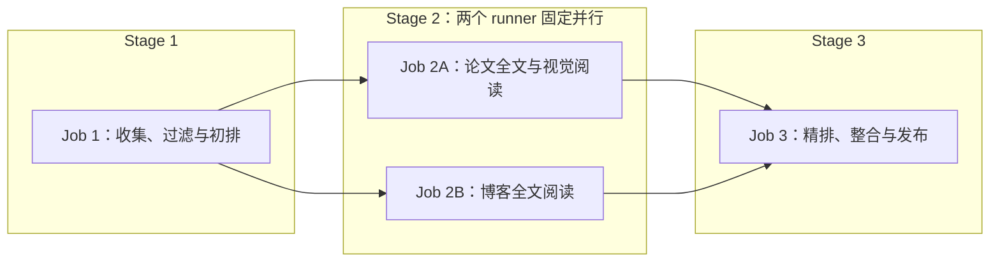

# RecSys Daily 全自动论文与行业情报站设计

日期：2026-08-09

状态：待最终评审

部署目标：GitHub Pages

运行环境：GitHub Actions + Docker

LLM：OpenAI-compatible API，默认面向 NVIDIA NIM

## 1. 目标

构建一个无需服务器和数据库、完全依靠 GitHub Actions 定时运行的中文推荐系统研究情报站。系统每天自动抓取学术论文和高质量工程博客，筛选与业务相关的内容，调用 LLM 生成中文摘要和结构化标签，随后部署到 GitHub Pages。

站点服务于以下推荐目标和业务场景：

- 推荐目标：`content`、`user`、`room`
- 文字流：Feed、文章、帖子、短内容推荐
- 语聊：语聊房、听众、主播、用户匹配与关系发现
- 直播间：直播内容、房间、主播和观众推荐
- 好友推荐：People You May Know、Follow Recommendation、Social Recommendation、Link Prediction
- 通用推荐技术：Retrieval、Ranking、Re-ranking、Multi-task Learning、Sequence Modeling、Graph Learning、LLM for Recommendation、Online Experimentation

系统输出为中文，但标题、算法名、数据集、指标和英文术语保留原文。

## 2. 非目标

首个版本明确不建设以下能力：

- 不运行常驻后端服务
- 不使用关系型数据库、Vector DB 或 Graph DB
- 不在 Git、缓存或 Pages artifact 中永久保存论文 PDF、TeX source archive、关键页面图片、博客原始 HTML 或任何提取全文
- 不在详情页嵌入 PDF、镜像论文/博客全文或提供站内全文阅读器
- 不建设复杂 RAG、聊天机器人或用户登录系统
- 不把知识图谱作为严格事实库或学术结论依据
- 不自动绕过来源站点的访问限制

知识图谱只承担导航、筛选和发现相邻内容的作用。

## 3. 每日输出规则

每天分别形成论文和博客两个推荐区：

| 内容类型 | 每日数量 | 规则 |
| --- | ---: | --- |
| 学术论文 | 目标 8 篇 | 优先新论文；不足时允许少于 8 篇，不填充低相关或重复论文 |
| 技术博客 | 目标 8 篇 | 优先未推荐的近期文章；不足时允许少于 8 篇，不为凑数降低阈值 |

因此每日页面最多展示 16 条新推荐。

系统按日运行。存在成功状态时，论文从 `last_success_at - 48 小时` 开始查询，博客从 `last_success_at - 7 天` 开始查询；重叠窗口用于容忍来源延迟和偶发漏跑，历史日报去重保证内容不会被重复推荐。任一类型不足 8 篇时允许少于 8 篇，并在运行报告中记录原因。

每条推荐至少包含：

- 原始英文标题
- 中文一句话总结
- 来源、作者、发布日期和原文链接
- 推荐目标：`content` / `user` / `room`
- 业务场景和技术主题标签
- 推荐理由与相关性分数
- LLM 生成状态和失败降级标记

## 4. 统一工作流与时间窗口

### 4.1 单工作流判定

冷启动和日常更新由同一个 `daily.yml`、同一个 Python CLI 包和同一套三阶段处理逻辑完成。生产 job 分别调用阶段子命令，本地 `run` 只是依次编排这些相同阶段；代码不接受独立的 cold-start/daily 模式参数，只根据 `data/state.json` 计算查询起始时间：

| 状态 | 论文起始时间 | 博客起始时间 |
| --- | --- | --- |
| 不存在有效状态 | 当前时间减 5 年 | 当前时间减 3 年 |
| 存在有效状态 | `last_success_at - 48 小时` | `last_success_at - 7 天` |

每次运行统一使用论文最多 100 篇、博客最多 50 篇，并从元数据初排结果中各取最多 16 篇进行临时全文解读，再分别重排出目标 8 篇。冷启动和日更使用完全相同的候选数、深读数和筛选代码，两种运行的唯一业务差异是时间范围。模型不设置每次运行调用次数上限；安全边界由候选数量、NVIDIA 40 RPM、单请求 context、每 worker 并发 1、有限重试和各 job 超时共同提供。

### 4.2 成功条件

所有待发布数据先写入临时工作目录。每次运行只有在以下步骤全部成功后，才提交正式数据和新的 `data/state.json`：

1. 必需来源完成抓取
2. 数据去重和 Schema 校验通过
3. LLM 结构化结果达到最低成功率
4. 知识图谱生成和裁剪通过
5. Docker 测试通过
6. 静态站点构建通过
7. GitHub Pages 部署成功

如果任一关键步骤失败，不提交新的 `state.json`。首次运行失败后，下次定时运行仍使用 5 年/3 年时间范围；日更失败后，下次运行仍从上一次成功时间回溯，不会跳过失败期间的内容。

博客 RSS 属于可选来源，单个 Feed 暂时失败只记录警告，避免某个公司博客故障导致整个工作流永远无法完成。来源配置仍支持将特定 Feed 标为 `required: true`。RSS 通常只返回近期条目，因此首次运行的“近 3 年、最多 50 篇”是接受范围和安全上限，不保证每个 Feed 都能回溯到 3 年前。

### 4.3 后续日更

存在有效状态后，同一管道使用增量时间窗口：

- 根据来源游标、发布日期和内容 ID 拉取新增候选
- 使用 arXiv ID、OpenReview ID、Canonical URL、DOI 和标准化标题去重
- 从候选中分别生成论文目标 8 篇、博客目标 8 篇
- 无新博客时仍正常发布论文日报
- 未产生任何新内容时只记录成功运行，不生成空日报

## 5. 来源设计

### 5.1 学术来源

| 来源 | 接口 | 作用 | 必需 |
| --- | --- | --- | --- |
| arXiv | 官方 Atom API | RecSys、IR、ML、Social Network、Multimedia 等论文主来源 | 是 |
| OpenReview | 官方 API v2 | ICLR、NeurIPS Workshop、RecSys Workshop 等投稿和会议内容 | 是 |

arXiv RSS 不作为独立论文来源启用，以免和 Atom API 重复。Atom API 能提供更完整的查询、分页和去重字段。

### 5.2 高质量 RSS/Atom 来源

以下地址已通过站点链接或 Feed 内容类型进行核验。核心来源默认启用；扩展来源同样可以默认启用，但使用更严格的关键词和 LLM 相关性阈值。

#### 核心来源

| ID | 来源 | Feed URL | 主要覆盖场景 | 默认权重 |
| --- | --- | --- | --- | ---: |
| `meta_engineering` | Meta Engineering | `https://engineering.fb.com/feed/` | 文字流、视频/直播、社交图、用户与内容推荐 | 1.00 |
| `netflix_techblog` | Netflix TechBlog | `https://netflixtechblog.com/feed` | 视频内容推荐、Ranking、Foundation Model | 1.00 |
| `spotify_engineering` | Spotify Engineering | `https://engineering.atspotify.com/feed/` | 音频推荐、用户偏好、序列建模 | 1.00 |
| `pinterest_engineering` | Pinterest Engineering | `https://medium.com/feed/pinterest-engineering` | Home Feed、Retrieval、Ranking、Graph、Ads | 1.00 |
| `discord_engineering` | Discord Engineering | `https://discord.com/blog/rss.xml` | 语聊、房间/社区、好友关系、Entity Embedding | 0.95 |

#### 扩展来源

| ID | 来源 | Feed URL | 主要覆盖场景 | 默认权重 |
| --- | --- | --- | --- | ---: |
| `airbnb_tech` | Airbnb Engineering & Data Science | `https://airbnb.tech/feed/` | Search/Ranking、双边市场、Embedding、Experimentation | 0.90 |
| `etsy_codeascraft` | Etsy Code as Craft | `https://www.etsy.com/codeascraft/rss` | Search、Ads、Recs、买家画像 | 0.90 |
| `google_research` | Google Research | `https://research.google/blog/rss/` | IR、ML、LLM、Graph 等研究进展 | 0.85 |
| `nvidia_developer` | NVIDIA Developer Blog | `https://developer.nvidia.com/blog/feed/` | GPU RecSys、推理优化、NIM 和 LLM 基础设施 | 0.80 |

#### 默认关闭的候选来源

这些来源质量高，但内容面过宽。保留在配置示例中，用户可自行启用：

| ID | 来源 | Feed URL |
| --- | --- | --- |
| `aws_ml_blog` | AWS Machine Learning Blog | `https://aws.amazon.com/blogs/machine-learning/feed/` |
| `microsoft_research` | Microsoft Research | `https://www.microsoft.com/en-us/research/feed/` |

ACM RecSys 官方站点和 LinkedIn Engineering 内容很相关，但当前不把未稳定确认的 RSS 端点放入默认配置。后续可以增加 `web_page` 适配器，或在确认官方 Feed 后仅修改 YAML，不需要改动主流程。

### 5.3 RSS 配置示例

实际实现使用 `config/sources.yaml`：

```yaml
academic:
  - id: arxiv
    kind: arxiv
    enabled: true
    required: true
    weight: 1.0

  - id: openreview
    kind: openreview
    enabled: true
    required: true
    weight: 1.0

blogs:
  - id: meta_engineering
    kind: rss
    name: Meta Engineering
    url: https://engineering.fb.com/feed/
    enabled: true
    required: false
    weight: 1.0
    scenarios: [text_feed, livestream, friend_recommendation]

  - id: netflix_techblog
    kind: rss
    name: Netflix TechBlog
    url: https://netflixtechblog.com/feed
    enabled: true
    required: false
    weight: 1.0
    scenarios: [text_feed, livestream]

  - id: spotify_engineering
    kind: rss
    name: Spotify Engineering
    url: https://engineering.atspotify.com/feed/
    enabled: true
    required: false
    weight: 1.0
    scenarios: [voice_chat, user_recommendation]

  - id: pinterest_engineering
    kind: rss
    name: Pinterest Engineering
    url: https://medium.com/feed/pinterest-engineering
    enabled: true
    required: false
    weight: 1.0
    scenarios: [text_feed]

  - id: discord_engineering
    kind: rss
    name: Discord Engineering
    url: https://discord.com/blog/rss.xml
    enabled: true
    required: false
    weight: 0.95
    scenarios: [voice_chat, room_recommendation, friend_recommendation]

  - id: airbnb_tech
    kind: rss
    name: Airbnb Engineering & Data Science
    url: https://airbnb.tech/feed/
    enabled: true
    required: false
    weight: 0.90

  - id: etsy_codeascraft
    kind: rss
    name: Etsy Code as Craft
    url: https://www.etsy.com/codeascraft/rss
    enabled: true
    required: false
    weight: 0.90

  - id: google_research
    kind: rss
    name: Google Research
    url: https://research.google/blog/rss/
    enabled: true
    required: false
    weight: 0.85

  - id: nvidia_developer
    kind: rss
    name: NVIDIA Developer Blog
    url: https://developer.nvidia.com/blog/feed/
    enabled: true
    required: false
    weight: 0.80
```

每个 Feed 每天只拉取一次，并保存 `ETag`、`Last-Modified` 和最近成功时间。支持 RSS 2.0 与 Atom，Canonical URL 相同的文章只保留一条。

## 6. 用户可编辑主题配置

主题、场景、任务和方法都由 `config/topics.yaml` 控制。用户增加新方向时无需修改代码。

```yaml
targets:
  - id: content
    name_zh: 内容推荐
    terms: [content recommendation, item recommendation]
  - id: user
    name_zh: 用户推荐
    terms: [user recommendation, people recommendation]
  - id: room
    name_zh: 房间推荐
    terms: [room recommendation, live room recommendation]

scenarios:
  - id: text_feed
    name_zh: 文字流
    terms: [feed ranking, news feed, post recommendation]
  - id: voice_chat
    name_zh: 语聊
    terms: [voice chat, social audio, listener matching]
  - id: livestream
    name_zh: 直播间
    terms: [live streaming, live room, host recommendation]
  - id: friend_recommendation
    name_zh: 好友推荐
    terms:
      - people you may know
      - friend recommendation
      - follow recommendation
      - social recommendation
      - link prediction

tasks:
  - retrieval
  - ranking
  - reranking
  - user_matching
  - link_prediction
  - multi_objective_optimization

methods:
  - collaborative_filtering
  - two_tower
  - sequence_modeling
  - graph_neural_network
  - reinforcement_learning
  - large_language_model
  - multi_task_learning
```

系统启动时验证 ID 唯一性、字段完整性和引用关系。配置错误会使构建明确失败，不会静默忽略。

## 7. 数据管道

管道采用单个 Python 包和一个 CLI。生产工作流调用明确的阶段命令，本地 `run` 命令按相同顺序完成端到端编排：

```text
python -m recsys_daily run
python -m recsys_daily collect-filter --output <dir>
python -m recsys_daily deep-read --kind paper --input <dir> --output <dir>
python -m recsys_daily deep-read --kind blog --input <dir> --output <dir>
python -m recsys_daily rank-publish --input <dir>
python -m recsys_daily test-fixtures
python -m recsys_daily build-data
```

处理阶段：



### 7.1 去重键

按优先级使用：

1. arXiv ID / OpenReview Forum ID
2. DOI
3. Canonical URL
4. 标准化标题哈希

标题标准化只作为最后降级手段，不合并标题相似但实际不同的论文版本。

### 7.2 两阶段筛选

为减少 LLM 调用，先做确定性预筛：

- 主题词、场景词、任务词匹配
- arXiv category / OpenReview venue
- 来源质量权重
- 发布时间和新颖度
- 与历史推荐的重复惩罚

每次运行都先用确定性规则把抓取结果限制在论文最多 100 篇、博客最多 50 篇，再将所有通过预筛的候选按批次交给 LLM。LLM 在一次结构化输出中同时给出相关性、中文一句话摘要、标签、图谱关系和证据，避免为同一条内容重复执行元数据分析。初排后，论文和博客各取 Top 16 进入全文深读；若不足 16 篇则全部进入。系统最后用深读质量、证据强度、业务价值和初排分数组合重排，各选目标 8 篇。日更因为时间窗口较短，实际候选量通常远低于首次运行，但不使用另一套 shortlist 逻辑。

元数据初排分数示意：

```text
metadata_score = 0.30 * topic_relevance
               + 0.25 * scenario_relevance
               + 0.15 * source_quality
               + 0.15 * novelty
               + 0.10 * practical_value
               + 0.05 * recency

final_score = 0.55 * metadata_score
            + 0.20 * evidence_quality
            + 0.15 * business_transferability
            + 0.10 * technical_depth
```

权重由 `config/settings.yaml` 调整。相同分数使用发布日期、source ID 和 stable ID 做确定性 tie-break，保证 fixtures 与重复运行结果稳定。

### 7.3 论文与博客全文深度解读

全文处理发生在元数据初排之后、最终推荐之前。每次最多处理 Top 16 论文和 Top 16 博客，深读结果参与最终重排，而不是只给已入选内容补充详情。该阶段是统一管道的固定部分，不为冷启动建立另一套流程。

论文处理规则：

1. 按 `arXiv HTML → 安全解析 TeX source → PDF text → Abstract` 的顺序获取正文；OpenReview 没有统一原稿格式时从 PDF text 开始
2. 只访问来源提供的公开地址，不尝试绕过登录、付费墙或访问控制；TeX archive 只读取受限扩展名和 `\\input`/`\\include` 关系，不编译、不执行任何 TeX 命令
3. PDF 串行下载到 runner 临时目录，单篇最大 20 MB、最多 80 页；提取后按 section heading 识别 Abstract、Introduction、Method、Experiments、Results、Limitations 和 Conclusion
4. 本地规则根据 Figure/Table caption、页面图片和章节位置识别所有关键页面，包括 Overview、Architecture、Main Results、Ablation 和 Case Study
5. 检测到关键页面时，每篇论文恰好调用一次 VLM；应用层不设置关键页面数量上限，将识别出的全部关键页面放入同一请求。没有关键页面时不发起零图片调用。provider adapter 只受模型 context、HTTP payload 和图像格式等真实协议约束，不按固定页数丢弃页面
6. VLM 输出页面级 Architecture、Table、Chart 和视觉限制证据；没有关键页面时标记 `not_required`，VLM 失败时标记 `unavailable`，两种情况都继续文本深读且不因缺少图片降低论文分数
7. 每篇论文再调用一次文本 LLM，将全文与 VLM 结构化证据合并为中文深度解读；输入超过文本模型 context 预算时按章节重要性和 token 数裁剪，不进行扫描版 OCR

博客处理规则：

1. 优先使用 RSS/Atom 中的 `content:encoded` 或 Atom `content`；若 Feed 只有 excerpt，再访问 canonical URL 的公开文章 HTML
2. 不绕过登录、付费墙、robots 或其他访问控制；被限制、拒绝或条款不允许自动抓取时直接降级
3. HTML 单篇最大 5 MB，使用 `trafilatura` 提取正文、标题和 heading，忽略脚本、样式、图片及导航区域
4. 同一域名并发为 1，带可识别 User-Agent，并使用请求间隔、`Retry-After` 和有限退避重试
5. 每篇博客单独调用一次 LLM，生成中文结构化解读

两类内容都遵循以下规则：

- 单次 LLM 输入使用 token-aware budgeting：1M context 中预留 output 与 prompt/schema 空间，其余预算用于全文；超长内容优先保留摘要、架构、方法、实验/结果、限制和结论等高价值段落
- 无论成功、降级或异常中断，都在 `finally` 阶段删除 source archive、PDF、关键页面图片、原始 HTML 和提取文本；它们不得进入 cache、日志、artifact 或 Git
- Top 16 候选的结构化深度解读与全文指纹写入 canonical item；未来遇到相同来源修订和指纹时可复用解读，无需再次抓取全文
- 只保存转述后的结构化分析和短证据定位，不保存长段原文

共同解读字段包括：

- 问题背景、核心贡献与主要方法
- 证据强度、关键结果、局限性与适用边界
- 对文字流、语聊、直播间、好友推荐的业务启示
- 相关工作和知识图谱关系

论文额外包括 Datasets、Baselines、Metrics、实验设计和关键 findings；博客额外包括 System Context、Architecture / Implementation、Production Constraints、Engineering Trade-offs、线上结果与可复用经验。论文证据只保存 section 名和 PDF page number；博客证据只保存 heading 或 section 名，不复制长段原文。

论文正文依据分别写入 `analysis_basis: arxiv_html`、`tex_source`、`pdf_text` 或 `abstract_fallback`，视觉状态独立写入 `visual_analysis.status: completed | not_required | unavailable`，避免组合枚举。博客使用 Feed 全文时写入 `rss_full_content`，成功提取公开网页正文时写入 `article_html`，失败时使用 excerpt 生成较短解读并写入 `excerpt_fallback`。详情页必须明确显示正文和视觉分析依据，不能把降级结果冒充全文深读。

所有下载都必须遵循来源访问规则。[arXiv automated-access guidance](https://info.arxiv.org/help/robots.html) 不允许无差别自动下载，因此论文 runner 内只串行处理初排 Top 16 论文，而不抓取候选全集。论文和博客正文都不在本站再发布；具体许可信息随 item 保存，并始终链接到原站。

## 8. LLM 与 API 限制

### 8.1 OpenAI-compatible 模型接口

```yaml
models:
  text:
    provider: nvidia
    base_url_env: NVIDIA_BASE_URL
    api_key_env: NVIDIA_API_KEY
    model: nvidia/nemotron-3-super-120b-a12b
    context_window_tokens: 1000000
    reserved_prompt_tokens: 8000
    reserved_output_tokens: 16000
    concurrency_per_worker: 1
    batch_size: 8
    timeout_seconds: 600
    retries: 3

  vision:
    provider: nvidia
    base_url_env: NVIDIA_BASE_URL
    api_key_env: NVIDIA_API_KEY
    model: nvidia/nemotron-3-nano-omni-30b-a3b-reasoning
    context_window_tokens: 262144
    max_requests_per_paper: 1
    include_all_detected_key_pages: true
    timeout_seconds: 600
    retries: 3

  alternatives:
    deepseek_v4_flash:
      provider: deepseek
      base_url: https://api.deepseek.com
      api_key_env: DEEPSEEK_API_KEY
      model: deepseek-v4-flash
      context_window_tokens: 1000000
```

NVIDIA NIM 的默认部署值为：

```text
NVIDIA_BASE_URL=https://integrate.api.nvidia.com/v1
```

首版默认完全基于 NVIDIA：Nemotron 3 Super 负责候选分析、全文解读、精排与中文生成，Nemotron 3 Nano Omni 负责论文视觉证据。DeepSeek V4 Flash 只作为显式可切换的 alternative provider；系统不因超时、`429` 或输出质量自动混用模型。切换模型只改配置，canonical item 记录实际 `provider`、`model`、thinking 设置和生成时间，保证结果可追踪。

代码暴露 `TextModelProvider` 与 `VisionModelProvider` 两个接口。NVIDIA 和 DeepSeek 共享 OpenAI-compatible 基础客户端，各 adapter 只处理 reasoning 参数、JSON mode、错误格式和能力发现差异。启动时验证所配置 endpoint 的模型存在、context 能力满足配置且必要模态可用。API Key 只存在 GitHub Actions Secrets 中，绝不写入仓库、Docker image 或构建产物。

### 8.2 限流和恢复

统一 HTTP 客户端负责：

- 固定超时
- 最多 3 次有限重试
- Exponential Backoff + jitter
- 尊重 `Retry-After`
- 对 `401/403` 直接失败，不盲目重试
- 对 `429/5xx` 有界重试
- 记录请求次数、状态码、批次和 Token 使用量
- 不在日志中输出 Secret 或完整 Authorization Header

默认限制：

```yaml
limits:
  http_concurrency: 2
  nvidia_hard_rpm: 40
  nvidia_target_rpm: 30
  nvidia_parallel_workers: 2
  nvidia_concurrency_per_worker: 1
  nvidia_min_interval_seconds_per_worker: 4
  rss_requests_per_run_per_source: 1
  arxiv_min_interval_seconds: 3
  request_timeout_seconds: 45
  retry_attempts: 3
  max_papers_per_run: 100
  max_blogs_per_run: 50
  deep_reading_candidates_per_type: 16
  max_pdf_downloads_per_run: 16
  max_blog_fulltext_fetches_per_run: 16
  pdf_download_concurrency: 1
  blog_download_concurrency_per_domain: 1
  blog_min_interval_seconds_per_domain: 2
  max_pdf_bytes: 20971520
  max_pdf_pages: 80
  max_blog_html_bytes: 5242880
```

NVIDIA endpoint 硬限制按 40 RPM 设计，系统主动把两个并行全文 runner 的合计目标控制在 30 RPM。每个 runner 只允许 1 个在途模型请求且请求启动至少间隔 4 秒；论文和博客 runner 分别错开启动，所有重试也必须重新经过限流器，不能绕过预算。因为两个 runner 固定且不再引入其他复杂并行方式，所以无需外部协调服务。

每次运行最多处理 150 条候选，摘要阶段按每批 8 条调用文本 LLM，满额时约 19 次正常调用；Top 16 论文最多各使用 1 次 VLM（仅在检测到关键页面时）并各使用 1 次文本深读，Top 16 博客各使用 1 次文本深读，因此冷启动满额时最多约 67 次正常调用。日更因候选较少且可复用未变更的既有深读结果，通常调用更少。系统不设置模型每次运行调用次数上限；单请求 context、候选数量、40 RPM、每 worker 并发 1、有限重试和各 job timeout 是实际边界。

文本模型按 1M context 配置，VLM 按其独立的 262,144 context 配置。发送请求前必须读取模型配置并用 tokenizer 或保守估算计算预算：`可用正文 tokens = context window - prompt/schema - reserved output`。模型实际 context 小于配置值时校验必须失败或显式改小，不能在服务端静默截断。VLM 的“全部关键页面”没有应用级页数上限，但仍必须满足 endpoint 的 context、payload 和图像协议；adapter 在一次请求内编码所有关键页面并在超出真实协议能力时返回明确的 `unavailable`，不得静默丢页或拆成多次调用。

如果 LLM 个别批次失败，允许降级使用英文摘要截断和规则标签，但每次运行都要求至少 90% 候选完成结构化分析；最终进入当日推荐的条目必须 100% 拥有可展示摘要，否则不进入推荐。该规则不区分首次运行和日更。

## 9. 数据模型与仓库结构

```text
.
├── .github/workflows/
│   ├── daily.yml
│   └── verify.yml
├── config/
│   ├── sources.yaml
│   ├── topics.yaml
│   ├── models.yaml
│   └── settings.yaml
├── data/
│   ├── state.json
│   ├── items/
│   │   ├── papers/
│   │   │   └── YYYY/MM/<stable-id>.json
│   │   └── blogs/
│   │       └── YYYY/MM/<stable-id>.json
│   ├── digests/
│   │   └── YYYY/MM/YYYY-MM-DD.json
│   └── runs/
│       └── YYYY/MM/<run-id>.json
├── pipeline/
│   ├── recsys_daily/
│   └── tests/
├── site/
│   └── Astro static site
├── fixtures/
├── Dockerfile
├── compose.yaml
└── scripts/dev.ps1
```

`data/items` 是唯一的内容事实来源，每篇论文或博客使用一个稳定 JSON 文件，并按首次发布日期的年/月分片。每天最多为 Top 16 论文和 Top 16 博客保存或更新结构化深读记录，单月通常不超过约 1,000 个新文件，仍低于 GitHub 建议的单目录 3,000 个条目上限。内容更新时覆盖同一个 stable ID 文件，由 Git 历史保留版本差异；未进入最终各 8 篇推荐的深读候选也保留结构化结果，以供后续重排复用。

日报文件只保存日期、排序、推荐理由和 item ID，不复制标题、摘要等完整内容。运行报告按年月和 run ID 分片；`state.json` 保持为单个小文件，用于保存最后成功时间、来源游标、ETag 和 `Last-Modified`。

以下内容不提交 Git：RSS/API 原始响应、TeX source archive、PDF、PDF 提取全文、全文 HTML、关键页面图片、其他图片副本、完整 LLM/VLM prompt/response、HTTP cache、Node/Python cache、Astro `dist`、搜索索引和 `graph.json`。图谱、搜索索引、详情页和归档页都在构建时从 canonical item 文件派生，只进入 GitHub Pages artifact。Git 只保存模型生成的结构化深度解读、视觉观察及其分析依据。

存储保护规则：

```yaml
storage:
  target_item_bytes: 16384
  max_item_bytes: 32768
  max_blog_excerpt_chars: 4000
  warn_repository_data_mb: 500
  warn_pages_artifact_mb: 500
  fail_pages_artifact_mb: 900
```

结构化深读以约 16 KB/条为目标；32 条/日的理论新增量约 187 MB/年，实际日更不足 32 条且已有指纹可复用时会更低。单条超过 32 KB 时先压缩冗余解释和非核心 excerpt，但不截断标题、作者、标识符、链接、结论和结构化标签。仓库数据达到 500 MB 时在运行报告中告警，提示用户降低深读候选数或迁移历史归档；Pages artifact 达到 500 MB 时告警、达到 900 MB 时构建失败，为 GitHub Pages 的 1 GB 上限和 10 分钟部署超时保留余量。

[GitHub Repository limits](https://docs.github.com/en/repositories/creating-and-managing-repositories/repository-limits) 当前建议单个目录不超过 3,000 个条目；[GitHub large-file guidance](https://docs.github.com/en/repositories/working-with-files/managing-large-files/about-large-files-on-github) 建议仓库最好保持在 1 GB 以下。[GitHub Pages limits](https://docs.github.com/en/pages/getting-started-with-github-pages/github-pages-limits) 要求发布站点不超过 1 GB。该结构以年月分片并排除生成物，目标是让正常运行多年后仍保持在建议范围内。

单条内容的核心 Schema：

```json
{
  "id": "stable-id",
  "kind": "paper",
  "source": "arxiv",
  "title": "Original English Title",
  "url": "https://...",
  "published_at": "2026-08-09T00:00:00Z",
  "summary_zh": "一句中文总结，保留关键 English terms。",
  "targets": ["user"],
  "scenarios": ["friend_recommendation"],
  "tasks": ["link_prediction", "ranking"],
  "methods": ["graph_neural_network"],
  "relevance_score": 0.92,
  "content_fingerprint": "sha256:...",
  "graph_relations": [],
  "deep_reading": {
    "analysis_basis": "pdf_text",
    "visual_analysis": {
      "status": "completed",
      "provider": "nvidia",
      "model": "nvidia/nemotron-3-nano-omni-30b-a3b-reasoning",
      "pages": [2, 6, 7, 9],
      "architecture_zh": "架构图的结构化解释。",
      "table_findings_zh": [],
      "chart_findings_zh": [],
      "limitations_zh": []
    },
    "problem_zh": "研究问题与背景。",
    "contributions_zh": ["核心贡献。"],
    "method_zh": "方法与模型结构。",
    "experiments": {
      "datasets": [],
      "baselines": [],
      "metrics": [],
      "findings_zh": []
    },
    "limitations_zh": [],
    "business_implications_zh": [],
    "evidence_refs": [
      {"section": "Experiments", "page": 6}
    ]
  },
  "llm": {
    "provider": "nvidia",
    "model": "configured-model",
    "generated_at": "2026-08-09T00:00:00Z",
    "degraded": false
  }
}
```

论文 `analysis_basis` 为 `arxiv_html`、`tex_source`、`pdf_text` 或 `abstract_fallback`；`visual_analysis.status` 为 `completed`、`not_required` 或 `unavailable`，只有 `completed` 必须包含 provider、model、pages 和视觉 findings。博客 item 使用相同公共字段，但 `analysis_basis` 为 `rss_full_content`、`article_html` 或 `excerpt_fallback`，深读分支保存 `system_context_zh`、`architecture_zh`、`implementation_zh`、`production_constraints_zh`、`tradeoffs_zh`、`results_zh` 和 `lessons_zh`。博客证据定位使用 heading/section，不使用 PDF page。JSON Schema 使用按 `kind` 区分的 `oneOf` 约束，避免把论文实验字段强加给博客。

## 10. 静态站点

前端使用 Astro + TypeScript，输出纯静态文件：

- `/`：当天简报，论文和博客各目标 8 篇
- `/papers/<id>/`：论文详情页
- `/articles/<id>/`：博客详情页
- `/archive/`：按日期和标签浏览历史日报
- `/graph/`：轻量交互知识图谱
- `/about/`：配置范围、来源和免责声明

论文详情页展示：

- 原始标题和中文一句话结论
- 原始摘要
- 研究问题、核心贡献和 Method / Model Architecture
- Datasets、Baselines、Metrics 与关键实验结果
- 局限性、适用边界和业务启示
- section/page 级证据引用
- `arxiv_html`、`tex_source`、`pdf_text` 或 `abstract_fallback` 正文依据，以及 `completed`、`not_required` 或 `unavailable` 视觉状态
- 视觉模型对 Architecture、Table 和 Chart 的页面级结构化观察与限制说明
- 场景、任务和方法标签
- 与当前内容相邻的论文/博客
- 原文、arXiv、OpenReview 或 DOI 外部链接；不在站内嵌入 PDF
- “LLM 生成，可能存在错误”的明确提示

博客详情页展示：

- 原始标题、Feed excerpt 和中文一句话结论
- System Context、Architecture / Implementation 与关键技术方案
- Production Constraints、Engineering Trade-offs、线上结果和可复用经验
- 局限性、适用边界和对四类业务场景的启示
- heading/section 级证据定位
- `rss_full_content`、`article_html` 或 `excerpt_fallback` 分析依据标记
- 标签、相关论文/博客和原文外链
- “LLM 生成，可能存在错误”的明确提示

详情页只展示结构化转述，不复制、镜像或缓存博客全文。

## 11. 轻量交互知识图谱

图谱使用 Cytoscape.js，仅加载构建时生成的静态 JSON。

节点类型：

- `paper`
- `article`
- `scenario`
- `target`
- `task`
- `method`

边包含：

- `type`
- `confidence`
- `evidence`
- `generated_by`

交互功能：

- 平移、缩放和拖动
- 按关键词搜索
- 按时间、场景、目标、任务和方法筛选
- 点击节点高亮一跳邻居
- 侧边栏展示摘要和详情页链接
- 从日报或详情页打开以该内容为中心的局部子图

### 11.1 防止图谱臃肿

图谱不是无限追加的全历史图，而是每次构建从 `data/items` 派生：

- 默认可见论文/博客节点总数最多 80
- 优先最近 90 天、高相关和高连接内容
- 旧内容按主题聚合，不默认展开
- 主题、场景、目标、任务和方法节点来自受控 YAML，数量稳定
- 图谱边只保留可见内容节点相关的高置信关系
- 用户筛选后再加载/显示局部子图

历史内容仍可从归档和详情页访问，不需要全部同时出现在图谱中。

## 12. Docker 与本地开发

整个项目使用单个应用镜像，不启动数据库或其他 Compose 服务。镜像包含 Python pipeline 和 Node/Astro build 环境。

PowerShell 本地命令：

```powershell
docker compose build
docker compose run --rm app test
docker compose run --rm app build
docker compose run --rm app run
```

便捷脚本：

```powershell
.\scripts\dev.ps1 test
.\scripts\dev.ps1 build
.\scripts\dev.ps1 run
```

测试默认使用 `fixtures/`，不需要真实 API Key。真实 pipeline 命令显式读取 `.env` 或命令行环境变量；`.env` 被 `.gitignore` 排除。

## 13. GitHub Actions

`daily.yml` 是唯一访问真实来源、调用 LLM、写入数据并部署 Pages 的运行工作流。`verify.yml` 只使用 fixtures 做代码验证，不承担冷启动或日更，因此不会复制生产管道逻辑。

### 13.1 verify.yml

触发条件：Pull Request、相关代码或配置 Push。

执行：

1. 构建 Docker image
2. 运行 Python 单元测试
3. 使用 fixtures 运行端到端 pipeline
4. 验证 JSON Schema
5. 构建 Astro 静态站点

### 13.2 daily.yml

触发条件：

- 每日定时运行，默认北京时间 08:23（UTC 00:23），避开整点高峰
- `workflow_dispatch` 手动运行

生产 workflow 分为三个逻辑阶段和四个物理 job；每个 job 都使用同一个 Dockerfile，并通过 GitHub Actions layer cache 避免重复构建完整镜像。

#### Job 1：collect-filter

- job ID 为 `collect_filter`
- `timeout-minutes: 120`
- 只读仓库权限
- 读取 `state.json`、计算时间窗口、抓取与去重、规则预筛、NVIDIA 文本模型批量分析
- 选出论文和博客各 Top 16
- 执行 `python -m recsys_daily collect-filter --output /workspace/stage-1`
- 上传 `stage-1-<run-id>` artifact，`retention-days: 1`

Artifact 只包含 `manifest.json`、`papers.jsonl` 和 `blogs.jsonl`。`manifest.json` 保存 `run_id`、触发 commit、state hash、config hash 和 schema version；不包含原始 API/RSS 响应或全文。

#### Job 2：deep-read

- job ID 为 `deep_read`，依赖 `needs: collect_filter`
- `timeout-minutes: 300`
- 只读仓库权限
- 固定 matrix 为 `kind: [paper, blog]`，`max-parallel: 2`，不再按候选或页数创建其他并行 job
- 两个 runner 下载同一个 stage-1 artifact，并分别执行 `deep-read --kind paper` 与 `deep-read --kind blog`
- 论文 runner 完成 Top 16 正文阅读，并在存在关键页面时为每篇论文发起恰好一次 VLM 视觉阅读；博客 runner 完成 Top 16 全文阅读
- 分别上传 `deep-reading-paper-<run-id>` 和 `deep-reading-blog-<run-id>` 结构化 artifact，`retention-days: 1`

两个全文 runner 各自并发为 1、最短请求间隔 4 秒，合计目标不超过 30 RPM。论文和博客固定并行可以为两类内容分别获得最多 5 小时执行时间，同时不引入候选分片、动态 matrix 或其他复杂调度。

#### Job 3：rank-integrate-publish

- job ID 为 `rank_integrate_publish`，依赖 `needs: [collect_filter, deep_read]`
- `timeout-minutes: 180`
- 下载三个结构化 artifact，并验证 `run_id`、commit、state/config hash 和 schema version 一致
- 执行 `python -m recsys_daily rank-publish --input /workspace/stages`
- 基于已经包含视觉证据的论文深读和博客深读各精排目标 8 篇
- 生成 canonical items、日报、详情页、图谱和运行报告
- 在容器内执行完整测试、Schema 校验与 Astro build
- 上传并部署 Pages artifact
- 部署成功后提交 `data/` 和最终 `state.json`

只有该 job 授予 `contents: write`、`pages: write` 和 `id-token: write`。原始 PDF、TeX、HTML、提取全文或关键页面图片不能出现在任何跨 job artifact；GitHub artifact 只用于传递结构化候选与分析结果。[GitHub workflow artifacts](https://docs.github.com/en/actions/concepts/workflows-and-actions/workflow-artifacts) 支持同一 workflow 内跨 job 传递文件，依赖关系使用 `needs`。

工作流公共设置：

- `concurrency.group: recsys-daily`
- `cancel-in-progress: false`
- 各 job 的 timeout 均低于 [GitHub Actions limits](https://docs.github.com/en/actions/reference/limits) 规定的 GitHub-hosted job 6 小时上限；官方还规定单次 workflow 最长 35 天，而本系统的理论墙钟上限约为 `2 + max(5, 5) + 3 = 10` 小时，也低于每日调度间隔
- Job 1 失败时不启动全文 job；任一全文 job 失败时不启动正式发布；任一失败都不写 `state.json`
- GitHub UI 重新运行失败 job 时可复用同一 workflow 中仍有效的成功 artifact，并以相同 manifest 防止跨批次混用

如果 Pages 部署成功但数据提交失败，下次仍会重试同一批次。站点可能暂时已有内容，但仓库状态不会被错误标为完成。

## 14. 测试策略

Python 单元测试覆盖：

- YAML 配置校验
- 冷启动/日更状态判断
- 时间窗口和数量上限
- 多来源标准化与去重
- 确定性评分
- NVIDIA 默认 provider、DeepSeek V4 Flash alternative provider、显式切换和实际模型审计字段
- OpenAI-compatible adapter 的 reasoning/JSON 差异、模型能力发现、JSON 解析和降级
- 深度解读 Schema 和 `analysis_basis` 标记
- 论文和博客各 Top 16 深读、基于深读结果重排并最终各选目标 8 篇
- 论文的 arXiv HTML、TeX source、PDF text 与 Abstract 降级顺序；TeX 安全解压且从不编译
- 存在关键页面的论文恰好一次 VLM 调用；无关键页面时不调用并标记 `not_required`；超过 5 个关键页面时仍在同一请求中全部传入，不存在应用级页数上限
- `visual_analysis` 的 `completed`、`not_required`、`unavailable` 状态，以及视觉失败不降低无图论文分数
- PDF 数量、大小、页数、下载超时和串行限制
- PDF 无法下载或解析时的 `abstract_fallback`
- RSS/Atom 全文优先、公开 HTML 正文提取、大小限制和同域串行限速
- 博客正文受限、下载或解析失败时的 `excerpt_fallback`
- 1M context 的 token-aware budgeting、prompt/output 预留和模型能力校验
- 不存在 LLM 每次运行调用次数上限，同时重试次数仍然有界
- 两个全文 runner 固定并行、每 worker 并发 1、合计目标 30 RPM 和硬上限 40 RPM；重试同样经过限流器
- stage manifest 的 run/commit/state/config/schema 校验，以及跨 job artifact 不匹配时拒绝发布
- 博客正文净化、prompt-injection 隔离、URL 重定向后重新校验
- 成功、失败和异常中断后临时 TeX、PDF、关键页面图片、HTML 与提取全文清理
- `data/`、跨 job artifact 与 Pages artifact 中不存在 TeX、PDF、关键页面图片、提取全文或全文 HTML
- `429`、`Retry-After` 与重试边界
- 冷启动失败不写状态
- 图谱节点上限和裁剪

端到端 fixtures 覆盖：

- 首次 cold-start 成功
- cold-start 中途失败
- 后续 daily 增量
- 某个可选 RSS 失败
- 没有博客但有论文
- 论文或博客不足 8 篇
- Top 16 深读候选中的部分全文抓取失败并正确降级
- LLM 部分批次失败
- collect-filter、论文深读、博客深读或 rank-publish 任一 job 失败时都不写状态
- 成功 artifact 在只重跑失败 job 时可复用，且不同 run 的 artifact 不会混用

前端验证以 Astro build、链接检查和关键页面快照为主，不引入浏览器测试集群。

## 15. 安全、合规和可观测性

- 只保存公开元数据、摘要、短 excerpt 和 LLM 结构化深度解读，不镜像或嵌入受版权保护的全文
- 只对初排 Top 16 论文临时访问公开 HTML/TeX/PDF；博客优先使用 Feed 全文，必要时最多访问 Top 16 篇公开文章 HTML
- 论文和博客抓取都遵守来源访问规则、robots 与站点条款，不绕过登录、付费墙或反自动化限制
- RSS、PDF 和 HTML 一律视为不可信输入；只允许公开 `https`/`http` URL，每次重定向后重新解析并拒绝 loopback、私网和 link-local 地址
- TeX source archive 同样视为不可信输入，限制压缩包与解压后大小、文件扩展名、路径和 symlink，且永不编译或执行
- HTML 不执行脚本；LLM prompt 明确把正文包裹为只读资料并忽略其中指令，输出仍须通过严格 JSON Schema 校验
- 临时 source archive、PDF、关键页面图片、原始 HTML 和提取文本不进入 Git、cache、日志、跨 job artifact 或 Pages artifact
- 深度解读使用转述和 section/page 或 heading/section 引用，不发布长段原文
- 每个页面保留原始来源链接和发布时间
- 遵循各 API 的使用政策、分页规则和请求间隔
- 不把 Secret 写入日志、缓存、artifact 或静态页面
- 每次运行写 `data/runs/YYYY/MM/<run-id>.json`，记录来源成功/失败、候选数量、推荐数量、LLM 调用量和告警
- 页面展示生成模型和生成时间，但不暴露 API Key、内部请求头或完整 prompt

## 16. 验收标准

首个版本完成时必须满足：

1. 空仓库状态下第一次 scheduled/manual 运行能自动使用冷启动时间范围
2. 冷启动论文限制为近 5 年最多 100 篇，博客限制为近 3 年最多 50 篇
3. 冷启动关键失败时远端仓库不存在完成状态
4. 后续每日运行自动使用增量时间范围，冷启动和日更除时间范围外共用同一套处理逻辑和安全上限
5. 每日论文和博客各目标 8 篇；候选不足时允许少于 8 篇，但不使用低相关或重复内容填充
6. 每条推荐拥有中文一句话摘要并保留关键英文术语
7. 用户可通过 YAML 修改主题、场景、好友推荐范围和 RSS 来源
8. 站点包含日报、详情、归档和可交互轻量图谱
9. 图谱默认内容节点不超过 80，历史增长不会导致页面无限臃肿
10. 本地测试和构建完全通过 Docker 完成
11. GitHub Actions 使用同一 Dockerfile，并对 API 限流、429 和失败重试有测试覆盖
12. GitHub Pages 部署不依赖任何常驻服务器
13. canonical item 按类型和年月分文件保存，日报只引用 item ID，构建产物和原始响应不进入 Git
14. `daily.yml` 使用 collect-filter、并行的 paper/blog deep-read 和 rank-integrate-publish 三个逻辑阶段；job timeout 分别为 120、300 和 180 分钟，单 job 不超过 5 小时，理论墙钟上限约 10 小时
15. 每次运行从论文和博客元数据初排结果中各取最多 16 篇临时全文深读，再依据深读结果各选目标 8 篇；不足 16 篇时处理全部候选
16. Top 16 论文在全文 runner 中检测关键页面；存在关键页面的论文恰好调用一次 VLM，单次调用包含全部识别出的关键页面且不设应用级页数上限；无关键页面不调用并标记 `not_required`，视觉失败或无关键页面不阻断文本深读
17. 每日入选论文和博客均拥有结构化深度解读并明确标记分析依据；source archive、PDF、关键页面图片、原始 HTML 和提取全文只存在于对应 runner 临时目录，站点不保存、不镜像且不嵌入原始全文
18. 默认文本模型为 NVIDIA Nemotron 3 Super、视觉模型为 NVIDIA Nemotron 3 Nano Omni；DeepSeek V4 Flash 作为显式可切换接口保留，但运行中不自动混用 provider
19. 模型不设置每次运行调用次数上限；文本单请求按 1M context 做 token-aware budgeting，两个全文 runner 固定并行且总目标 30 RPM、硬上限 40 RPM、每 worker 并发 1、有限重试
20. 任一 stage/job 失败都不写 `state.json`；跨 job 只传递 retention 1 天的结构化 artifact，并在发布前验证 manifest 一致性

## 17. 后续可选增强

不纳入首版，但保留扩展接口：

- LinkedIn Engineering、Twitch、YouTube 等网页来源适配器
- 邮件、Telegram、Slack 或飞书推送
- 用户收藏、评分和个性化 reranking
- 扫描版 PDF OCR、公式级符号解析和跨图表数值校验
- 向量搜索和问答
- OPML 导入/导出
