# RecSys Daily 全自动论文与行业情报站设计

日期：2026-08-09

状态：待最终评审

部署目标：GitHub Pages

运行环境：GitHub Actions + Docker

LLM：OpenAI-compatible API，默认面向 NVIDIA NIM

## 1. 目标

构建一个无需服务器和数据库、完全依靠 GitHub Actions 定时运行的中文推荐系统研究情报站。系统每天自动抓取学术论文和高质量工程博客，筛选与业务相关的内容，调用 LLM 生成中文摘要和结构化标签，随后部署到 GitHub Pages。

站点服务于以下推荐目标和业务场景：

- 推荐目标：`content`、`user`、`room`
- 文字流：Feed、文章、帖子、短内容推荐
- 语聊：语聊房、听众、主播、用户匹配与关系发现
- 直播间：直播内容、房间、主播和观众推荐
- 好友推荐：People You May Know、Follow Recommendation、Social Recommendation、Link Prediction
- 通用推荐技术：Retrieval、Ranking、Re-ranking、Multi-task Learning、Sequence Modeling、Graph Learning、LLM for Recommendation、Online Experimentation

系统输出为中文，但标题、算法名、数据集、指标和英文术语保留原文。

## 2. 非目标

首个版本明确不建设以下能力：

- 不运行常驻后端服务
- 不使用关系型数据库、Vector DB 或 Graph DB
- 不下载和解析论文 PDF 全文
- 不建设复杂 RAG、聊天机器人或用户登录系统
- 不把知识图谱作为严格事实库或学术结论依据
- 不自动绕过来源站点的访问限制

知识图谱只承担导航、筛选和发现相邻内容的作用。

## 3. 每日输出规则

每天分别形成论文和博客两个推荐区：

| 内容类型 | 每日数量 | 规则 |
| --- | ---: | --- |
| 学术论文 | 目标 8 篇 | 优先新论文；不足时允许少于 8 篇，不填充低相关或重复论文 |
| 技术博客 | 目标 8 篇 | 优先未推荐的近期文章；不足时允许少于 8 篇，不为凑数降低阈值 |

因此每日页面最多展示 16 条新推荐。

系统按日运行。存在成功状态时，论文从 `last_success_at - 48 小时` 开始查询，博客从 `last_success_at - 7 天` 开始查询；重叠窗口用于容忍来源延迟和偶发漏跑，历史日报去重保证内容不会被重复推荐。任一类型不足 8 篇时允许少于 8 篇，并在运行报告中记录原因。

每条推荐至少包含：

- 原始英文标题
- 中文一句话总结
- 来源、作者、发布日期和原文链接
- 推荐目标：`content` / `user` / `room`
- 业务场景和技术主题标签
- 推荐理由与相关性分数
- LLM 生成状态和失败降级标记

## 4. 统一工作流与时间窗口

### 4.1 单工作流判定

冷启动和日常更新由同一个 `daily.yml`、同一个 CLI 命令和同一套处理阶段完成。代码不接受独立的 cold-start/daily 模式参数，只根据 `data/state.json` 计算查询起始时间：

| 状态 | 论文起始时间 | 博客起始时间 |
| --- | --- | --- |
| 不存在有效状态 | 当前时间减 5 年 | 当前时间减 3 年 |
| 存在有效状态 | `last_success_at - 48 小时` | `last_success_at - 7 天` |

每次运行统一使用论文最多 100 篇、博客最多 50 篇和 LLM 最多 25 次调用作为安全上限。日更通常不会触及这些上限；冷启动用它们防止长时间范围产生不受控的 API 请求。两种运行的唯一业务差异是时间范围。

### 4.2 成功条件

所有待发布数据先写入临时工作目录。每次运行只有在以下步骤全部成功后，才提交正式数据和新的 `data/state.json`：

1. 必需来源完成抓取
2. 数据去重和 Schema 校验通过
3. LLM 结构化结果达到最低成功率
4. 知识图谱生成和裁剪通过
5. Docker 测试通过
6. 静态站点构建通过
7. GitHub Pages 部署成功

如果任一关键步骤失败，不提交新的 `state.json`。首次运行失败后，下次定时运行仍使用 5 年/3 年时间范围；日更失败后，下次运行仍从上一次成功时间回溯，不会跳过失败期间的内容。

博客 RSS 属于可选来源，单个 Feed 暂时失败只记录警告，避免某个公司博客故障导致整个工作流永远无法完成。来源配置仍支持将特定 Feed 标为 `required: true`。RSS 通常只返回近期条目，因此首次运行的“近 3 年、最多 50 篇”是接受范围和安全上限，不保证每个 Feed 都能回溯到 3 年前。

### 4.3 后续日更

存在有效状态后，同一管道使用增量时间窗口：

- 根据来源游标、发布日期和内容 ID 拉取新增候选
- 使用 arXiv ID、OpenReview ID、Canonical URL、DOI 和标准化标题去重
- 从候选中分别生成论文目标 8 篇、博客目标 8 篇
- 无新博客时仍正常发布论文日报
- 未产生任何新内容时只记录成功运行，不生成空日报

## 5. 来源设计

### 5.1 学术来源

| 来源 | 接口 | 作用 | 必需 |
| --- | --- | --- | --- |
| arXiv | 官方 Atom API | RecSys、IR、ML、Social Network、Multimedia 等论文主来源 | 是 |
| OpenReview | 官方 API v2 | ICLR、NeurIPS Workshop、RecSys Workshop 等投稿和会议内容 | 是 |

arXiv RSS 不作为独立论文来源启用，以免和 Atom API 重复。Atom API 能提供更完整的查询、分页和去重字段。

### 5.2 高质量 RSS/Atom 来源

以下地址已通过站点链接或 Feed 内容类型进行核验。核心来源默认启用；扩展来源同样可以默认启用，但使用更严格的关键词和 LLM 相关性阈值。

#### 核心来源

| ID | 来源 | Feed URL | 主要覆盖场景 | 默认权重 |
| --- | --- | --- | --- | ---: |
| `meta_engineering` | Meta Engineering | `https://engineering.fb.com/feed/` | 文字流、视频/直播、社交图、用户与内容推荐 | 1.00 |
| `netflix_techblog` | Netflix TechBlog | `https://netflixtechblog.com/feed` | 视频内容推荐、Ranking、Foundation Model | 1.00 |
| `spotify_engineering` | Spotify Engineering | `https://engineering.atspotify.com/feed/` | 音频推荐、用户偏好、序列建模 | 1.00 |
| `pinterest_engineering` | Pinterest Engineering | `https://medium.com/feed/pinterest-engineering` | Home Feed、Retrieval、Ranking、Graph、Ads | 1.00 |
| `discord_engineering` | Discord Engineering | `https://discord.com/blog/rss.xml` | 语聊、房间/社区、好友关系、Entity Embedding | 0.95 |

#### 扩展来源

| ID | 来源 | Feed URL | 主要覆盖场景 | 默认权重 |
| --- | --- | --- | --- | ---: |
| `airbnb_tech` | Airbnb Engineering & Data Science | `https://airbnb.tech/feed/` | Search/Ranking、双边市场、Embedding、Experimentation | 0.90 |
| `etsy_codeascraft` | Etsy Code as Craft | `https://www.etsy.com/codeascraft/rss` | Search、Ads、Recs、买家画像 | 0.90 |
| `google_research` | Google Research | `https://research.google/blog/rss/` | IR、ML、LLM、Graph 等研究进展 | 0.85 |
| `nvidia_developer` | NVIDIA Developer Blog | `https://developer.nvidia.com/blog/feed/` | GPU RecSys、推理优化、NIM 和 LLM 基础设施 | 0.80 |

#### 默认关闭的候选来源

这些来源质量高，但内容面过宽。保留在配置示例中，用户可自行启用：

| ID | 来源 | Feed URL |
| --- | --- | --- |
| `aws_ml_blog` | AWS Machine Learning Blog | `https://aws.amazon.com/blogs/machine-learning/feed/` |
| `microsoft_research` | Microsoft Research | `https://www.microsoft.com/en-us/research/feed/` |

ACM RecSys 官方站点和 LinkedIn Engineering 内容很相关，但当前不把未稳定确认的 RSS 端点放入默认配置。后续可以增加 `web_page` 适配器，或在确认官方 Feed 后仅修改 YAML，不需要改动主流程。

### 5.3 RSS 配置示例

实际实现使用 `config/sources.yaml`：

```yaml
academic:
  - id: arxiv
    kind: arxiv
    enabled: true
    required: true
    weight: 1.0

  - id: openreview
    kind: openreview
    enabled: true
    required: true
    weight: 1.0

blogs:
  - id: meta_engineering
    kind: rss
    name: Meta Engineering
    url: https://engineering.fb.com/feed/
    enabled: true
    required: false
    weight: 1.0
    scenarios: [text_feed, livestream, friend_recommendation]

  - id: netflix_techblog
    kind: rss
    name: Netflix TechBlog
    url: https://netflixtechblog.com/feed
    enabled: true
    required: false
    weight: 1.0
    scenarios: [text_feed, livestream]

  - id: spotify_engineering
    kind: rss
    name: Spotify Engineering
    url: https://engineering.atspotify.com/feed/
    enabled: true
    required: false
    weight: 1.0
    scenarios: [voice_chat, user_recommendation]

  - id: pinterest_engineering
    kind: rss
    name: Pinterest Engineering
    url: https://medium.com/feed/pinterest-engineering
    enabled: true
    required: false
    weight: 1.0
    scenarios: [text_feed]

  - id: discord_engineering
    kind: rss
    name: Discord Engineering
    url: https://discord.com/blog/rss.xml
    enabled: true
    required: false
    weight: 0.95
    scenarios: [voice_chat, room_recommendation, friend_recommendation]

  - id: airbnb_tech
    kind: rss
    name: Airbnb Engineering & Data Science
    url: https://airbnb.tech/feed/
    enabled: true
    required: false
    weight: 0.90

  - id: etsy_codeascraft
    kind: rss
    name: Etsy Code as Craft
    url: https://www.etsy.com/codeascraft/rss
    enabled: true
    required: false
    weight: 0.90

  - id: google_research
    kind: rss
    name: Google Research
    url: https://research.google/blog/rss/
    enabled: true
    required: false
    weight: 0.85

  - id: nvidia_developer
    kind: rss
    name: NVIDIA Developer Blog
    url: https://developer.nvidia.com/blog/feed/
    enabled: true
    required: false
    weight: 0.80
```

每个 Feed 每天只拉取一次，并保存 `ETag`、`Last-Modified` 和最近成功时间。支持 RSS 2.0 与 Atom，Canonical URL 相同的文章只保留一条。

## 6. 用户可编辑主题配置

主题、场景、任务和方法都由 `config/topics.yaml` 控制。用户增加新方向时无需修改代码。

```yaml
targets:
  - id: content
    name_zh: 内容推荐
    terms: [content recommendation, item recommendation]
  - id: user
    name_zh: 用户推荐
    terms: [user recommendation, people recommendation]
  - id: room
    name_zh: 房间推荐
    terms: [room recommendation, live room recommendation]

scenarios:
  - id: text_feed
    name_zh: 文字流
    terms: [feed ranking, news feed, post recommendation]
  - id: voice_chat
    name_zh: 语聊
    terms: [voice chat, social audio, listener matching]
  - id: livestream
    name_zh: 直播间
    terms: [live streaming, live room, host recommendation]
  - id: friend_recommendation
    name_zh: 好友推荐
    terms:
      - people you may know
      - friend recommendation
      - follow recommendation
      - social recommendation
      - link prediction

tasks:
  - retrieval
  - ranking
  - reranking
  - user_matching
  - link_prediction
  - multi_objective_optimization

methods:
  - collaborative_filtering
  - two_tower
  - sequence_modeling
  - graph_neural_network
  - reinforcement_learning
  - large_language_model
  - multi_task_learning
```

系统启动时验证 ID 唯一性、字段完整性和引用关系。配置错误会使构建明确失败，不会静默忽略。

## 7. 数据管道

管道采用单个 Python 包和一个 CLI：

```text
python -m recsys_daily run
python -m recsys_daily test-fixtures
python -m recsys_daily build-data
```

处理阶段：

```mermaid
flowchart LR
    A["读取 YAML 与 state"] --> B["计算各来源时间窗口"]
    B --> C["抓取 arXiv / OpenReview / RSS"]
    C --> D["标准化、去重、规则预筛"]
    D --> E["LLM 批量相关性分析与摘要"]
    E --> F["论文和博客各选目标 8 篇"]
    F --> G["生成详情、日报和轻量图谱"]
    G --> H["Schema 校验与 Docker 测试"]
    H --> I["Astro 静态构建"]
    I --> J["部署 GitHub Pages"]
    J --> K["提交 data 与 state"]
```



### 7.1 去重键

按优先级使用：

1. arXiv ID / OpenReview Forum ID
2. DOI
3. Canonical URL
4. 标准化标题哈希

标题标准化只作为最后降级手段，不合并标题相似但实际不同的论文版本。

### 7.2 两阶段筛选

为减少 LLM 调用，先做确定性预筛：

- 主题词、场景词、任务词匹配
- arXiv category / OpenReview venue
- 来源质量权重
- 发布时间和新颖度
- 与历史推荐的重复惩罚

每次运行都先用确定性规则把抓取结果限制在论文最多 100 篇、博客最多 50 篇，再将所有通过预筛的候选按批次交给 LLM。LLM 在一次结构化输出中同时给出相关性、中文一句话摘要、标签、图谱关系和证据，避免为同一条内容多次调用模型。日更因为时间窗口较短，实际候选量通常远低于首次运行，但不使用另一套 shortlist 逻辑。

最终分数示意：

```text
score = 0.30 * topic_relevance
      + 0.25 * scenario_relevance
      + 0.15 * source_quality
      + 0.15 * novelty
      + 0.10 * practical_value
      + 0.05 * recency
```

权重由 `config/settings.yaml` 调整。

## 8. LLM 与 API 限制

### 8.1 OpenAI-compatible 配置

```yaml
llm:
  base_url_env: LLM_BASE_URL
  api_key_env: LLM_API_KEY
  model_env: LLM_MODEL
  concurrency: 1
  batch_size: 8
  timeout_seconds: 60
  retries: 3
  max_calls_per_run: 25
```

NVIDIA NIM 的默认部署值可设为：

```text
LLM_BASE_URL=https://integrate.api.nvidia.com/v1
```

API Key 和模型名只存在 GitHub Actions Secrets/Variables 中，绝不写入仓库、Docker image 或构建产物。

### 8.2 限流和恢复

统一 HTTP 客户端负责：

- 固定超时
- 最多 3 次有限重试
- Exponential Backoff + jitter
- 尊重 `Retry-After`
- 对 `401/403` 直接失败，不盲目重试
- 对 `429/5xx` 有界重试
- 记录请求次数、状态码、批次和 Token 使用量
- 不在日志中输出 Secret 或完整 Authorization Header

默认限制：

```yaml
limits:
  http_concurrency: 2
  rss_requests_per_run_per_source: 1
  arxiv_min_interval_seconds: 3
  request_timeout_seconds: 45
  retry_attempts: 3
  max_papers_per_run: 100
  max_blogs_per_run: 50
```

每次运行最多处理 150 条内容，按每批 8 条调用 LLM，最多约 19 次正常调用；日更因候选较少通常只需要少量批次。两种运行使用相同批处理代码和相同的每次运行上限。

如果 LLM 个别批次失败，允许降级使用英文摘要截断和规则标签，但每次运行都要求至少 90% 候选完成结构化分析；最终进入当日推荐的条目必须 100% 拥有可展示摘要，否则不进入推荐。该规则不区分首次运行和日更。

## 9. 数据模型与仓库结构

```text
.
├── .github/workflows/
│   ├── daily.yml
│   └── verify.yml
├── config/
│   ├── sources.yaml
│   ├── topics.yaml
│   └── settings.yaml
├── data/
│   ├── state.json
│   ├── items/
│   │   ├── papers/
│   │   │   └── YYYY/MM/<stable-id>.json
│   │   └── blogs/
│   │       └── YYYY/MM/<stable-id>.json
│   ├── digests/
│   │   └── YYYY/MM/YYYY-MM-DD.json
│   └── runs/
│       └── YYYY/MM/<run-id>.json
├── pipeline/
│   ├── recsys_daily/
│   └── tests/
├── site/
│   └── Astro static site
├── fixtures/
├── Dockerfile
├── compose.yaml
└── scripts/dev.ps1
```

`data/items` 是唯一的内容事实来源，每篇论文或博客使用一个稳定 JSON 文件，并按首次发布日期的年/月分片。约 16 条/日意味着单月通常不超过 500 个文件，远低于 GitHub 建议的单目录 3,000 个条目上限。内容更新时覆盖同一个 stable ID 文件，由 Git 历史保留版本差异。

日报文件只保存日期、排序、推荐理由和 item ID，不复制标题、摘要等完整内容。运行报告按年月和 run ID 分片；`state.json` 保持为单个小文件，用于保存最后成功时间、来源游标、ETag 和 `Last-Modified`。

以下内容不提交 Git：RSS/API 原始响应、PDF、图片副本、完整 LLM prompt/response、HTTP cache、Node/Python cache、Astro `dist`、搜索索引和 `graph.json`。图谱、搜索索引、详情页和归档页都在构建时从 canonical item 文件派生，只进入 GitHub Pages artifact。

存储保护规则：

```yaml
storage:
  max_item_bytes: 32768
  max_blog_excerpt_chars: 4000
  warn_repository_data_mb: 500
  warn_pages_artifact_mb: 500
  fail_pages_artifact_mb: 900
```

单条记录超限时截断非核心 excerpt，但不截断标题、作者、标识符、链接和结构化标签。Pages artifact 达到 500 MB 时告警、达到 900 MB 时构建失败，为 GitHub Pages 的 1 GB 上限和 10 分钟部署超时保留余量。

[GitHub Repository limits](https://docs.github.com/en/repositories/creating-and-managing-repositories/repository-limits) 当前建议单个目录不超过 3,000 个条目；[GitHub large-file guidance](https://docs.github.com/en/repositories/working-with-files/managing-large-files/about-large-files-on-github) 建议仓库最好保持在 1 GB 以下。[GitHub Pages limits](https://docs.github.com/en/pages/getting-started-with-github-pages/github-pages-limits) 要求发布站点不超过 1 GB。该结构以年月分片并排除生成物，目标是让正常运行多年后仍保持在建议范围内。

单条内容的核心 Schema：

```json
{
  "id": "stable-id",
  "kind": "paper",
  "source": "arxiv",
  "title": "Original English Title",
  "url": "https://...",
  "published_at": "2026-08-09T00:00:00Z",
  "summary_zh": "一句中文总结，保留关键 English terms。",
  "targets": ["user"],
  "scenarios": ["friend_recommendation"],
  "tasks": ["link_prediction", "ranking"],
  "methods": ["graph_neural_network"],
  "relevance_score": 0.92,
  "graph_relations": [],
  "llm": {
    "model": "configured-model",
    "generated_at": "2026-08-09T00:00:00Z",
    "degraded": false
  }
}
```

## 10. 静态站点

前端使用 Astro + TypeScript，输出纯静态文件：

- `/`：当天简报，论文和博客各目标 8 篇
- `/papers/<id>/`：论文详情页
- `/articles/<id>/`：博客详情页
- `/archive/`：按日期和标签浏览历史日报
- `/graph/`：轻量交互知识图谱
- `/about/`：配置范围、来源和免责声明

详情页展示：

- 原始标题和中文一句话结论
- 原始摘要/Feed excerpt
- 业务适用性说明
- 场景、任务和方法标签
- 与当前内容相邻的论文/博客
- 原文、arXiv、OpenReview 或 DOI 链接
- “LLM 生成，可能存在错误”的明确提示

## 11. 轻量交互知识图谱

图谱使用 Cytoscape.js，仅加载构建时生成的静态 JSON。

节点类型：

- `paper`
- `article`
- `scenario`
- `target`
- `task`
- `method`

边包含：

- `type`
- `confidence`
- `evidence`
- `generated_by`

交互功能：

- 平移、缩放和拖动
- 按关键词搜索
- 按时间、场景、目标、任务和方法筛选
- 点击节点高亮一跳邻居
- 侧边栏展示摘要和详情页链接
- 从日报或详情页打开以该内容为中心的局部子图

### 11.1 防止图谱臃肿

图谱不是无限追加的全历史图，而是每次构建从 `data/items` 派生：

- 默认可见论文/博客节点总数最多 80
- 优先最近 90 天、高相关和高连接内容
- 旧内容按主题聚合，不默认展开
- 主题、场景、目标、任务和方法节点来自受控 YAML，数量稳定
- 图谱边只保留可见内容节点相关的高置信关系
- 用户筛选后再加载/显示局部子图

历史内容仍可从归档和详情页访问，不需要全部同时出现在图谱中。

## 12. Docker 与本地开发

整个项目使用单个应用镜像，不启动数据库或其他 Compose 服务。镜像包含 Python pipeline 和 Node/Astro build 环境。

PowerShell 本地命令：

```powershell
docker compose build
docker compose run --rm app test
docker compose run --rm app build
docker compose run --rm app run
```

便捷脚本：

```powershell
.\scripts\dev.ps1 test
.\scripts\dev.ps1 build
.\scripts\dev.ps1 run
```

测试默认使用 `fixtures/`，不需要真实 API Key。真实 pipeline 命令显式读取 `.env` 或命令行环境变量；`.env` 被 `.gitignore` 排除。

## 13. GitHub Actions

`daily.yml` 是唯一访问真实来源、调用 LLM、写入数据并部署 Pages 的运行工作流。`verify.yml` 只使用 fixtures 做代码验证，不承担冷启动或日更，因此不会复制生产管道逻辑。

### 13.1 verify.yml

触发条件：Pull Request、相关代码或配置 Push。

执行：

1. 构建 Docker image
2. 运行 Python 单元测试
3. 使用 fixtures 运行端到端 pipeline
4. 验证 JSON Schema
5. 构建 Astro 静态站点

### 13.2 daily.yml

触发条件：

- 每日定时运行，默认北京时间 08:23（UTC 00:23），避开整点高峰
- `workflow_dispatch` 手动运行

执行顺序：

1. 浅克隆默认分支；当前工作树已包含生成所需的全部 canonical data
2. 构建或恢复 Docker layer cache
3. 容器内执行唯一命令 `python -m recsys_daily run`
4. 容器内执行测试和站点构建
5. 上传 Pages artifact
6. 部署 GitHub Pages
7. 部署成功后提交 `data/` 和最终 `state.json`

工作流设置：

- `concurrency.group: recsys-daily`
- `cancel-in-progress: false`
- 主 job `timeout-minutes: 300`，即 5 小时；低于 [GitHub Actions limits](https://docs.github.com/en/actions/reference/limits) 规定的 GitHub-hosted job 6 小时上限并保留 1 小时余量
- 最小权限原则
- Pages deploy 使用 `pages: write` 和 `id-token: write`
- 数据提交只授予 `contents: write`

如果 Pages 部署成功但数据提交失败，下次仍会重试同一批次。站点可能暂时已有内容，但仓库状态不会被错误标为完成。

## 14. 测试策略

Python 单元测试覆盖：

- YAML 配置校验
- 冷启动/日更状态判断
- 时间窗口和数量上限
- 多来源标准化与去重
- 确定性评分
- LLM JSON 解析和降级
- `429`、`Retry-After` 与重试边界
- 冷启动失败不写状态
- 图谱节点上限和裁剪

端到端 fixtures 覆盖：

- 首次 cold-start 成功
- cold-start 中途失败
- 后续 daily 增量
- 某个可选 RSS 失败
- 没有博客但有论文
- 论文或博客不足 8 篇
- LLM 部分批次失败

前端验证以 Astro build、链接检查和关键页面快照为主，不引入浏览器测试集群。

## 15. 安全、合规和可观测性

- 只保存公开元数据、摘要和短 excerpt，不镜像受版权保护的全文
- 每个页面保留原始来源链接和发布时间
- 遵循各 API 的使用政策、分页规则和请求间隔
- 不把 Secret 写入日志、缓存、artifact 或静态页面
- 每次运行写 `data/runs/YYYY/MM/<run-id>.json`，记录来源成功/失败、候选数量、推荐数量、LLM 调用量和告警
- 页面展示生成模型和生成时间，但不暴露 API Key、内部请求头或完整 prompt

## 16. 验收标准

首个版本完成时必须满足：

1. 空仓库状态下第一次 scheduled/manual 运行能自动使用冷启动时间范围
2. 冷启动论文限制为近 5 年最多 100 篇，博客限制为近 3 年最多 50 篇
3. 冷启动关键失败时远端仓库不存在完成状态
4. 后续每日运行自动使用增量时间范围，冷启动和日更除时间范围外共用同一套处理逻辑和安全上限
5. 每日论文和博客各目标 8 篇；候选不足时允许少于 8 篇，但不使用低相关或重复内容填充
6. 每条推荐拥有中文一句话摘要并保留关键英文术语
7. 用户可通过 YAML 修改主题、场景、好友推荐范围和 RSS 来源
8. 站点包含日报、详情、归档和可交互轻量图谱
9. 图谱默认内容节点不超过 80，历史增长不会导致页面无限臃肿
10. 本地测试和构建完全通过 Docker 完成
11. GitHub Actions 使用同一 Dockerfile，并对 API 限流、429 和失败重试有测试覆盖
12. GitHub Pages 部署不依赖任何常驻服务器
13. canonical item 按类型和年月分文件保存，日报只引用 item ID，构建产物和原始响应不进入 Git
14. 主工作流 `timeout-minutes` 为 300，Pages artifact 达到 500 MB 时告警且必须小于 900 MB

## 17. 后续可选增强

不纳入首版，但保留扩展接口：

- LinkedIn Engineering、Twitch、YouTube 等网页来源适配器
- 邮件、Telegram、Slack 或飞书推送
- 用户收藏、评分和个性化 reranking
- PDF 全文解析与引用定位
- 向量搜索和问答
- OPML 导入/导出
