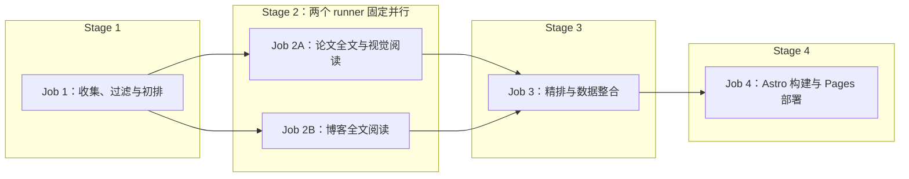

# RecSys Daily 全自动论文与行业情报站设计

日期：2026-08-09

状态：已批准修复设计，待实现

部署目标：GitHub Pages

运行环境：GitHub Actions + Docker

LLM：OpenAI-compatible API，默认面向 NVIDIA NIM

## 1. 目标

构建一个无需服务器和数据库、完全依靠 GitHub Actions 定时运行的中文推荐系统研究情报站。系统每天自动抓取学术论文和高质量工程博客，筛选与业务相关的内容，调用 LLM 生成中文摘要和结构化标签，随后部署到 GitHub Pages。

站点服务于以下推荐目标和业务场景：

- 推荐目标：`content`、`user`、`room`
- 文字流：Feed、文章、帖子、短内容推荐
- 语聊：语聊房、听众、主播、用户匹配与关系发现
- 直播间：直播内容、房间、主播和观众推荐
- 好友推荐：People You May Know、Follow Recommendation、Social Recommendation、Link Prediction
- 通用推荐技术：Retrieval、Ranking、Re-ranking、Multi-task Learning、Sequence Modeling、Graph Learning、LLM for Recommendation、Online Experimentation

系统输出为中文，但标题、算法名、数据集、指标和英文术语保留原文。

## 2. 非目标

首个版本明确不建设以下能力：

- 不运行常驻后端服务
- 不使用关系型数据库、Vector DB 或 Graph DB
- 不下载或解析 TeX source archive；不在 Git、缓存或 Pages artifact 中永久保存论文 PDF、关键页面图片、博客原始 HTML 或任何提取全文
- 不在详情页嵌入 PDF、镜像论文/博客全文或提供站内全文阅读器
- 不建设复杂 RAG、聊天机器人或用户登录系统
- 不把知识图谱作为严格事实库或学术结论依据
- 不自动绕过来源站点的访问限制

知识图谱只承担导航、筛选和发现相邻内容的作用。

## 3. 每日输出规则

每天分别形成论文和博客两个推荐区：

| 内容类型 | 每日数量 | 规则 |
| --- | ---: | --- |
| 学术论文 | 目标 8 篇 | 优先新论文；不足时允许少于 8 篇，不填充低相关或重复论文 |
| 技术博客 | 目标 8 篇 | 优先未推荐的近期文章；不足时允许少于 8 篇，不为凑数降低阈值 |

因此每日页面最多展示 16 条新推荐。

系统按日运行。存在成功状态时，论文从 `last_success_at - 48 小时` 开始查询，博客从 `last_success_at - 7 天` 开始查询；重叠窗口用于容忍来源延迟和偶发漏跑，历史日报去重保证内容不会被重复推荐。任一类型不足 8 篇时允许少于 8 篇，并在运行报告中记录原因。

每条推荐至少包含：

- 原始英文标题
- 中文一句话总结
- 来源、作者、发布日期和原文链接
- 推荐目标：`content` / `user` / `room`
- 业务场景和技术主题标签
- 推荐理由与相关性分数
- LLM 生成状态和失败降级标记

## 4. 统一工作流与时间窗口

### 4.1 单工作流判定

冷启动和日常更新由同一个 `daily.yml`、同一个 Python CLI 包和同一套四阶段处理逻辑完成。前三个数据处理阶段由 Python 命令完成，最后一个网站构建与部署阶段由 Node/Astro 完成；冷启动和日更不接受独立模式参数，只根据 `data/state.json` 计算查询起始时间：

| 状态 | 论文起始时间 | 博客起始时间 |
| --- | --- | --- |
| 不存在有效状态 | 当前时间减 5 年 | 当前时间减 3 年 |
| 存在有效状态 | `last_success_at - 48 小时` | `last_success_at - 7 天` |

每次运行统一使用论文最多 100 篇、博客最多 50 篇，并从元数据初排结果中各取最多 16 篇进行临时全文解读，再分别重排出目标 8 篇。冷启动和日更使用完全相同的候选数、深读数和筛选代码，两种运行的唯一业务差异是时间范围。模型不设置每次运行调用次数上限；安全边界由候选数量、NVIDIA 40 RPM、单请求 context、每 worker 并发 1、有限重试和各 job 超时共同提供。

### 4.2 成功条件

所有待发布数据先写入临时工作目录。每次运行只有在以下步骤全部成功后，才提交正式数据和新的 `data/state.json`：

1. 必需来源完成抓取
2. 数据去重和 Schema 校验通过
3. LLM 结构化结果达到最低成功率
4. 知识图谱生成和裁剪通过
5. Docker 测试通过
6. 静态站点构建通过
7. GitHub Pages 部署成功

如果任一关键步骤失败，不提交新的 `state.json`。首次运行失败后，下次定时运行仍使用 5 年/3 年时间范围；日更失败后，下次运行仍从上一次成功时间回溯，不会跳过失败期间的内容。

博客 RSS 属于可选来源，单个 Feed 暂时失败只记录警告，避免某个公司博客故障导致整个工作流永远无法完成。来源配置仍支持将特定 Feed 标为 `required: true`。RSS 通常只返回近期条目，因此首次运行的“近 3 年、最多 50 篇”是接受范围和安全上限，不保证每个 Feed 都能回溯到 3 年前。

### 4.3 后续日更

存在有效状态后，同一管道使用增量时间窗口：

- 根据来源游标、发布日期和内容 ID 拉取新增候选
- 使用 arXiv ID、Canonical URL、DOI 和标准化标题去重
- 从候选中分别生成论文目标 8 篇、博客目标 8 篇
- 无新博客时仍正常发布论文日报
- 未产生任何新内容时只记录成功运行，不生成空日报

## 5. 来源设计

### 5.1 学术来源

| 来源 | 接口 | 作用 | 必需 |
| --- | --- | --- | --- |
| arXiv | 官方 Atom API | RecSys、IR、ML、Social Network、Multimedia 等论文主来源 | 是 |

首版学术来源只支持 arXiv。arXiv RSS 不作为独立论文来源启用，以免和 Atom API 重复；Atom API 提供查询、分页和稳定 ID。

### 5.2 高质量 RSS/Atom 来源

以下地址已通过站点链接或 Feed 内容类型进行核验。核心来源和次级来源默认启用；次级来源使用更严格的关键词和 LLM 相关性阈值。

#### 核心来源

| ID | 来源 | Feed URL | 主要覆盖场景 | 默认权重 |
| --- | --- | --- | --- | ---: |
| `meta_engineering` | Meta Engineering | `https://engineering.fb.com/feed/` | 文字流、视频/直播、社交图、用户与内容推荐 | 1.00 |
| `netflix_techblog` | Netflix TechBlog | `https://netflixtechblog.com/feed` | 视频内容推荐、Ranking、Foundation Model | 1.00 |
| `spotify_engineering` | Spotify Engineering | `https://engineering.atspotify.com/feed/` | 音频推荐、用户偏好、序列建模 | 1.00 |
| `pinterest_engineering` | Pinterest Engineering | `https://medium.com/feed/pinterest-engineering` | Home Feed、Retrieval、Ranking、Graph、Ads | 1.00 |
| `discord_engineering` | Discord Engineering | `https://discord.com/blog/rss.xml` | 语聊、房间/社区、好友关系、Entity Embedding | 0.95 |

#### 次级来源

| ID | 来源 | Feed URL | 主要覆盖场景 | 默认权重 |
| --- | --- | --- | --- | ---: |
| `airbnb_tech` | Airbnb Engineering & Data Science | `https://airbnb.tech/feed/` | Search/Ranking、双边市场、Embedding、Experimentation | 0.90 |
| `etsy_codeascraft` | Etsy Code as Craft | `https://www.etsy.com/codeascraft/rss` | Search、Ads、Recs、买家画像 | 0.90 |
| `google_research` | Google Research | `https://research.google/blog/rss/` | IR、ML、LLM、Graph 等研究进展 | 0.85 |
| `nvidia_developer` | NVIDIA Developer Blog | `https://developer.nvidia.com/blog/feed/` | GPU RecSys、推理优化、NIM 和 LLM 基础设施 | 0.80 |

### 5.3 RSS 配置示例

实际实现使用 `config/sources.yaml`：

```yaml
academic:
  - id: arxiv
    kind: arxiv
    enabled: true
    required: true
    weight: 1.0

blogs:
  - id: meta_engineering
    kind: rss
    name: Meta Engineering
    url: https://engineering.fb.com/feed/
    enabled: true
    required: false
    weight: 1.0
    scenarios: [text_feed, livestream, friend_recommendation]

  - id: netflix_techblog
    kind: rss
    name: Netflix TechBlog
    url: https://netflixtechblog.com/feed
    enabled: true
    required: false
    weight: 1.0
    scenarios: [text_feed, livestream]

  - id: spotify_engineering
    kind: rss
    name: Spotify Engineering
    url: https://engineering.atspotify.com/feed/
    enabled: true
    required: false
    weight: 1.0
    scenarios: [voice_chat, user_recommendation]

  - id: pinterest_engineering
    kind: rss
    name: Pinterest Engineering
    url: https://medium.com/feed/pinterest-engineering
    enabled: true
    required: false
    weight: 1.0
    scenarios: [text_feed]

  - id: discord_engineering
    kind: rss
    name: Discord Engineering
    url: https://discord.com/blog/rss.xml
    enabled: true
    required: false
    weight: 0.95
    scenarios: [voice_chat, room_recommendation, friend_recommendation]

  - id: airbnb_tech
    kind: rss
    name: Airbnb Engineering & Data Science
    url: https://airbnb.tech/feed/
    enabled: true
    required: false
    weight: 0.90

  - id: etsy_codeascraft
    kind: rss
    name: Etsy Code as Craft
    url: https://www.etsy.com/codeascraft/rss
    enabled: true
    required: false
    weight: 0.90

  - id: google_research
    kind: rss
    name: Google Research
    url: https://research.google/blog/rss/
    enabled: true
    required: false
    weight: 0.85

  - id: nvidia_developer
    kind: rss
    name: NVIDIA Developer Blog
    url: https://developer.nvidia.com/blog/feed/
    enabled: true
    required: false
    weight: 0.80
```

每个 Feed 在 `collect-filter` 中拉取一次并保存 `ETag`、`Last-Modified` 和最近成功
时间；blog deep-read runner 可以为入选来源再拉取一次以恢复不能跨 job 传递的 Feed
全文，因此每个来源每次运行总计最多两次请求。两个阶段都支持 RSS 2.0 与 Atom，
Canonical URL 相同的文章只保留一条。

## 6. 用户可编辑主题配置

主题、场景、任务和方法都由 `config/topics.yaml` 控制。该文件同时是抓取词表、LLM 标签约束、搜索筛选项和知识图谱分类节点的唯一配置来源；用户增加新方向时无需修改代码。

```yaml
targets:
  - id: content
    name_zh: 内容推荐
    name_en: Content Recommendation
    terms: [content recommendation, item recommendation]
  - id: user
    name_zh: 用户推荐
    name_en: User Recommendation
    terms: [user recommendation, people recommendation]
  - id: room
    name_zh: 房间推荐
    name_en: Room Recommendation
    terms: [room recommendation, live room recommendation]

scenarios:
  - id: text_feed
    name_zh: 文字流
    name_en: Text Feed
    terms: [feed ranking, news feed, post recommendation]
  - id: voice_chat
    name_zh: 语聊
    name_en: Voice Chat
    terms: [voice chat, social audio, listener matching]
  - id: livestream
    name_zh: 直播间
    name_en: Livestream
    terms: [live streaming, live room, host recommendation]
  - id: friend_recommendation
    name_zh: 好友推荐
    name_en: Friend Recommendation
    terms:
      - people you may know
      - friend recommendation
      - follow recommendation
      - social recommendation
      - link prediction

tasks:
  - id: retrieval
    name_zh: 召回
    name_en: Retrieval
    terms: [candidate retrieval, candidate generation]
  - id: ranking
    name_zh: 排序
    name_en: Ranking
    terms: [recommendation ranking, learning to rank]
  - id: reranking
    name_zh: 重排
    name_en: Re-ranking
    terms: [reranking, slate optimization]
  - id: user_matching
    name_zh: 用户匹配
    name_en: User Matching
    terms: [user matching, people matching]
  - id: link_prediction
    name_zh: 链路预测
    name_en: Link Prediction
    terms: [link prediction, social link prediction]
  - id: multi_objective_optimization
    name_zh: 多目标优化
    name_en: Multi-objective Optimization
    terms: [multi-objective recommendation, multi-objective optimization]

methods:
  - id: collaborative_filtering
    name_zh: 协同过滤
    name_en: Collaborative Filtering
    terms: [collaborative filtering, matrix factorization]
  - id: two_tower
    name_zh: 双塔模型
    name_en: Two-Tower Model
    terms: [two-tower model, dual encoder]
  - id: sequence_modeling
    name_zh: 序列建模
    name_en: Sequence Modeling
    terms: [sequential recommendation, sequence modeling]
  - id: graph_neural_network
    name_zh: 图神经网络
    name_en: Graph Neural Network
    terms: [graph neural network, graph learning, GNN]
  - id: reinforcement_learning
    name_zh: 强化学习
    name_en: Reinforcement Learning
    terms: [reinforcement learning, bandit recommendation]
  - id: large_language_model
    name_zh: 大语言模型
    name_en: Large Language Model
    terms: [LLM for recommendation, generative recommendation]
  - id: multi_task_learning
    name_zh: 多任务学习
    name_en: Multi-task Learning
    terms: [multi-task learning, multi-task recommendation]
```

四类条目统一使用 `id`、`name_zh`、`name_en` 和 `terms`，避免前端硬编码标签或根据 ID 猜测展示名称。系统启动时验证 ID 唯一性、字段完整性和引用关系；canonical item 中的每个标签都必须引用这里已声明的 ID。配置错误会使构建明确失败，不会静默忽略。

`rank-integrate` 将本次运行实际使用的配置标准化为 `publish-bundle/taxonomy.json`。该小文件只保留四类条目的 ID、中文名、英文名和配置顺序，不包含抓取词表；Astro 使用它生成搜索筛选项和图谱分类标签。这样重跑 `build_deploy` 时仍使用与数据处理阶段完全一致的分类快照，网站构建不需要再次解析 YAML。

## 7. 数据管道

数据管道采用单个 Python 包和一个 CLI。生产工作流调用明确的阶段命令，本地 `run` 命令只编排 Python 数据阶段并产出待发布数据包；网站构建由独立的 Node/Astro 容器消费该数据包：

```text
python -m recsys_daily run
python -m recsys_daily collect-filter --output <dir>
python -m recsys_daily deep-read --kind paper --input <dir> --output <dir>
python -m recsys_daily deep-read --kind blog --input <dir> --output <dir>
python -m recsys_daily rank-integrate --input <dir> --output <dir>
python -m recsys_daily test-fixtures
```

处理阶段：



### 7.1 去重键

按优先级使用：

1. arXiv ID
2. DOI
3. Canonical URL
4. 标准化标题哈希

标题标准化只作为最后降级手段，不合并标题相似但实际不同的论文版本。

### 7.2 两阶段筛选

为减少 LLM 调用，先做确定性预筛：

- 主题词、场景词、任务词匹配
- arXiv category
- 来源质量权重
- 发布时间和新颖度
- 与历史推荐的重复惩罚

每次运行都先用确定性规则把抓取结果限制在论文最多 100 篇、博客最多 50 篇，再将所有通过预筛的候选按批次交给 LLM。LLM 在一次结构化输出中同时给出相关性、中文一句话摘要、标签、图谱关系和证据，避免为同一条内容重复执行元数据分析。初排后，论文和博客各取 Top 16 进入全文深读；若不足 16 篇则全部进入。系统最后用深读质量、证据强度、业务价值和初排分数组合重排，各选目标 8 篇。日更因为时间窗口较短，实际候选量通常远低于首次运行，但不使用另一套 shortlist 逻辑。

元数据初排分数示意：

```text
metadata_score = 0.30 * topic_relevance
               + 0.25 * scenario_relevance
               + 0.15 * source_quality
               + 0.15 * novelty
               + 0.10 * practical_value
               + 0.05 * recency

final_score = 0.55 * metadata_score
            + 0.20 * evidence_quality
            + 0.15 * business_transferability
            + 0.10 * technical_depth
```

权重由 `config/settings.yaml` 调整。相同分数使用发布日期、source ID 和 stable ID 做确定性 tie-break，保证 fixtures 与重复运行结果稳定。

### 7.3 论文与博客全文深度解读

全文处理发生在元数据初排之后、最终推荐之前。每次最多处理 Top 16 论文和 Top 16 博客，深读结果参与最终重排，而不是只给已入选内容补充详情。该阶段是统一管道的固定部分，不为冷启动建立另一套流程。

论文处理规则：

1. 按 `arXiv HTML → PDF text → Abstract` 的顺序获取正文
2. 只访问 arXiv 提供的公开地址，不尝试绕过登录、付费墙或访问控制；首版不下载或解析 TeX source
3. PDF 串行下载到 runner 临时目录，单篇最大 20 MB、最多 80 页；提取后按 section heading 识别 Abstract、Introduction、Method、Experiments、Results、Limitations 和 Conclusion
4. 本地规则根据 Figure/Table caption、页面图片和章节位置识别所有关键页面，包括 Overview、Architecture、Main Results、Ablation 和 Case Study
5. 检测到关键页面时，每篇论文恰好调用一次 VLM；应用层不设置关键页面数量上限，将识别出的全部关键页面放入同一请求。没有关键页面时不发起零图片调用。视觉请求只受所配置 invoke URL 的 context、HTTP payload 和图像格式等真实协议约束，不按固定页数丢弃页面
6. VLM 输出页面级 Architecture、Table、Chart 和视觉限制证据；没有关键页面时标记 `not_required`，VLM 失败时标记 `unavailable`，两种情况都继续文本深读且不因缺少图片降低论文分数
7. 每篇论文再调用一次文本 LLM，将全文与 VLM 结构化证据合并为中文深度解读；输入超过文本模型 context 预算时按章节重要性和 token 数裁剪，不进行扫描版 OCR

博客处理规则：

1. 优先使用 RSS/Atom 中的 `content:encoded` 或 Atom `content`；若 Feed 只有 excerpt，再访问 canonical URL 的公开文章 HTML
2. 不绕过登录、付费墙、robots 或其他访问控制；被限制、拒绝或条款不允许自动抓取时直接降级
3. HTML 单篇最大 5 MB，使用 `trafilatura` 提取正文、标题和 heading，忽略脚本、样式、图片及导航区域
4. 同一域名并发为 1，带可识别 User-Agent，并使用请求间隔、`Retry-After` 和有限退避重试
5. 每篇博客单独调用一次 LLM，生成中文结构化解读

由于博客全文不能进入 Stage 1 artifact，而 `deep-read --kind blog` 运行在独立
runner，blog deep-read runner 可以按 `source_id` 对每个已启用 Feed 最多再次抓取
一次。它只在进程内缓存第二次响应，按 stable ID、canonical URL 或标准化标题匹配
Stage 1 候选，并优先使用匹配条目的 `content:encoded` 或 Atom `content`。第二次
Feed 抓取失败、没有全文或无法匹配时，继续使用公开文章 HTML，再降级到 excerpt。
该行为由 `limits.rss_requests_per_run_per_source` 控制，生产默认值为 2；Feed
原文仍不得进入跨 job artifact、日志、canonical item 或 Pages artifact。

两类内容都遵循以下规则：

- 单次 LLM 输入使用 token-aware budgeting：1M context 中预留 output 与 prompt/schema 空间，其余预算用于全文；超长内容优先保留摘要、架构、方法、实验/结果、限制和结论等高价值段落
- 无论成功、降级或异常中断，都在 `finally` 阶段删除 PDF、关键页面图片、原始 HTML 和提取文本；它们不得进入 cache、日志、artifact 或 Git
- Top 16 候选的结构化深度解读与全文指纹写入 canonical item；遇到相同来源修订和指纹时直接复用解读，无需再次抓取全文
- 只保存转述后的结构化分析和短证据定位，不保存长段原文

共同解读字段包括：

- 问题背景、核心贡献与主要方法
- 证据强度、关键结果、局限性与适用边界
- 对文字流、语聊、直播间、好友推荐的业务启示
- 相关工作和知识图谱关系

论文额外包括 Datasets、Baselines、Metrics、实验设计和关键 findings；博客额外包括 System Context、Architecture / Implementation、Production Constraints、Engineering Trade-offs、线上结果与可复用经验。论文证据只保存 section 名和 PDF page number；博客证据只保存 heading 或 section 名，不复制长段原文。

论文正文依据分别写入 `analysis_basis: arxiv_html`、`pdf_text` 或 `abstract_fallback`，视觉状态独立写入 `visual_analysis.status: completed | not_required | unavailable`，避免组合枚举。博客使用 Feed 全文时写入 `rss_full_content`，成功提取公开网页正文时写入 `article_html`，失败时使用 excerpt 生成较短解读并写入 `excerpt_fallback`。详情页必须明确显示正文和视觉分析依据，不能把降级结果冒充全文深读。

所有下载都必须遵循来源访问规则。[arXiv automated-access guidance](https://info.arxiv.org/help/robots.html) 不允许无差别自动下载，因此论文 runner 内只串行处理初排 Top 16 论文，而不抓取候选全集。论文和博客正文都不在本站再发布；具体许可信息随 item 保存，并始终链接到原站。

## 8. LLM 与 API 限制

### 8.1 文本 OpenAI-compatible 接口与独立视觉接口

```yaml
models:
  text:
    active_profile: nvidia_super
    profiles:
      nvidia_super:
        base_url_env: NVIDIA_BASE_URL
        api_key_env: NVIDIA_API_KEY
        model: nvidia/nemotron-3-super-120b-a12b
        context_window_tokens: 1000000

      nvidia_ultra:
        base_url_env: NVIDIA_BASE_URL
        api_key_env: NVIDIA_API_KEY
        model: nvidia/nemotron-3-ultra-550b-a55b
        context_window_tokens: 1000000

      deepseek_v4_flash:
        base_url_env: DEEPSEEK_BASE_URL
        api_key_env: DEEPSEEK_API_KEY
        model: deepseek-v4-flash
        context_window_tokens: 1000000

    reserved_prompt_tokens: 8000
    reserved_output_tokens: 16000
    batch_size: 8

  vision:
    profile: nvidia_omni
    invoke_url_env: NVIDIA_VLM_INVOKE_URL
    api_key_env: NVIDIA_API_KEY
    model: nvidia/nemotron-3-nano-omni-30b-a3b-reasoning
    context_window_tokens: 262144
    max_requests_per_paper: 1
    include_all_detected_key_pages: true
    request_defaults:
      max_tokens: 65536
      reasoning_budget: 16384
      stream: false
      temperature: 0.6
      top_p: 0.95

  common:
    concurrency_per_worker: 1
    timeout_seconds: 600
    retries: 3
```

默认 URL 环境变量为：

```text
NVIDIA_BASE_URL=https://integrate.api.nvidia.com/v1
DEEPSEEK_BASE_URL=https://api.deepseek.com
NVIDIA_VLM_INVOKE_URL=https://integrate.api.nvidia.com/v1/chat/completions
```

文本模型只实现一个薄的 OpenAI-compatible wrapper：使用 `OpenAI(base_url=<active profile base_url>, api_key=...)`，再调用 `client.chat.completions.create(...)`。NVIDIA Nemotron 3 Super、Nemotron 3 Ultra 和 DeepSeek V4 Flash 使用同一文本路径；OpenAI SDK 根据 base URL 访问 Chat Completions，配置中不手工追加 `/chat/completions`。切换文本模型只修改 `models.text.active_profile`。系统不自动 failover，也不在一次运行中自动混用文本 profile。

视觉模型不复用文本 wrapper。它使用 `requests.post` 直接调用完整的 `NVIDIA_VLM_INVOKE_URL`，发送 `Authorization: Bearer <API_KEY>`、`Content-Type: application/json` 和 `Accept: application/json`。VLM 固定 `stream: false`，请求体按 NVIDIA 接口显式组装。文本与视觉路径只共用超时、重试、限流和日志脱敏策略，不共享调用函数。

VLM 请求遵循 NVIDIA 官方 Chat Completions 多模态格式：`messages[0].content` 是一个数组，先放 `{"type":"text","text":"..."}`，再为每个关键页面追加一个 `{"type":"image_url","image_url":{"url":"data:image/png;base64,..."}}`。所有检测到的关键页面进入同一次请求；请求体合并 `models.vision.request_defaults` 中的 `max_tokens`、`reasoning_budget`、`stream`、`temperature` 和 `top_p`。只读取 `choices[0].message.content` 作为待校验结果，不保存或记录 `reasoning_content`。canonical item 分别记录实际文本 profile、视觉 profile、model 和生成时间。实现不建设 provider adapter、模型能力发现或自动参数探测；API Key 只存在 GitHub Actions Secrets 中。[NVIDIA 模型页](https://build.nvidia.com/nvidia/nemotron-3-nano-omni-30b-a3b-reasoning)给出了该托管 invoke URL、请求参数和 `image_url` 多图片格式。

### 8.2 限流和恢复

文本 wrapper 和视觉 requests 调用共用同一组请求策略：

- 固定超时
- 最多 3 次有限重试
- Exponential Backoff + jitter
- 尊重 `Retry-After`
- 对 `401/403` 直接失败，不盲目重试
- 对 `429/5xx` 有界重试
- 记录请求次数、状态码、批次和 Token 使用量
- 不在日志中输出 Secret 或完整 Authorization Header

默认限制：

```yaml
limits:
  http_concurrency: 2
  nvidia_hard_rpm: 40
  nvidia_target_rpm: 30
  nvidia_parallel_workers: 2
  nvidia_concurrency_per_worker: 1
  nvidia_min_interval_seconds_per_worker: 4
  rss_requests_per_run_per_source: 2
  arxiv_min_interval_seconds: 3
  request_timeout_seconds: 45
  retry_attempts: 3
  max_papers_per_run: 100
  max_blogs_per_run: 50
  deep_reading_candidates_per_type: 16
  max_pdf_downloads_per_run: 16
  max_blog_fulltext_fetches_per_run: 16
  pdf_download_concurrency: 1
  blog_download_concurrency_per_domain: 1
  blog_min_interval_seconds_per_domain: 2
  max_pdf_bytes: 20971520
  max_pdf_pages: 80
  max_blog_html_bytes: 5242880
```

NVIDIA endpoint 硬限制按 40 RPM 设计，系统主动把两个并行全文 runner 的合计目标控制在 30 RPM。每个 runner 只允许 1 个在途模型请求且请求启动至少间隔 4 秒；论文和博客 runner 分别错开启动，所有重试也必须重新经过限流器，不能绕过预算。因为两个 runner 固定且不再引入其他复杂并行方式，所以无需外部协调服务。

每次运行最多处理 150 条候选，摘要阶段按每批 8 条调用文本 LLM，满额时约 19 次正常调用；Top 16 论文最多各使用 1 次 VLM（仅在检测到关键页面时）并各使用 1 次文本深读，Top 16 博客各使用 1 次文本深读，因此冷启动满额时最多约 67 次正常调用。日更因候选较少且可复用未变更的既有深读结果，通常调用更少。系统不设置模型每次运行调用次数上限；单请求 context、候选数量、40 RPM、每 worker 并发 1、有限重试和各 job timeout 是实际边界。

文本模型按 profile 中的 1M context 配置，VLM 按其独立的 262,144 context 配置。发送请求前必须读取配置并用 tokenizer 或保守估算计算预算：`可用正文 tokens = context window - prompt/schema - reserved output`。首版不从 endpoint 自动发现 context；配置维护者必须使用服务端真实值，服务端拒绝超限请求时必须显式失败或降级，不能静默截断。VLM 的“全部关键页面”没有应用级页数上限，但仍必须满足 endpoint 的 context、payload 和图像协议；客户端在一次请求内编码所有关键页面并在超出真实协议能力时返回明确的 `unavailable`，不得静默丢页或拆成多次调用。

如果 LLM 个别批次失败，允许降级使用英文摘要截断和规则标签，但每次运行都要求至少 90% 候选完成结构化分析；最终进入当日推荐的条目必须 100% 拥有可展示摘要，否则不进入推荐。该规则不区分首次运行和日更。

## 9. 数据模型与仓库结构

```text
.
├── .github/workflows/
│   ├── daily.yml
│   └── verify.yml
├── config/
│   ├── sources.yaml
│   ├── topics.yaml
│   ├── models.yaml
│   └── settings.yaml
├── data/
│   ├── state.json
│   ├── items/
│   │   ├── papers/
│   │   │   └── YYYY/MM/<stable-id>.json
│   │   └── blogs/
│   │       └── YYYY/MM/<stable-id>.json
│   ├── digests/
│   │   └── YYYY/MM/YYYY-MM-DD.json
│   └── runs/
│       └── YYYY/MM/<run-id>.json
├── pipeline/
│   ├── Dockerfile
│   ├── recsys_daily/
│   └── tests/
├── site/
│   ├── Dockerfile
│   └── Astro static site
├── fixtures/
├── compose.yaml
└── scripts/dev.ps1
```

`data/items` 是唯一的内容事实来源，每篇论文或博客使用一个稳定 JSON 文件，并按首次发布日期的年/月分片。每天最多为 Top 16 论文和 Top 16 博客保存或更新结构化深读记录，单月通常不超过约 1,000 个新文件，仍低于 GitHub 建议的单目录 3,000 个条目上限。内容更新时覆盖同一个 stable ID 文件，由 Git 历史保留版本差异；未进入最终各 8 篇推荐的深读候选也保留结构化结果，以供后续重排复用。

日报文件只保存日期、排序、推荐理由和 item ID，不复制标题、摘要等完整内容。运行报告按年月和 run ID 分片；`state.json` 保持为单个小文件，用于保存最后成功时间、来源游标、ETag 和 `Last-Modified`。

以下内容不提交 Git：RSS/API 原始响应、PDF、PDF 提取全文、全文 HTML、关键页面图片、其他图片副本、完整 LLM/VLM prompt/response、HTTP cache、Node/Python cache、Astro `dist`、`graph.json` 和 Pagefind 索引。图谱、详情页、归档页和搜索索引都在构建时从 canonical item 文件派生，只进入 GitHub Pages artifact。搜索只索引站内详情页已经公开的元数据、摘要和结构化深度解读，不索引、复制或保存论文 PDF 文本与博客原始全文。Git 只保存模型生成的结构化深度解读、视觉观察及其分析依据。

存储保护规则：

```yaml
storage:
  target_item_bytes: 16384
  max_item_bytes: 32768
  max_blog_excerpt_chars: 4000
  warn_repository_data_mb: 500
  warn_pages_artifact_mb: 500
  fail_pages_artifact_mb: 900
```

结构化深读以约 16 KB/条为目标；32 条/日的理论新增量约 187 MB/年，实际日更不足 32 条且已有指纹可复用时会更低。单条超过 32 KB 时先压缩冗余解释和非核心 excerpt，但不截断标题、作者、标识符、链接、结论和结构化标签。仓库数据达到 500 MB 时在运行报告中告警，提示用户降低深读候选数或迁移历史归档；Pages artifact 达到 500 MB 时告警、达到 900 MB 时构建失败，为 GitHub Pages 的 1 GB 上限和 10 分钟部署超时保留余量。

[GitHub Repository limits](https://docs.github.com/en/repositories/creating-and-managing-repositories/repository-limits) 当前建议单个目录不超过 3,000 个条目；[GitHub large-file guidance](https://docs.github.com/en/repositories/working-with-files/managing-large-files/about-large-files-on-github) 建议仓库最好保持在 1 GB 以下。[GitHub Pages limits](https://docs.github.com/en/pages/getting-started-with-github-pages/github-pages-limits) 要求发布站点不超过 1 GB。该结构以年月分片并排除生成物，目标是让正常运行多年后仍保持在建议范围内。

单条内容的核心 Schema：

```json
{
  "id": "stable-id",
  "kind": "paper",
  "source": "arxiv",
  "title": "Original English Title",
  "url": "https://...",
  "published_at": "2026-08-09T00:00:00Z",
  "summary_zh": "一句中文总结，保留关键 English terms。",
  "targets": ["user"],
  "scenarios": ["friend_recommendation"],
  "tasks": ["link_prediction", "ranking"],
  "methods": ["graph_neural_network"],
  "relevance_score": 0.92,
  "content_fingerprint": "sha256:...",
  "graph_relations": [],
  "deep_reading": {
    "analysis_basis": "pdf_text",
    "visual_analysis": {
      "status": "completed",
      "profile": "nvidia_omni",
      "model": "nvidia/nemotron-3-nano-omni-30b-a3b-reasoning",
      "pages": [2, 6, 7, 9],
      "architecture_zh": "架构图的结构化解释。",
      "table_findings_zh": [],
      "chart_findings_zh": [],
      "limitations_zh": []
    },
    "problem_zh": "研究问题与背景。",
    "contributions_zh": ["核心贡献。"],
    "method_zh": "方法与模型结构。",
    "experiments": {
      "datasets": [],
      "baselines": [],
      "metrics": [],
      "findings_zh": []
    },
    "limitations_zh": [],
    "business_implications_zh": [],
    "evidence_refs": [
      {"section": "Experiments", "page": 6}
    ]
  },
  "llm": {
    "profile": "nvidia_super",
    "model": "configured-model",
    "generated_at": "2026-08-09T00:00:00Z",
    "degraded": false
  }
}
```

论文 `analysis_basis` 为 `arxiv_html`、`pdf_text` 或 `abstract_fallback`；`visual_analysis.status` 为 `completed`、`not_required` 或 `unavailable`，只有 `completed` 必须包含 profile、model、pages 和视觉 findings。博客 item 使用相同公共字段，但 `analysis_basis` 为 `rss_full_content`、`article_html` 或 `excerpt_fallback`，深读分支保存 `system_context_zh`、`architecture_zh`、`implementation_zh`、`production_constraints_zh`、`tradeoffs_zh`、`results_zh` 和 `lessons_zh`。博客证据定位使用 heading/section，不使用 PDF page。JSON Schema 使用按 `kind` 区分的 `oneOf` 约束，避免把论文实验字段强加给博客。

## 10. 静态站点

前端使用 Astro + TypeScript + Tailwind CSS 4，输出纯静态文件。Tailwind 通过官方推荐的 Vite plugin 接入，不使用已废弃的 `@astrojs/tailwind`；首版不安装 React，搜索和图谱交互分别使用原生 TypeScript 驱动 Pagefind 与 Cytoscape.js。Astro 只为明确包含客户端脚本的页面输出 JavaScript，详情、归档和关于页面保持静态 HTML。

- `/`：当天简报，论文和博客各目标 8 篇
- `/papers/<id>/`：论文详情页
- `/articles/<id>/`：博客详情页
- `/archive/`：按日期和标签浏览历史日报
- `/search/`：站内内容搜索和配置驱动筛选
- `/graph/`：轻量交互知识图谱
- `/about/`：配置范围、来源和免责声明

论文详情页展示：

- 原始标题和中文一句话结论
- 原始摘要
- 研究问题、核心贡献和 Method / Model Architecture
- Datasets、Baselines、Metrics 与关键实验结果
- 局限性、适用边界和业务启示
- section/page 级证据引用
- `arxiv_html`、`pdf_text` 或 `abstract_fallback` 正文依据，以及 `completed`、`not_required` 或 `unavailable` 视觉状态
- 视觉模型对 Architecture、Table 和 Chart 的页面级结构化观察与限制说明
- 场景、任务和方法标签
- 与当前内容相邻的论文/博客
- 原文、arXiv 或 DOI 外部链接；不在站内嵌入 PDF
- “LLM 生成，可能存在错误”的明确提示

博客详情页展示：

- 原始标题、Feed excerpt 和中文一句话结论
- System Context、Architecture / Implementation 与关键技术方案
- Production Constraints、Engineering Trade-offs、线上结果和可复用经验
- 局限性、适用边界和对四类业务场景的启示
- heading/section 级证据定位
- `rss_full_content`、`article_html` 或 `excerpt_fallback` 分析依据标记
- 标签、相关论文/博客和原文外链
- “LLM 生成，可能存在错误”的明确提示

详情页只展示结构化转述，不复制、镜像或缓存博客全文。

### 10.1 搜索页

搜索使用 Pagefind Extended 在 `astro build` 完成后对静态 HTML 建立索引。`<html lang="zh-CN">` 用于启用中文界面和中文分词；npm 提供的 extended binary 同时支持中文分词与页面中的英文术语。只把论文和博客详情页的主内容标记为 `data-pagefind-body`，首页、日报、归档、图谱和导航不进入索引，避免同一条内容出现多个重复结果。

搜索页面的职责边界如下：

- `taxonomy.json` 生成 `targets`、`scenarios`、`tasks` 和 `methods` 四组筛选项，按 YAML 顺序显示 `name_zh name_en`
- 内容类型 `kind: paper | blog`、发布年份 `published_year` 和构建时计算的 `age: 7d | 30d | 365d` 属于系统字段，不写入 `topics.yaml`；年份用于历史定位，age bucket 用于最近一周、一月和一年筛选
- 每个详情页把 canonical item 的分类 ID 写入 Pagefind filter attribute；显示名称只来自 taxonomy，不在页面脚本中维护第二份映射
- 同一筛选组内的多选采用 OR，不同筛选组之间采用 AND
- Pagefind 加载后读取实际 filter counts，零结果配置项保留但置灰，当前条件下的可用数量随搜索结果更新
- 默认按相关性返回结果；时间筛选只限制结果集合，不复制一套归档查询逻辑

初始访问 `/search/` 时只发送静态表单、内嵌的小型 taxonomy 数据和页面 CSS，不加载 Pagefind runtime 或索引。用户首次聚焦搜索框或操作筛选项时才动态 `import("/pagefind/pagefind.js")` 并初始化；输入使用 Pagefind 的约 300 ms debounced search。每次先调用前 10 个 result 的 `data()`，点击“加载更多”后再按 10 条读取，避免一次下载所有结果详情。Pagefind 的索引分块、筛选文件和结果详情都保持按需加载。

[Astro Tailwind 文档](https://docs.astro.build/en/guides/styling/#tailwind)规定 Astro 5.2+ 使用 Tailwind 4 Vite plugin；[Astro framework components](https://docs.astro.build/en/guides/framework-components/)说明未使用 `client:*` 的框架组件不会下发客户端 runtime，但本项目当前交互规模不需要 React island。[Pagefind Search API](https://pagefind.app/docs/api/)支持聚焦时初始化、debounced search 和逐条加载结果数据，[Pagefind filtering API](https://pagefind.app/docs/js-api-filtering/)提供筛选及动态数量，[Pagefind multilingual search](https://pagefind.app/docs/multilingual/)说明 extended release 的中文分词能力。

## 11. 轻量交互知识图谱

图谱使用 Cytoscape.js，仅加载构建时生成的静态 JSON。

节点类型：

- `paper`
- `article`
- `scenario`
- `target`
- `task`
- `method`

边包含：

- `type`
- `confidence`
- `evidence`
- `generated_by`

交互功能：

- 平移、缩放和拖动
- 在当前已加载图谱节点中按标题或标签快速定位；站内全局内容检索统一跳转 `/search/`，图谱页不重复加载 Pagefind
- 按时间、场景、目标、任务和方法筛选
- 点击节点高亮一跳邻居
- 侧边栏展示摘要和详情页链接
- 从日报或详情页打开以该内容为中心的局部子图

### 11.1 防止图谱臃肿

图谱不是无限追加的全历史图，而是每次构建从 `data/items` 派生：

- 默认可见论文/博客节点总数最多 80
- 优先最近 90 天、高相关和高连接内容
- 旧内容按主题聚合，不默认展开
- 主题、场景、目标、任务和方法节点来自受控 YAML，数量稳定
- 图谱边只保留可见内容节点相关的高置信关系
- 用户筛选后再加载/显示局部子图

历史内容仍可从归档和详情页访问，不需要全部同时出现在图谱中。

## 12. Docker 与本地开发

项目不启动数据库或常驻 Compose 服务，但按技术栈使用两个独立镜像：`pipeline/Dockerfile` 只包含 Python、正文提取和 LLM/VLM 客户端；`site/Dockerfile` 只包含 Node、pnpm、Astro、Tailwind、Pagefind 和前端依赖。两个镜像通过结构化 publish bundle 交接，不共享 Python 或 Node 运行时。

PowerShell 本地命令：

```powershell
docker compose build pipeline site
docker compose run --rm pipeline test-fixtures
docker compose run --rm pipeline run --output /workspace/publish-bundle
docker compose run --rm site build
```

便捷脚本：

```powershell
.\scripts\dev.ps1 test
.\scripts\dev.ps1 build
.\scripts\dev.ps1 run
```

`compose.yaml` 使用临时或 bind-mounted `work/publish-bundle` 作为两个容器的唯一交接目录。`dev.ps1 run` 先运行 pipeline 生成数据包，再运行 site build；`dev.ps1 test` 分别执行 Python fixtures 和 Astro + Pagefind fixture build。测试默认不需要真实 API Key。真实 pipeline 命令显式读取 `.env` 或命令行环境变量；`.env` 和 `work/` 都被 `.gitignore` 排除。

Astro Docs MCP 只作为可选的本地文档查询工具，不写入项目依赖、Docker 镜像或 GitHub Actions；项目构建和运行不依赖任何 MCP 服务。

## 13. GitHub Actions

`daily.yml` 是唯一访问真实来源、调用 LLM、写入数据并部署 Pages 的运行工作流。`verify.yml` 只使用 fixtures 做代码验证，不承担冷启动或日更，因此不会复制生产管道逻辑。

### 13.1 verify.yml

触发条件：Pull Request、相关代码或配置 Push。

执行：

1. 构建 `pipeline/Dockerfile`
2. 运行 Python 单元测试、fixtures 端到端数据管道和 JSON Schema 校验
3. 构建 `site/Dockerfile`
4. 使用 pipeline fixture publish bundle 执行一次 Astro + Pagefind production build，检查图谱、搜索索引和 Pages artifact 大小

### 13.2 daily.yml

触发条件：

- 每日定时运行，默认北京时间 08:23（UTC 00:23），避开整点高峰
- `workflow_dispatch` 手动运行

生产 workflow 分为四个逻辑阶段和五个物理 job。前三个数据阶段的业务命令在 `pipeline/Dockerfile` 镜像内运行；最后的网站构建命令在 `site/Dockerfile` 镜像内运行。checkout、artifact 上传下载、Pages 部署和 Git 提交由 GitHub runner 上的官方 action 或宿主步骤负责，不要求业务镜像安装另一套技术栈。两个镜像分别使用 GitHub Actions layer cache，不把 Python/PDF 依赖带入前端镜像，也不把 Node/Astro 依赖带入数据镜像。

#### Job 1：collect-filter

- job ID 为 `collect_filter`
- `timeout-minutes: 120`
- 只读仓库权限
- 读取 `state.json`、计算时间窗口、抓取与去重、规则预筛、NVIDIA 文本模型批量分析
- 选出论文和博客各 Top 16
- 执行 `python -m recsys_daily collect-filter --output /workspace/stage-1`
- 上传 `stage-1-<run-id>` artifact，`retention-days: 1`

Artifact 只包含 `manifest.json`、`papers.jsonl`、`blogs.jsonl`、结构化的
`source-states.json` 和 `stage-report.json`。其中 `source-states.json` 只保存来源
游标、`ETag`、`Last-Modified` 和最近成功时间；`stage-report.json` 只保存来源状态、
告警、metadata LLM 调用次数、成功率和降级计数。两者都不包含原始 API/RSS 响应或
全文。为减少协调代码，`manifest.json` 仍只保存 `run_id` 和 `schema_version`；不计算
commit、state 或 config hash。

#### Job 2：deep-read

- job ID 为 `deep_read`，依赖 `needs: collect_filter`
- `timeout-minutes: 300`
- 只读仓库权限
- 固定 matrix 为 `kind: [paper, blog]`，`max-parallel: 2`，不再按候选或页数创建其他并行 job
- 两个 runner 下载同一个 stage-1 artifact，并分别执行 `deep-read --kind paper` 与 `deep-read --kind blog`
- 论文 runner 完成 Top 16 正文阅读，并在存在关键页面时为每篇论文发起恰好一次 VLM 视觉阅读；博客 runner 完成 Top 16 全文阅读
- 分别上传 `deep-reading-paper-<run-id>` 和 `deep-reading-blog-<run-id>` 结构化 artifact，`retention-days: 1`

两个全文 runner 各自并发为 1、最短请求间隔 4 秒，合计目标不超过 30 RPM。论文和博客固定并行可以为两类内容分别获得最多 5 小时执行时间，同时不引入候选分片、动态 matrix 或其他复杂调度。

#### Job 3：rank-integrate

- job ID 为 `rank_integrate`，依赖 `needs: [collect_filter, deep_read]`
- `timeout-minutes: 120`
- 使用 `pipeline/Dockerfile`，保持仓库只读权限
- 下载三个结构化 artifact，并验证 `run_id` 和 `schema_version` 一致
- 执行 `python -m recsys_daily rank-integrate --input /workspace/stages --output /workspace/publish-bundle`
- 基于已经包含视觉证据的论文深读和博客深读各精排目标 8 篇
- 生成待提交的 canonical items、日报、运行报告、图谱关系、pending `state.json` 和本次配置的 `taxonomy.json` 快照
- 对完整待发布数据执行 JSON Schema、引用完整性和存储大小校验
- 上传 `publish-bundle-<run-id>` 结构化 artifact，`retention-days: 1`

Publish bundle 只包含 `manifest.json`、`taxonomy.json` 和 `pending-data/`；后者与最终 `data/` 目录同构，但在部署成功前只存在于 artifact 中。`taxonomy.json` 是本次运行使用的 `topics.yaml` 标准化只读快照，只服务于网站构建，不提交到 `data/`。Publish bundle 不包含 HTML 页面、`graph.json`、Pagefind 索引或 Astro `dist`，这些均由下一阶段从 canonical JSON 派生。

`pending-data/` 是完整的待发布 `data/` 树，而不是只有本次新增内容的 overlay：
`rank-integrate` 从只读仓库 `data/` 复制并校验既有 `items/`、`digests/` 和 `runs/`，
再覆盖本次运行产生的同路径结构化 JSON。正式部署成功后，整个 pending tree 才会
提升为仓库 `data/`。复制过程只允许文档化的 JSON 路径，拒绝 PDF、HTML、TXT、未知
扩展名和未声明目录，防止历史工作目录污染 Pages artifact。

每次 `RunReport` 还保存本次构建需要的配置快照，例如 `graph_max_content_nodes`、
`graph_recent_days`、`warn_pages_artifact_mb`、`fail_pages_artifact_mb`、
`warn_repository_data_mb` 和存储大小阈值。Astro 和 Pages artifact 校验只读取该
快照，不重新解析 `settings.yaml`，保证重跑 `build_deploy` 使用与数据阶段一致的
配置。

#### Job 4：build-deploy

- job ID 为 `build_deploy`，依赖 `needs: rank_integrate`
- `timeout-minutes: 60`
- 使用 `site/Dockerfile`，下载 `publish-bundle-<run-id>` 并再次验证 manifest
- `site/Dockerfile` 使用 `pnpm install --frozen-lockfile` 构建依赖层；Pagefind 固定在 `pnpm-lock.yaml`，运行时不下载 `latest`
- job 在该镜像内执行 `pnpm build`：先运行 Astro production build，从 `pending-data/` 和 `taxonomy.json` 派生详情页、搜索页、归档页、交互图谱和 `graph.json`，再对 `dist` 运行 Pagefind Extended
- Pagefind 只索引详情页主内容，并输出按需加载的 runtime、支持中英文术语的索引、filters 和 metadata 到 `dist/pagefind/`
- 验证 Pages artifact 不超过配置的大小边界，然后上传并部署
- Pages 部署成功后，将 `pending-data/` 暂存为仓库 `data/`，并在同一个 Git commit 中提交 canonical 数据和最终 `state.json`

只有 `build_deploy` 授予 `contents: write`、`pages: write` 和 `id-token: write`；其他四个物理 job 都保持只读。原始 PDF、HTML、提取全文或关键页面图片不能出现在任何跨 job artifact；GitHub artifact 只用于传递结构化候选、分析结果和 pending canonical 数据。[GitHub workflow artifacts](https://docs.github.com/en/actions/concepts/workflows-and-actions/workflow-artifacts) 支持同一 workflow 内跨 job 传递文件，依赖关系使用 `needs`。

工作流公共设置：

- `concurrency.group: recsys-daily`
- `cancel-in-progress: false`
- 各 job 的 timeout 均低于 [GitHub Actions limits](https://docs.github.com/en/actions/reference/limits) 规定的 GitHub-hosted job 6 小时上限；官方还规定单次 workflow 最长 35 天，而本系统的理论墙钟上限约为 `2 + max(5, 5) + 2 + 1 = 10` 小时，也低于每日调度间隔
- Job 1 失败时不启动全文 job；任一全文 job 失败时不启动精排；精排失败时不启动网站构建；网站构建或部署失败时不提交 pending 数据；任一失败都不写正式 `state.json`
- GitHub UI 重新运行失败 job 时可复用同一 workflow 中仍有效的成功 artifact；精确 artifact 名称、当前 workflow run 和 manifest `run_id` 共同防止跨批次混用

前端检查、构建或部署失败时只需重新运行 `build_deploy`，直接复用 publish bundle，不重新抓取内容或调用 LLM。如果 Pages 部署成功但数据提交失败，下次仍会重试同一批次；站点可能暂时已有内容，但仓库状态不会被错误标为完成。

## 14. 测试策略

首版把自动化测试控制在约 15–20 个高价值测试，不建设 provider capability 测试、浏览器测试集群、页面快照或大量错误组合矩阵。运行期失败策略不变，只压缩重复测试代码。

Python 单元与集成测试覆盖：

- YAML 配置、四类主题对象和引用校验、`taxonomy.json` 标准化快照、手动切换 active text profile、冷启动/日更时间窗口和数量上限
- arXiv Atom 与 RSS/Atom 标准化、稳定 ID 去重和确定性评分
- 文本 OpenAI-compatible wrapper 的 profile 切换与 JSON 解析；独立 NVIDIA VLM `requests.post` 路径的多 `image_url` payload、请求参数以及忽略 reasoning trace
- `429/5xx`、`Retry-After`、最多 3 次重试、每 worker 并发 1 和 NVIDIA 40 RPM 边界
- `arXiv HTML → PDF text → Abstract` 与博客 `Feed full content → article HTML → excerpt` 降级链
- Stage 1 metadata 批量 LLM 输出的中文摘要、taxonomy 标签、相关性、图谱关系和降级状态；模型失败时规则标签不得依赖固定 topic ID
- Top 16 深读、最终各 8 篇、深读 Schema、正文/视觉依据和图谱节点裁剪
- 完整 pending data tree、历史推荐 ID 合并、RunReport 构建配置快照和配置大小阈值消费
- PDF、关键页面图片、HTML 与提取全文在成功或失败后的清理，以及结构化 artifact 不包含原始全文
- manifest 只校验 `run_id` 和 `schema_version`，不匹配时拒绝进入下一阶段

端到端 fixtures 只保留五组：

1. 首次 cold-start 成功并生成完整 publish bundle
2. 后续 daily 增量保留历史 canonical data，合并历史推荐 ID 并推进状态
3. 可选 RSS 失败、第二次 Feed 抓取失败、正文抓取失败和 LLM 部分失败时按既有规则降级
4. 参数化注入 collect/deep-read/rank/site/deploy 失败，验证都不写正式 `state.json`
5. pipeline fixture bundle 能完成 Astro + Pagefind production build、图谱生成、中文搜索索引与 filter metadata 生成，以及按 RunReport 快照执行 Pages artifact 大小检查

前端不做页面快照、独立链接爬虫或浏览器自动化；Astro production build、Pagefind build 和 fixture 产物存在性检查是首版前端验收门槛，不额外建设搜索浏览器测试。前端失败后仍可只重跑 `build_deploy` 并复用 publish bundle，不再次调用 LLM。

## 15. 安全、合规和可观测性

- 只保存公开元数据、摘要、短 excerpt 和 LLM 结构化深度解读，不镜像或嵌入受版权保护的全文
- 只对初排 Top 16 论文临时访问公开 arXiv HTML/PDF；博客优先使用 Feed 全文，必要时最多访问 Top 16 篇公开文章 HTML
- 论文和博客抓取都遵守来源访问规则、robots 与站点条款，不绕过登录、付费墙或反自动化限制
- RSS、PDF 和 HTML 一律视为不可信输入；只允许公开 `https`/`http` URL，每次重定向后重新解析并拒绝 loopback、私网和 link-local 地址
- HTML 不执行脚本；LLM prompt 明确把正文包裹为只读资料并忽略其中指令，输出仍须通过严格 JSON Schema 校验
- 临时 PDF、关键页面图片、原始 HTML 和提取文本不进入 Git、cache、日志、跨 job artifact 或 Pages artifact
- 深度解读使用转述和 section/page 或 heading/section 引用，不发布长段原文
- 每个页面保留原始来源链接和发布时间
- 遵循各 API 的使用政策、分页规则和请求间隔
- 不把 Secret 写入日志、缓存、artifact 或静态页面
- 每次运行写 `data/runs/YYYY/MM/<run-id>.json`，记录来源成功/失败、候选数量、推荐数量、LLM 调用量和告警
- 页面展示生成模型和生成时间，但不暴露 API Key、内部请求头或完整 prompt

## 16. 验收标准

首个版本完成时必须满足：

1. 空仓库状态下第一次 scheduled/manual 运行能自动使用冷启动时间范围
2. 冷启动论文限制为近 5 年最多 100 篇，博客限制为近 3 年最多 50 篇
3. 冷启动关键失败时远端仓库不存在完成状态
4. 后续每日运行自动使用增量时间范围，冷启动和日更除时间范围外共用同一套处理逻辑和安全上限
5. 每日论文和博客各目标 8 篇；候选不足时允许少于 8 篇，但不使用低相关或重复内容填充
6. 每条推荐拥有中文一句话摘要并保留关键英文术语
7. 用户可通过 YAML 修改主题、场景、好友推荐范围和 RSS 来源
8. 站点包含日报、详情、归档、按需加载的站内内容搜索和可交互轻量图谱；搜索筛选项由 `topics.yaml` 自动生成
9. 图谱默认内容节点不超过 80，历史增长不会导致页面无限臃肿
10. 本地测试和构建完全通过 Docker 完成，pipeline 与 site 使用两个独立镜像并通过 publish bundle 交接
11. GitHub Actions 的数据 job 使用 `pipeline/Dockerfile`、网站 job 使用 `site/Dockerfile`，并对 API 限流、429 和失败重试有测试覆盖
12. GitHub Pages 部署不依赖任何常驻服务器
13. canonical item 按类型和年月分文件保存，日报只引用 item ID，构建产物和原始响应不进入 Git
14. `daily.yml` 使用 collect-filter、并行的 paper/blog deep-read、rank-integrate 和 build-deploy 四个逻辑阶段，共五个物理 job；job timeout 分别为 120、300、120 和 60 分钟，单 job 不超过 5 小时，理论墙钟上限约 10 小时
15. 每次运行从论文和博客元数据初排结果中各取最多 16 篇临时全文深读，再依据深读结果各选目标 8 篇；不足 16 篇时处理全部候选
16. Top 16 论文在全文 runner 中检测关键页面；存在关键页面的论文恰好调用一次 VLM，单次调用包含全部识别出的关键页面且不设应用级页数上限；无关键页面不调用并标记 `not_required`，视觉失败或无关键页面不阻断文本深读
17. 每日入选论文和博客均拥有结构化深度解读并明确标记分析依据；PDF、关键页面图片、原始 HTML 和提取全文只存在于对应 runner 临时目录，站点不保存、不镜像且不嵌入原始全文
18. 默认文本 profile 为 NVIDIA Nemotron 3 Super、视觉 profile 为 NVIDIA Nemotron 3 Nano Omni；NVIDIA Ultra 与 DeepSeek V4 Flash 可通过 YAML 手动切换，但运行中不自动混用文本 profile
19. 模型不设置每次运行调用次数上限；文本单请求按 1M context 做 token-aware budgeting，两个全文 runner 固定并行且总目标 30 RPM、硬上限 40 RPM、每 worker 并发 1、有限重试
20. 任一 stage/job 失败都不写正式 `state.json`；跨 job 只传递 retention 1 天的结构化 artifact，manifest 只校验 `run_id` 与 `schema_version`；前端失败可只重跑 `build_deploy`，不重新调用 LLM
21. 首版学术来源只有 arXiv，论文正文降级链只有 `arXiv HTML → PDF text → Abstract`，不实现 OpenReview 或 TeX source
22. 文本模型使用一个同步 OpenAI-compatible wrapper，NVIDIA 与 DeepSeek 分别配置 base URL；视觉模型使用独立完整 invoke URL 和 `requests.post`，单请求包含多个 `image_url`，默认 `max_tokens: 65536`、`reasoning_budget: 16384`、`temperature: 0.6`、`top_p: 0.95` 和 `stream: false`
23. 前端使用 Astro + TypeScript + Tailwind CSS 4，不安装 React；Pagefind Extended 只索引论文和博客详情页公开的元数据、摘要与结构化深度解读，搜索 runtime、索引、filters 和结果详情均按需加载且只进入 Pages artifact；知识图谱的关系生成、筛选和交互能力保持不变，图内搜索仅匹配已加载节点标题与标签
24. 自动化测试控制在约 15–20 个高价值测试和五组端到端 fixtures，不建设浏览器集群、页面快照、provider capability 或大量错误组合测试

## 17. 已批准修复设计（2026-08-10）

本节记录对当前实现的批准修复，作为本设计其余章节的具体执行补充：

1. `collect-filter` 必须使用当前 text profile 按 `models.text.batch_size` 批量生成
   `summary_zh`、四类 taxonomy 标签、`relevance_score`、`graph_relations` 和分析
   状态。模型 JSON Schema 的标签枚举从 `topics.yaml` 动态生成；不得在整合阶段
   使用 `content`、`text_feed`、`ranking` 或 `two_tower` 等固定默认值。模型批次
   失败时只能使用当前词表生成规则标签并标记 degraded；没有可展示摘要或完整标签
   的条目不得进入最终日报。
2. `deep-read --kind blog` 在独立 runner 中按来源缓存第二次 Feed 抓取，默认每个
   来源每次运行最多 2 次请求；Feed 全文只在进程内使用，随后按既有 HTML/excerpt
   降级链处理并清理临时内容。
3. `rank-integrate` 必须基于只读仓库 data 生成完整 pending tree，且用稳定去重
   合并 previous/current `recommended_item_ids`。正式 state 仍只在 Pages 部署成功
   后提升。
4. `RunReport` 必须记录站点构建和存储告警所需的配置快照；Node/Astro 和构建校验
   从该快照读取图谱节点/时间限制、item 大小和 Pages artifact 阈值。Stage 1 的
   来源状态、告警、metadata LLM 调用次数、成功率和降级计数通过结构化的
   `stage-report.json` 传给 `rank-integrate`，再合并进最终 RunReport。
5. `TextClient`、`VisionClient`、正文抓取、excerpt 限制、存储告警和图谱裁剪都必须
   消费对应 YAML 配置；重复的业务常量只允许存在于配置校验的架构不变量中。
6. 测试必须覆盖真实的 Stage 1 metadata、二次 Feed 抓取缓存、历史 bundle、状态
   合并、降级和 site build；仅检查 fixture 目录存在不算端到端验证。
